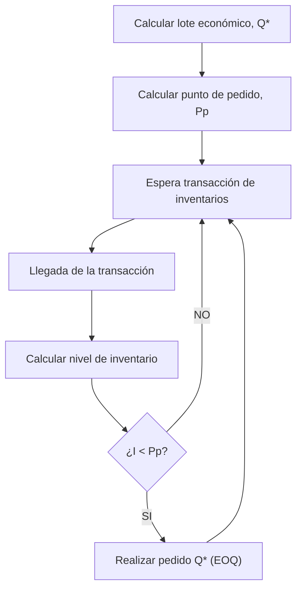
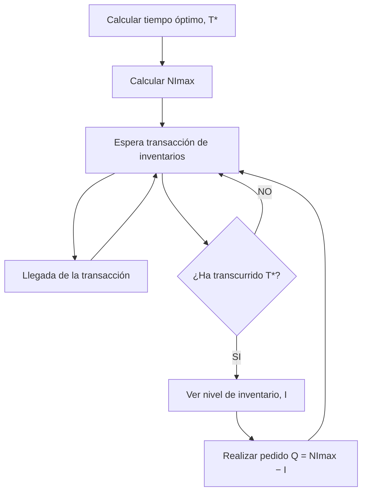

# Apunte 12 — Gestión de Inventarios

> **Unidad 4 — Gestión de Inventarios.** Primera presentación de la unidad. Recorre de forma integral la administración de inventarios: qué es un inventario y por qué se mantiene, sus costos e inconvenientes, el rol de la demanda **independiente vs. dependiente**, el objetivo de la gestión (definir un sistema de control que minimice el costo total), la **clasificación ABC**, los dos grandes **sistemas de control** (revisión continua y revisión periódica) y —su núcleo— el **catálogo de modelos cuantitativos**: cálculo del **lote óptimo (EOQ)** en sus tres casos, cálculo del **punto de pedido** (con y sin stock de seguridad, para demanda variable y nivel de servicio) y el **modelo de período fijo**. Cubre prácticamente la totalidad de los temas del plan analítico de la Unidad 4.

**Docente responsable:** Dr. Ing. Pablo D. Villarreal

**Bibliografía de referencia de la presentación:**

- Russell & Taylor, *Operations Management. Creating Value Along the Supply Chain* (7.ª ed.), John Wiley & Sons, 2011 — Capítulo 13: *Inventory Management*.
- F. Robert Jacobs & Richard B. Chase, *Operations and Supply Chain Management*, McGraw Hill, 2018 — Capítulo 20: *Inventory Management*.

**Recurso asociado** (en `recursos-inventarios/`): `plantilla-modelos-inventarios.xls` — planilla de cátedra con **una hoja por modelo** (*Clasificación ABC, EOQ, EOQ II, Descuentos por Cantidad, Punto de Pedido, Modelo de Período Fijo*). Se cargan los parámetros de entrada y la hoja calcula automáticamente las salidas (lote óptimo, costo total, punto de pedido, stock de seguridad, etc.) y los gráficos de costos.

---

## Agenda de la presentación

1. Inventario: conceptos.
2. Costos de inventarios.
3. Objetivo de la gestión de inventarios.
4. Sistemas de control de inventarios.
5. Clasificación ABC.
6. Proceso de revisión continua.
   - Modelos para calcular el lote óptimo.
   - Modelos para calcular el punto de pedido.
7. Sistema de revisión periódica.
   - Modelo básico de período fijo.

---

## 1. Inventario: conceptos

> **Inventario:** *stock* de materiales (p. ej., materias primas, productos) mantenidos en una organización para **satisfacer una demanda futura** (interna o externa).

**Gestión de inventarios.** Su **propósito** es determinar la **cantidad de materiales a mantener en stock**. Debe dar respuesta a cuatro preguntas:

- **¿Qué ordenar?**
- **¿Cuánto ordenar?**
- **¿Cuándo ordenar?**
- **¿Con qué frecuencia comprobar el nivel de inventario?**

### Tipos de inventarios

- Materias primas.
- Partes compradas.
- Productos en proceso (terminados parcialmente).
- Componentes.
- Herramientas, maquinarias y equipos.
- Piezas de repuesto e insumos industriales.
- Productos terminados.

### Razones para mantener inventarios

- Satisfacer una **demanda inesperada**.
- Amortiguar **variaciones estacionales o cíclicas**.
- **Descuentos** u otros beneficios por cantidad.
- Cubrirse por **aumentos de precios**.
- Lograr **independencia entre las etapas** de producción y suministro, y evitar demoras o interrupciones de la producción.

### Inconveniente de los inventarios

Hay una **tensión** de fondo entre dos objetivos en conflicto:

| Dimensión | Relación | Consecuencia |
|---|---|---|
| **Costos** | mayor inventario → **más costos** | encarece |
| **Nivel de servicio al cliente** | menor inventario → **menor nivel de servicio** | desabastece |

> **Idea clave:** los **inventarios son necesarios, pero generan inconvenientes**. Toda la gestión de inventarios consiste en **balancear** costos contra nivel de servicio.

### Información clave: tipos de demanda

La naturaleza de la demanda determina si hay que **pronosticarla** o si puede **calcularse**:

| Tipo | Origen | Qué representa | Cómo se obtiene |
|---|---|---|---|
| **Independiente** | **externa** a la empresa | productos finales requeridos por los consumidores | **debe pronosticarse** (Unidad 3) |
| **Dependiente** | **interna** a la empresa | materiales o partes usados para producir los productos finales | **puede calcularse con certeza** (Unidad 6 — MRP) |

> Esta unidad (modelos EOQ, punto de pedido, período fijo) aplica esencialmente a **demanda independiente**. La demanda dependiente se gestiona con MRP.

---

## 2. Costos de inventarios

Minimizar el **costo total de inventarios** exige modelar sus tres componentes:

### a) Costos de almacenamiento (*holding / carrying cost*, $C_c$)

- Costo de **mantener unidades en inventario**: financieros, alquileres, amortización, refrigeración, seguros, administrativos, **obsolescencia**, deterioro, impuestos, etc.
- Son función del **nivel de inventario y del horizonte de tiempo**: $C_c = F(\text{inventario}, \text{tiempo})$.
- **Cálculo:** entre el **10 % y el 40 % del valor del producto**; suma de los costos individuales por unidad y por tiempo (generalmente **anual**), expresados en unidad monetaria sobre base anual.

### b) Costos de emisión de orden (*ordering cost*, $C_o$)

- Todos los **gastos fijos** asociados a emitir una orden (el reaprovisionamiento del stock): transporte, embarque, teléfono/fax, administrativos, correo, control e inspección, etc.
- Son función del **número de órdenes**: $C_o = F(\text{n.º de órdenes})$.
- Son **independientes del tamaño** de la orden.

### c) Costos por faltante (*stockout cost*)

- Todos los gastos asociados con **no poder cumplir a tiempo** con la demanda por falta de productos: pérdida de ventas, pérdida de clientes, penalización por demora.
- Son función **inversa** del inventario: $F(1/\text{inventario})$ → **disminuyen** a medida que aumenta el inventario.

> Los modelos básicos de esta unidad (EOQ) **suponen que no se permiten faltantes**, por lo que trabajan con los dos primeros costos ($C_c$ y $C_o$) más el costo de compra; el costo por faltante reaparece, conceptualmente, al dimensionar el **stock de seguridad** vía el nivel de servicio.

---

## 3. Objetivo de la gestión de inventarios

> **Objetivo:** definir un **Sistema de Control de Inventarios** que especifique **qué ordenar, cuánto ordenar y cuándo ordenar**, **minimizando el costo total de inventarios**.

---

## 4. Sistemas de control de inventarios

Hay dos grandes familias, según **cómo y cuándo** se revisa el inventario y se dispara la orden:

| Sistema | Variable de decisión fija | Parámetros que define | Pregunta que responde |
|---|---|---|---|
| **Revisión continua** (cantidad de orden fija) | **el tamaño de la orden** ($Q^*$) es siempre el mismo | $Q^*$ (lote económico, EOQ) y $P_p$ (punto de pedido) | se ordena **siempre $Q^*$**, **cuando** $I < P_p$ |
| **Revisión periódica** (período de tiempo fijo) | **el momento de la orden** es siempre el mismo | $T^*$ (período fijo de revisión) y $NI_{max}$ (inventario máximo) | se ordena **cada $T^*$**, una **cantidad variable** $Q = NI_{max} - I$ |

Notación común:

- $I$: registro del **nivel de inventario** actual.
- $Q^*$: **lote económico** (EOQ), tamaño de la orden.
- $P_p$: **punto de pedido**, nivel de inventario en el cual se coloca una nueva orden.
- $T^*$: período fijo óptimo de revisión.
- $NI_{max}$: inventario máximo (nivel objetivo "*order-up-to*").

### 4.1. Proceso de revisión continua



- **Ventaja:** controla el inventario **en cada transacción** (ingreso/salida de material) ⇒ **menor probabilidad de faltante** ante un aumento inesperado de la demanda.
- **Desventaja:** requiere **emitir pedidos en cualquier momento** ⇒ dificulta la gestión de compras.

### 4.2. Proceso de revisión periódica



- **Ventaja:** los pedidos se emiten en los **tiempos previstos** ⇒ **facilita la gestión de compras**.
- **Desventaja:** **no controla permanentemente** el inventario ⇒ **mayor probabilidad de faltante** por aumento inesperado de la demanda.

---

## ★ Catálogo de modelos de inventario (énfasis del apunte)

> Esta es la columna vertebral de la Unidad 4. Conviene tener clarísimo **qué modelo existe, a qué sistema de control pertenece, qué supone y qué calcula**. La tabla reúne todos los modelos de la presentación; las secciones posteriores los desarrollan uno por uno. La última columna indica la **hoja de la plantilla** de cátedra que lo resuelve.

| # | Modelo | Sistema | Supuestos clave | Calcula | Hoja de la plantilla |
|:--:|---|---|---|---|---|
| 1 | **Clasificación ABC** | (previo) priorización | demanda y valor por ítem varían | clases A/B/C según % valor | `Clasificación ABC` |
| 2 | **EOQ — Caso 1: ingreso instantáneo** | Revisión continua | demanda cierta y constante; sin faltantes; *lead time* constante; la orden llega **toda junta** | $Q^*$, $TC_{min}$, $N^*$, $T^*$ | `EOQ` |
| 3 | **EOQ — Caso 2: ingreso no instantáneo** | Revisión continua | igual que 1, pero la orden **se recibe gradualmente** (producción a tasa $p$ mientras se consume a tasa $d$) | $Q^*$, $TC_{min}$, $T_i$, n.º corridas, $NI_{max}$ | `EOQ II` |
| 4 | **EOQ — Caso 3: descuento por cantidad** | Revisión continua | igual que 1, con **precio decreciente por cantidad comprada** | $Q^*$ y $CT$ considerando el costo de compra | `Descuentos por Cantidad` |
| 5 | **Punto de pedido $P_p = d\,L$** | Revisión continua | define **cuándo** ordenar | $P_p$ | `Punto de Pedido` |
| 6 | **Punto de pedido con stock de seguridad** | Revisión continua | **demanda y/o *lead time* aleatorios**; nivel de servicio deseado | $S_s$, $P_p$ con buffer | `Punto de Pedido` |
| 7 | **Modelo básico de período fijo** | Revisión periódica | revisa cada $T^*$; demanda aleatoria; nivel de servicio | $T^*$, $NI_{max}$, $Q = NI_{max} - I$ | `Modelo de Período Fijo` |

---

## 5. Clasificación ABC

**Principio:** el **volumen de la demanda** y el **valor** de los materiales **varían** entre ítems; conviene **concentrar el esfuerzo de gestión** en los pocos ítems que concentran la mayor parte del valor (regla de Pareto, "los pocos vitales").

**Base:** clasificar el inventario en tres categorías según el **porcentaje del valor total** que representan:

| Clase | % de Unidades (ítems) | % del Valor (pesos) | Tratamiento típico |
|:--:|:--:|:--:|---|
| **A** | 5 – 15 % | 70 – 80 % | control estricto: **revisión continua**, conteos frecuentes |
| **B** | ≈ 30 % | ≈ 15 % | control intermedio |
| **C** | 50 – 60 % | 5 – 10 % | control simple: **revisión periódica**, lotes grandes |

**Procedimiento.**

1. Para cada ítem, calcular el **valor total anual** $= (\text{uso anual}) \times (\text{costo unitario})$.
2. **Ordenar los ítems de mayor a menor** valor total.
3. Calcular el **% del valor total** y el **% acumulado**.
4. Trazar los **cortes** A / B / C según los acumulados (≈ 70–80 %, ≈ 95 %, 100 %).

> **Para qué sirve:** decidir **qué sistema de control** aplicar a cada ítem. A los **A** (y a menudo **B**) se les aplica **revisión continua** con sus modelos EOQ; a los **C**, esquemas más livianos. Es el **primer paso** antes de elegir y parametrizar un modelo de control.

---

## 6. Modelos para calcular el lote óptimo (EOQ)

> **EOQ** = *Economic Order Quantity*. **Objetivo: económico** — hallar el tamaño de orden $Q$ que **minimiza el costo total** de gestión del inventario. (Pertenece al sistema de **revisión continua**: responde **"¿cuánto ordenar?"**.)

### El ciclo de inventario (Caso 1)

Con ingreso instantáneo, el inventario sigue un **diente de sierra**: sube de golpe a $Q^*$ al recibir la orden y baja linealmente a tasa de demanda hasta llegar al punto de pedido $P_p$, momento en el que se emite la siguiente orden (que llega tras el *lead time* $LT$).

```
Nivel de
inventario
   Q* ┤◣           ◣
      │ ╲          ╲
      │  ╲          ╲
   Pp ┤   ╲____      ╲____
      │   :   ╲      :   ╲
      └───:────╲─────:────╲──► tiempo
          │ LT │     │ LT │
       emisión    recibo
       de orden   de la orden
```

### 6.1. Caso 1 — Ingreso instantáneo

**Supuestos:** demanda conocida con **certeza** y **constante** en el tiempo; **no se permiten faltantes**; *lead time* (tiempo de provisión) **constante**; **la orden se recibe toda junta**.

**Costo total anual de gestión del inventario:**

$$TC = \underbrace{C_p \cdot D}_{\text{compra}} + \underbrace{C_o \cdot \frac{D}{Q}}_{\text{emisión}} + \underbrace{C_c \cdot \frac{Q}{2}}_{\text{almacenamiento}}$$

donde $D$ = demanda anual, $Q$ = cantidad ordenada, $C_p$ = costo de compra unitario, $C_o$ = costo de emisión por orden, $C_c$ = costo de almacenamiento por unidad y por año. (El inventario **promedio** es $Q/2$, de ahí ese término.)

**Cálculo del lote óptimo $Q^*$.** Es un problema de optimización univariable sin restricciones $\min_{Q} TC$. Como el costo de compra $C_p D$ **no depende de $Q$**, se optimiza el resto:

$$\frac{dTC}{dQ} = -\,\frac{C_o\,D}{Q^2} + \frac{C_c}{2} = 0 \quad\text{(condición necesaria)}$$
$$\frac{d^2TC}{dQ^2} = \frac{2\,C_o\,D}{Q^3} > 0 \quad\text{(condición suficiente: mínimo global, pues } Q>0)$$

Despejando:

$$\boxed{\;Q^* = \sqrt{\dfrac{2\,C_o\,D}{C_c}}\;}$$

Y a partir de $Q^*$:

$$\text{N.º óptimo de pedidos/año:}\quad N^* = \frac{D}{Q^*}$$
$$\text{Período óptimo (ciclo de la orden):}\quad T^* = \frac{Q^*}{D} \;=\; \frac{\text{días/año}}{N^*}$$
$$\text{Costo total mínimo (sin costo de compra):}\quad TC_{min} = \sqrt{2\,C_o\,D\,C_c}$$

**Curvas de costos.** El costo de **almacenamiento** ($C_c Q/2$) **crece** con $Q$ y el de **emisión** ($C_o D/Q$) **decrece** con $Q$; el **costo total** (sin compra) tiene un **mínimo** justo donde ambas curvas se cruzan, en $Q^* = Q_{opt}$. El costo de compra $C_p D$ es una **recta horizontal** que sólo desplaza el total hacia arriba sin mover $Q^*$.

**Ejemplo (EOQ básico).** $C_c = \$0.75$ u/año, $C_o = \$150$, $D = 10\,000$ u/año:

$$Q^* = \sqrt{\frac{2 \cdot 150 \cdot 10\,000}{0.75}} = \sqrt{4\,000\,000} = \mathbf{2\,000 \text{ u}}$$
$$N^* = \frac{10\,000}{2\,000} = \mathbf{5 \text{ pedidos/año}} \qquad TC_{min} = \sqrt{2\cdot150\cdot10\,000\cdot0.75} = \mathbf{\$1\,500}$$

### 6.2. Caso 2 — Ingreso no instantáneo

**Supuestos:** iguales al Caso 1, salvo que **la orden se recibe gradualmente** durante un cierto tiempo, **a medida que el inventario se consume simultáneamente**. Es el caso de **producción propia** (se fabrica a tasa $p$ mientras se demanda a tasa $d$).

- $p$ = *production rate* (velocidad de producción).
- $d$ = *demand rate* (velocidad diaria de la demanda).

Como el stock se acumula sólo a la **tasa neta** $(p-d)$ mientras se produce, el **inventario máximo** ya no es $Q$ sino $Q\,(1-d/p)$, y el **promedio** es la mitad:

$$\text{Inventario máximo} = Q\left(1 - \frac{d}{p}\right) \qquad \text{Inventario promedio} = \frac{Q}{2}\left(1-\frac{d}{p}\right)$$

**Costo total anual:**

$$TC = C_p\,D + C_o\,\frac{D}{Q} + C_c\,\frac{Q}{2}\left(1-\frac{d}{p}\right)$$

**Lote óptimo:**

$$\boxed{\;Q^* = \sqrt{\dfrac{2\,C_o\,D}{C_c\left(1-\dfrac{d}{p}\right)}}\;}$$

Métricas adicionales del ciclo de producción:

$$T_i\ (\text{período de ingreso de la orden}) = \frac{Q^*}{p} \qquad \text{N.º de corridas de producción} = \frac{D}{Q^*}$$

> Aquí $C_o$ suele interpretarse como **costo de *setup*** (preparación) de la corrida de producción. Nótese que si $p \to \infty$ (ingreso instantáneo), $d/p \to 0$ y la fórmula del Caso 2 **se reduce** a la del Caso 1.

**Ejemplo (Caso 2).** $C_c = \$0.75$ u/año, $C_o = \$150$ (*setup*), $D = 10\,000$ u/año, $p = 150$ u/día, con $d = 10\,000/311 = 32.2$ u/día:

$$1 - \frac{d}{p} = 1 - \frac{32.2}{150} = 0.785$$
$$Q^* = \sqrt{\frac{2\cdot150\cdot10\,000}{0.75 \cdot 0.785}} \approx \mathbf{2\,256.8 \text{ u}}$$
$$T_i = \frac{2\,256.8}{150} \approx \mathbf{15.05 \text{ días}} \qquad \text{N.º corridas} = \frac{10\,000}{2\,256.8} \approx \mathbf{4.43}$$

### 6.3. Caso 3 — Descuento por cantidad

**Supuestos:** iguales al Caso 1 (ingreso instantáneo, sin faltantes), pero el **precio de compra disminuye** a medida que se incrementa la cantidad comprada. El costo de compra **deja de ser irrelevante**: ahora $C_p$ depende de $Q$.

$$C_p(Q) = \begin{cases} d_0 & 0 \le Q < Q_1 \\ d_1 & Q_1 \le Q < Q_2 \\ d_2 & Q \ge Q_2 \end{cases}\qquad\text{con } d_0 > d_1 > d_2$$

**Costo total:**

$$CT = C_p(Q)\cdot D + C_o\,\frac{D}{Q} + C_c\,\frac{Q}{2}$$

La función $CT(Q)$ es **discontinua**: cada tramo de precio define una curva $TC(d_i)$, y en cada **punto de quiebre** ($Q_1, Q_2$) el costo **salta hacia abajo** (al bajar el precio de compra).

**Resolución (algoritmo).** Se calcula el lote óptimo **sin costo de compra**, $Q_{opt} = \sqrt{2C_oD/C_c}$, y se decide comparando costos totales en los candidatos:

$$
\begin{aligned}
&\textbf{Si } Q_{opt} < Q_1: \\
&\quad \text{Si } CT(d_0, Q_{opt}) \le CT(d_1, Q_1):\ \{\text{si } CT(d_0,Q_{opt})\le CT(d_2,Q_2)\Rightarrow Q^*=Q_{opt};\ \text{sino } Q^*=Q_2\} \\
&\quad \text{Sino: } \{\text{si } CT(d_1,Q_1)\le CT(d_2,Q_2)\Rightarrow Q^*=Q_1;\ \text{sino } Q^*=Q_2\} \\[4pt]
&\textbf{Si } Q_1 < Q_{opt} < Q_2:\ \{\text{si } CT(d_1,Q_{opt}) \le CT(d_2,Q_2)\Rightarrow Q^*=Q_{opt};\ \text{sino } Q^*=Q_2\} \\[4pt]
&\textbf{Si } Q_{opt} > Q_2:\ Q^* = Q_{opt}
\end{aligned}
$$

> **Intuición:** el $Q_{opt}$ teórico puede caer en un tramo de precio "caro"; conviene **comparar** ese costo contra el de **saltar al siguiente punto de quiebre** $Q_i$ y comprar de más para acceder al descuento. El óptimo real es siempre o bien $Q_{opt}$, o bien un **punto de quiebre** $Q_i$.

**Ejemplo (Caso 3).** Tamaño de orden y precio: 1–49 → \$1\,400; 50–89 → \$1\,100; 90+ → \$900. $C_c = \$190$ por producto/año, $C_o = \$2\,500$, $D = 200$ u/año:

$$Q_{opt} = \sqrt{\frac{2\cdot2\,500\cdot200}{190}} = \sqrt{5\,263.2} \approx 72.5 \;\Rightarrow\; \text{cae en el tramo } 50\text{–}89\ (\$1\,100)$$

Se compara contra el quiebre siguiente $Q_2 = 90$ ($\$900$):

$$CT(\$1\,100,\ 72.5) = 1\,100(200) + 2\,500\tfrac{200}{72.5} + 190\tfrac{72.5}{2} \approx \$233\,784$$
$$CT(\$900,\ 90) = 900(200) + 2\,500\tfrac{200}{90} + 190\tfrac{90}{2} \approx \mathbf{\$194\,106}$$

$$\Rightarrow\; Q^* = \mathbf{90 \text{ u}},\quad CT_{min} \approx \mathbf{\$194\,106}$$ (conviene comprar de más para acceder al descuento).

---

## 7. Modelos para calcular el punto de pedido

> **Objetivo: control** — el punto de pedido responde **"¿cuándo emitir la orden?"** en el sistema de revisión continua. (El "cuánto" lo da el EOQ; el "cuándo" lo da $P_p$.)

### 7.1. Punto de pedido básico (demanda determinística)

El **punto de pedido** $P_p$ es el nivel de inventario al cual se emite una nueva orden, de modo que la orden **llegue justo** cuando el stock se agota, cubriendo la demanda **durante el *lead time***:

$$\boxed{\;P_p = d \cdot L\;}$$

donde $d$ = demanda diaria [u/día], $L$ = *lead time* (tiempo de provisión) [días].

**Ejemplo.** $D = 10\,000$ u/año, $q = 311$ días/año → $d = 10\,000/311 = 32.1$ u/día; con $L = 10$ días:

$$P_p = (32.1)(10) = \mathbf{321 \text{ u}}$$

### 7.2. Inventario / stock de seguridad ($S_s$)

> **Stock de seguridad:** *"buffer"* adicionado al inventario disponible durante el tiempo de provisión.

Se utiliza para hacer frente a la **variabilidad** durante el *lead time*:

- Una **demanda mayor a la esperada** durante el tiempo de provisión ($D$ aleatoria).
- Una **demora** en el tiempo de provisión de la orden ($L$ aleatorio).

**Nivel de servicio.** Es la **probabilidad de que el inventario disponible durante el *lead time* sea suficiente** para satisfacer la demanda esperada (equivalentemente, la probabilidad de **no** incurrir en faltante). A mayor nivel de servicio → mayor probabilidad de satisfacer al cliente → **mayor** stock de seguridad necesario.

### 7.3. Punto de pedido con demanda variable

Si la demanda diaria $d$ es **aleatoria**, entonces la demanda durante el período de provisión, $d_L$, también es una variable aleatoria. Asumiendo demanda diaria independiente con desvío estándar $\sigma_d$, el desvío de la demanda **acumulada** en $L$ días es:

$$\sigma_{d_L} = \sigma_d\,\sqrt{L}$$

El punto de pedido se compone entonces de la **demanda media** durante el *lead time* más el **stock de seguridad**:

$$\boxed{\;P_p = \bar{d}\,L + \underbrace{z\,\sigma_d\sqrt{L}}_{S_s}\;}$$

donde $\bar{d}$ = demanda diaria media, $L$ = *lead time*, $\sigma_d$ = desvío estándar de la demanda diaria, y $z$ = valor de la distribución normal estándar asociado al **nivel de servicio** deseado.

**Determinación de $z$ según el nivel de servicio.** $z$ es el valor tal que $F(z)$ = nivel de servicio (área bajo la normal a la izquierda); $(1 - F(z))$ es la probabilidad de faltante. Valores usuales:

| Nivel de servicio | $z$ |
|:--:|:--:|
| 90 % | 1.28 |
| 95 % | 1.645 |
| 99 % | 2.33 |

> Esquema mental: $P_p$ = (lo que se espera consumir durante el *lead time*) + (un colchón $S_s$ dimensionado por cuánta protección —nivel de servicio— se quiere contra la variabilidad). Subir el nivel de servicio **sólo** mueve $z$ (y por ende $S_s$), no la demanda media.

---

## 8. Sistema de revisión periódica: modelo básico de período fijo

En este sistema **se revisa cada $T^*$** y se ordena una **cantidad variable** que **lleva el inventario hasta un nivel objetivo** $NI_{max}$ (*order-up-to level*):

$$Q = NI_{max} - I$$

donde $I$ es el nivel de inventario observado en el momento de la revisión.

**Diferencia operativa con la revisión continua.** Como **no se vigila el inventario entre revisiones**, hay que protegerse contra la variabilidad de la demanda **durante todo el intervalo $T + L$** (el período de revisión **más** el *lead time*), no sólo durante $L$. Por eso el colchón es mayor.

**Tamaño de la orden con demanda aleatoria:**

$$\boxed{\;Q = \bar{d}\,(T + L) + \underbrace{z\,\sigma_d\sqrt{T+L}}_{S_s} - I\;}$$

donde $\bar{d}$ = demanda diaria media, $T$ = período entre revisiones (tiempo entre órdenes), $L$ = *lead time*, $\sigma_d$ = desvío estándar de la demanda diaria, $z$ = valor de la normal según el nivel de servicio, $I$ = inventario en stock al momento de la revisión.

El **inventario máximo objetivo** es entonces:

$$NI_{max} = \bar{d}\,(T+L) + z\,\sigma_d\sqrt{T+L}$$

> **Comparación de los colchones.** Revisión **continua**: $S_s = z\,\sigma_d\sqrt{L}$ (sólo cubre el *lead time*). Revisión **periódica**: $S_s = z\,\sigma_d\sqrt{T+L}$ (cubre el *lead time* **más** todo el período de revisión, que es el lapso "a ciegas"). De ahí la desventaja anotada en §4.2: a igual nivel de servicio, el período fijo necesita **más** stock de seguridad.

---

## 9. Implementación de los modelos en un sistema de gestión

Aspectos a evaluar al implementar estos modelos en un **sistema de gestión de inventarios** real (la mirada de Ingeniería en Sistemas):

- **Datos maestros confiables.** $D$, $C_o$, $C_c$, $L$, $\sigma_d$ por ítem; muchos provienen de **otros módulos** (compras, producción, costos) y de los **pronósticos** de la Unidad 3 (la demanda independiente que alimenta el EOQ).
- **Clasificación ABC como política de control diferenciado.** El sistema debería **asignar automáticamente** el modelo de control (continua vs. periódica) según la clase ABC, para no gestionar 50 000 SKU con el mismo rigor.
- **Frecuencia de recálculo.** $Q^*$ y $P_p$ no son constantes: cambian al cambiar la demanda. El sistema debe **recalcular periódicamente** los parámetros a partir de pronósticos actualizados.
- **Integración con la cadena.** El punto de pedido dispara una **orden de compra** (a un proveedor) o una **orden de producción** (Caso 2); el sistema debe conectar inventarios con compras, MRP (Unidad 6) y distribución (DRP, Unidad 7).

---

## Síntesis del apunte

Un **inventario** es stock que se mantiene para satisfacer demanda futura; es **necesario** (amortigua variabilidad, da independencia entre etapas, captura descuentos) pero **costoso**, de modo que toda la gestión consiste en **balancear costos contra nivel de servicio**. La demanda puede ser **independiente** (externa, se pronostica) o **dependiente** (interna, se calcula con MRP); esta unidad trata la independiente. Los **costos** relevantes son los de **almacenamiento** ($C_c$, crece con el stock), **emisión de orden** ($C_o$, fijo por orden) y **faltante** (inverso al stock). El **objetivo** es definir un **sistema de control** —qué, cuánto y cuándo ordenar— que **minimice el costo total**.

Hay dos **sistemas de control**: **revisión continua** (orden de tamaño fijo $Q^*$ cuando $I<P_p$; mejor protección, peor para compras) y **revisión periódica** (orden variable cada $T^*$ hasta $NI_{max}$; mejor para compras, requiere más stock de seguridad). La **clasificación ABC** decide **a qué ítems** aplicar cada esquema.

El corazón de la unidad es el **catálogo de modelos**:

- **Lote óptimo (EOQ)** — *cuánto ordenar*: **Caso 1** (ingreso instantáneo), $Q^*=\sqrt{2C_oD/C_c}$; **Caso 2** (ingreso gradual / producción), $Q^*=\sqrt{2C_oD/[C_c(1-d/p)]}$; **Caso 3** (descuento por cantidad), donde el óptimo es $Q_{opt}$ **o** un punto de quiebre, según comparación de costos totales.
- **Punto de pedido** — *cuándo ordenar*: $P_p=d\,L$ en el caso determinístico; $P_p=\bar d\,L + z\,\sigma_d\sqrt{L}$ con **stock de seguridad** cuando la demanda es variable, dimensionado por el **nivel de servicio** (vía $z$).
- **Período fijo** — revisión periódica: $Q = \bar d\,(T+L) + z\,\sigma_d\sqrt{T+L} - I$, con un colchón mayor por cubrir el intervalo $T+L$.

Cada modelo tiene su **hoja en la plantilla de cátedra** (`recursos-inventarios/plantilla-modelos-inventarios.xls`), que automatiza el cálculo de salidas y los gráficos de costos. Los **casos de estudio** que ejercitan estos modelos se transcriben y encuadran en el [[apunte-13-casos-de-estudio-inventarios|Apunte 13]].
