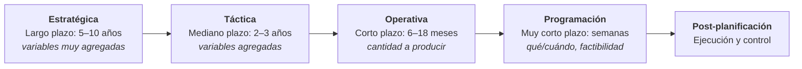
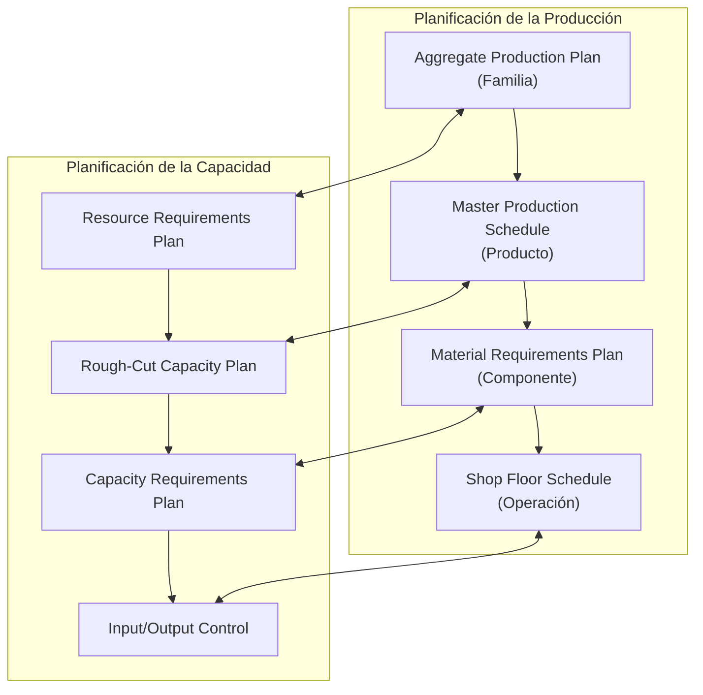
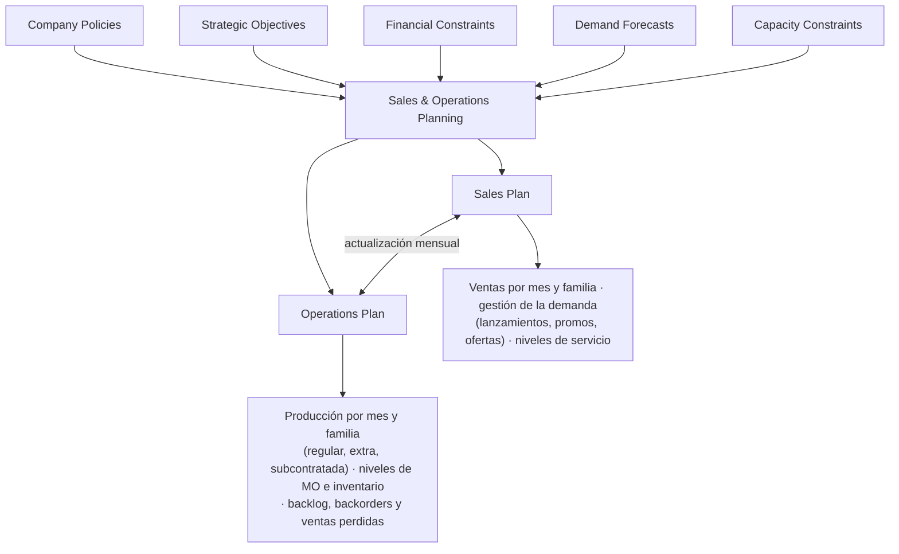
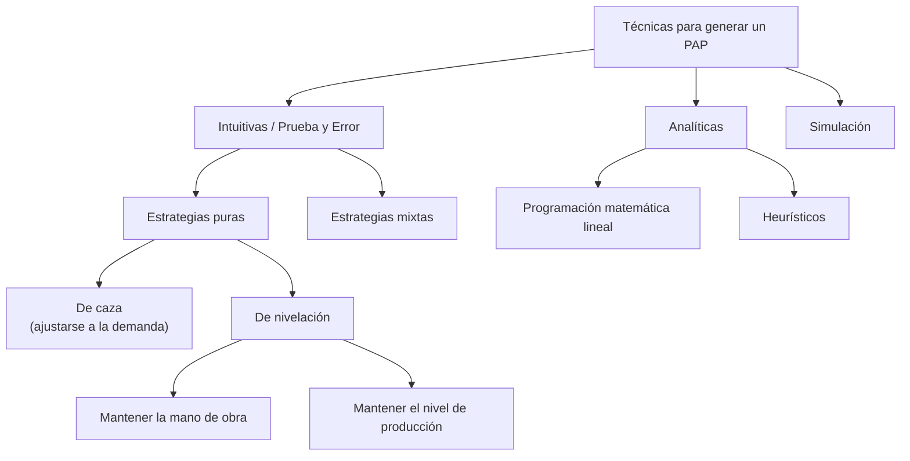

# Apunte 14 — Planificación Agregada de la Producción (PAP)

> **Unidad 5 — Planificación Jerárquica de la Producción.** Primera presentación de la unidad. Encuadra la **planificación de operaciones** dentro de la gestión de operaciones, define los **niveles de planificación** (estratégico, táctico, operativo y programación) y el enfoque de **Planificación Jerárquica de la Producción** (la matriz que coordina planificación de la producción con planificación de la capacidad). Su núcleo es la **Planificación Agregada de la Producción (PAP)** —también llamada *Sales and Operations Planning (S&OP)*—: qué es, su proceso, las **estrategias para ajustar la capacidad y para gestionar la demanda**, las **técnicas de prueba/error** (caza y nivelación) y el **modelo formal** (parámetros, variables, función objetivo de minimización de costos y los algoritmos de caza y de nivelación de mano de obra). Cubre los cuatro primeros temas del plan de la Unidad 5; la **Planificación Maestra de la Producción (PMP)**, los **entornos de producción** y el **disponible a prometer** se tratan aparte.

**Docente responsable:** Dr. Ing. Pablo D. Villarreal

**Bibliografía de referencia de la presentación:**

- Russell & Taylor, *Operations Management. Creating Value Along the Supply Chain* (7.ª ed.), John Wiley & Sons, 2011 — Capítulo 14: *Sales and Operations Planning*.
- F. Robert Jacobs & Richard B. Chase, *Operations and Supply Chain Management*, McGraw Hill, 2018 — Capítulo 19: *Sales and Operations Planning*.

---

## Agenda de la presentación

1. Planificación de las operaciones (planificación de la producción).
2. Proceso de Planificación Jerárquica de la Producción.
3. El proceso de Planificación de las Operaciones y Ventas (S&OP).
4. Estrategias para ajustar la capacidad.
5. Estrategias para gestionar la demanda.
6. Técnicas para planificación agregada.

> **Dónde estamos en la gestión de operaciones.** El flujo general de la unidad es: *Pronósticos → Planificación → Gestión de inventarios → Requerimiento de materiales → Scheduling → Distribución de productos.* Este apunte abre el bloque de **Planificación**, que toma como entrada los **pronósticos** (Unidad 3) y entrega el plan que luego alimenta el requerimiento de materiales (MRP, Unidad 6) y la programación (scheduling, Unidad 8).

---

## 1. Planificación de operaciones

> **Planificar** es *"proyectar el futuro deseado, los medios necesarios y las actividades a desarrollar para conseguirlos"*.

> **Planificación de la producción.** Consiste en **determinar la cantidad de producto a producir** en una **secuencia de períodos de tiempo**, con el objeto de **optimizar ciertos criterios** (típicamente, minimizar costos) a la vez que se **satisfacen restricciones** tales como la capacidad de recursos.

### 1.1. Recursos de producción

La planificación se apoya en cuatro grandes recursos:

- **Instalaciones** (máquinas, equipos, planta).
- **Materiales.**
- **Mano de obra.**
- **Inventarios.**

### 1.2. Dinámica de los recursos según el horizonte de tiempo

Cada recurso es "ajustable" en una escala de tiempo distinta. A medida que el horizonte se acorta (de años a horas), hay menos recursos que pueden modificarse:

| Recurso | Escala en la que se decide / ajusta |
|---|---|
| Instalaciones | Años (decisión estructural, lenta) |
| Mano de obra | Meses |
| Materiales | Días |
| Inventarios | Horas / muy corto plazo |

La idea de fondo: en el **largo plazo** todo es ajustable (incluso construir una planta); en el **muy corto plazo** sólo quedan palancas rápidas como el inventario.

---

## 2. Niveles de planificación

La planificación de la producción se **descompone** en dos ejes simultáneos:

- **Escala de tiempo:** del corto al largo plazo.
- **Nivel de detalle:** de lo *muy agregado* a lo *detallado*.

Cuanto **más largo** el horizonte, **más agregadas** son las variables; cuanto **más corto**, **más detalle**.



| Nivel | Horizonte | Qué decide |
|---|---|---|
| **Estratégica** | Largo plazo (5–10 años) | Objetivos y estrategias; diseñar y determinar productos/servicios y procesos. Variables **muy agregadas**. |
| **Táctica** | Mediano plazo (2–3 años) | Capacidad, equipos, localización, *layout*. Variables **agregadas**. |
| **Operativa** | Corto plazo (6–18 meses) | **Cantidad a producir** en un plazo dado para alcanzar los objetivos. |
| **Programación** | Muy corto plazo (semanas) | Unidades a producir o comprar **y cuándo**; actividades a desarrollar; chequear **factibilidad** (capacidad de recursos); considerar inventarios de productos y materiales. |
| **Post-planificación** | — | **Ejecución y control.** |

### 2.1. Planificar implica comparar

El acto central de planificar es **comparar** dos magnitudes y **cerrar la brecha** entre ellas:

$$\textbf{Capacidad requerida (PLAN)} \;\longleftrightarrow\; \textbf{Capacidad disponible (RECURSOS)}$$

Según el horizonte, los **ajustes posibles** para equilibrar ambas son de distinto tipo:

| Tipo de ajuste | Horizonte | Ejemplos |
|---|---|---|
| **Estructurales** | Largo plazo | Cambios en la estructura productiva: productos, procesos, *layout*, capacidad de plantas. |
| **Coyunturales** | Mediano y corto plazo | Horas extras, tercerización, contratación/despidos, inventarios, agregar/quitar turnos, etc. |

> La **PAP** trabaja en el plazo **medio/corto**: por eso sus palancas son los **ajustes coyunturales**, no los estructurales.

---

## 3. Planificación Jerárquica de la Producción

> Es un **enfoque para coordinar** las **metas, planes y actividades** de los tres niveles de planificación.

Trabaja con tres **tipos de unidades**, de lo agregado a lo detallado:

- **Familias:** grupo de productos con **similar requerimiento de demanda, procesos de producción y materiales**.
- **Productos.**
- **Componentes.**

> **Propiedad clave.** La planificación jerárquica **asegura la INTEGRACIÓN VERTICAL** (coherencia entre niveles, de la familia a la operación), pero **NO asegura la INTEGRACIÓN HORIZONTAL** (la coordinación entre áreas/funciones en un mismo nivel).

### 3.1. La matriz de planificación

El enfoque acopla, en cada nivel, un plan de **producción** con su correspondiente plan de **capacidad**, sobre un **nivel de recurso** creciente en detalle:

| Tipo de ítem | Planificación de la Producción | Planificación de la Capacidad | Nivel de recurso |
|---|---|---|---|
| **Familia** | *Aggregate Production Plan* (APP / PAP) | *Resource Requirements Plan* (RRP) | Planta |
| **Producto** | *Master Production Schedule* (MPS / PMP) | *Rough-Cut Capacity Plan* (RCCP) | Centros críticos de trabajo |
| **Componente** | *Material Requirements Plan* (MRP) | *Capacity Requirements Plan* (CRP) | Todos los centros |
| **Operación** | *Shop Floor Schedule* (SFC) | *Input/Output Control* | Equipo / máquina individual |



> La **PAP** (este apunte) es la **fila superior** de la matriz: planifica la **producción de familias** contra la **capacidad de la planta**. La fila siguiente —**PMP / MPS**— desagrega a nivel de **producto**.

---

## 4. Planificación Agregada de la Producción (PAP)

> **PAP — *Aggregate Production Plan*.** Es un **proceso para coordinar el suministro con la demanda**. También se lo llama ***Sales and Operations Planning (S&OP)***. **Determina la capacidad de recursos requerida** para satisfacer una demanda en un **horizonte de mediano plazo**, **minimizando los costos** de los recursos.

> **"Agregado"** significa **planificar las operaciones para líneas o familias de productos** (no para ítems individuales).

**Objetivos de la PAP:**

- Establecer un **plan para asignar recursos**.
- Desarrollar una **estrategia económica** que satisfaga la demanda → **minimizar los costos** de los recursos requeridos.

### 4.1. El proceso de PAP (S&OP)

El S&OP integra entradas de toda la empresa para producir, en paralelo, un **plan de ventas** y un **plan de operaciones** que se actualizan mensualmente y se mantienen consistentes entre sí:



- **Entradas:** políticas de la empresa, objetivos estratégicos, restricciones financieras, **pronósticos de demanda** y restricciones de capacidad.
- **Salidas:** un **Plan de Ventas** (ventas por mes por familia, gestión de la demanda, niveles de servicio al cliente) y un **Plan de Operaciones** (producción por mes por familia —regular, horas extra y subcontratada—, niveles de fuerza de trabajo e inventario, *backlogs*/*backorders*/ventas perdidas).

### 4.2. Proceso de actualización mensual del PAP

El S&OP es un **ciclo mensual** de cinco pasos que converge en un plan consensuado (*Company Game Plan*):


---

## 5. Estrategias para satisfacer la demanda

Hay dos grandes familias de estrategias, según sobre qué lado de la brecha capacidad-demanda se actúe:

| Familia | Carácter | Sobre qué actúa |
|---|---|---|
| **Ajustar la capacidad** | Estrategias **pasivas / reactivas** | Ajustes coyunturales: horas extras, tercerización, contratación/despidos, inventarios, agregar/quitar turnos, vacaciones, movilidad del personal, rutas alternativas, tamaño de lotes, etc. |
| **Gestionar la demanda** | Estrategias **activas / agresivas** | Actuar sobre la propia demanda (promociones, ofertas especiales, etc.). |

### 5.1. Estrategias para gestionar la demanda

- **Trasladar** la demanda a otros períodos con incentivos, promociones de ventas y campañas de publicidad.
- Ofrecer productos o servicios con **patrones de demanda contracíclicos** (que "rellenen" los valles de la demanda principal).
- **Asociarse con proveedores** para reducir la distorsión de la información a lo largo de la cadena de suministro (atenuar el *efecto látigo*).

### 5.2. Estrategias para ajustar la capacidad

| Estrategia | En qué consiste |
|---|---|
| **Nivelación de la producción** | Producir a un **ritmo constante** y usar el **inventario** para absorber las fluctuaciones de la demanda. |
| **Caza de la demanda** (*chase*) | **Contratar y despedir** trabajadores para seguir de cerca la demanda. |
| **Pico de demanda** | Mantener recursos para los **niveles pico** y asegurar **altos niveles de servicio** al cliente. |
| **Horas extras** | Ajustar (aumentar/disminuir) las **horas de mano de obra** para satisfacer la demanda. |
| **Subcontratación** | Permitir que **empresas externas** completen el trabajo. |
| **Empleados part-time** | Sumar capacidad laboral parcial. |
| **Pedidos retrasados / pendientes / pérdidas de ventas** | Diferir o no satisfacer parte de la demanda (ver detalle abajo). |

**Sobre los pedidos no satisfechos en término:**

- **Pedidos retrasados (*backlog*):** pedidos **acumulados** de clientes para completarse en una **fecha posterior**.
- **Pedidos pendientes (*backordering*):** ordenar un artículo que está **temporalmente agotado**.
- **Pérdidas de ventas:** demanda que directamente **no se captura**.

> **Estrategia pura vs. mixta.** Cuando la empresa elige **una sola** de estas alternativas, se dice que tiene una **estrategia pura**. Cuando combina **dos o más**, tiene una **estrategia mixta**.

### 5.3. Variable de decisión ↔ costo asociado

Cada palanca de ajuste de capacidad lleva aparejado un **costo incremental**:

| Variable de decisión | Costo asociado |
|---|---|
| Variar el tamaño de la fuerza de trabajo (RR. HH.) | Costos de **empleo/despido** de personal |
| Usar horas extras o aceptar tiempos ociosos | Costos de **horas extras** / costos de **no producción** |
| Variar niveles de inventarios | Costos de **almacenamiento** |
| Aceptar faltantes de inventario | Costos por **faltantes** (pérdida de ventas) |
| Subcontratación | Costos de **tercerización** |

---

## 6. Proceso de elaboración de un PAP

Pasos del proceso:

1. **Calcular las necesidades de productos** (a partir del pronóstico y los inventarios).
2. **Determinar las medidas de ajuste coyuntural** posibles.
3. **Determinar un plan satisfactorio:**
   - Elaborar **planes de producción alternativos**.
   - **Evaluar** los planes contra los objetivos definidos (costo, cumplimiento de la demanda, etc.).

**Factores a considerar:**

- **Restricciones:** del entorno (p. ej., mano de obra disponible) y de las políticas de la empresa (p. ej., límites de horas extra, políticas de inventario).
- **Objetivos:** costos (incrementales) y satisfacción del cliente.

---

## 7. Técnicas para generar un PAP



- **Intuitivas o de prueba y error.** Se construyen planes con **estrategias puras** (caza; nivelación de mano de obra; nivelación de producción) o **mixtas**, y se comparan por costo.
- **Analíticas.** **Programación matemática lineal** (incluida la **Programación Lineal Entera** para optimizar el plan agregado) y **heurísticos**.
- **Simulación.**

### 7.1. Intuición gráfica: caza vs. nivelación

- **Estrategia de caza.** La curva de **producción "persigue"** a la curva de **demanda** período a período: se contrata y despide para que producción ≈ demanda en cada mes. Minimiza inventario, pero asume **costos de contratación/despido** y de variabilidad de la fuerza de trabajo.

```
unidades
   │            ╭╮      Demanda (─)   Producción (≈ sigue a la demanda)
   │      ╭─╮  ╱  ╲
   │     ╱   ╲╱    ╲
   │ ╭──╯           ╲___
   └──────────────────────► tiempo
   (producción "pegada" a la demanda)
```

- **Estrategia de nivelación (de producción).** La **producción se mantiene constante**; las diferencias contra la demanda se absorben con **inventario** (cuando producción > demanda) o con faltantes/*backlog* (cuando producción < demanda). Minimiza la variabilidad de la fuerza de trabajo, pero asume **costos de posesión de inventario**.

```
unidades
   │        ____________   Producción (constante ─)
   │       ╱  ╲      ╱        Demanda (fluctúa)
   │ ─────────────────────  ← nivel de producción
   │      ╲   ╱╲   ╱
   └──────────────────────► tiempo
   (el inventario absorbe la diferencia área a área)
```

---

## 8. Modelo formal de PAP

La presentación formaliza el PAP como un **modelo de optimización** sobre un producto agregado *X* y un horizonte de *T* períodos (meses).

### 8.1. Parámetros de entrada

| Símbolo | Significado |
|:--:|---|
| $X$ | Un producto agregado |
| $T$ | Horizonte de tiempo de la planificación |
| $t$ | Índice de períodos, $t = 1 \dots T$ (meses) |
| $D_t$ | Necesidades de producción (demanda estimada) del producto agregado en el período $t$ |
| $I_0$ | Inventario inicial en $t = 0$ |

**Parámetros de recursos y operativos:**

| Símbolo | Significado |
|:--:|---|
| $d_t$ | Días productivos del período $t$ |
| $Phe$ | Horas estándar requeridas **por unidad** del producto agregado |
| $Whe$ | Horas estándar **por trabajador por día** |
| $We$ | N.º de trabajadores **estables** |
| $W_{max}$ | N.º de trabajadores **máximo** por período |
| $W_0$ | N.º de trabajadores al inicio ($t=0$) |
| $HE$ | **Fracción máxima** del total de horas regulares permitidas como horas extras |

**Parámetros de costos:**

| Símbolo | Significado |
|:--:|---|
| $C_r$ | Costo por hora estándar en **jornada regular** |
| $C_e$ | Costo por hora estándar en **hora extra** |
| $C_s$ | Costo por unidad **subcontratada** |
| $C_c$ | Costo de **contratación** de un trabajador |
| $C_d$ | Costo de **despido** de un trabajador |
| $C_p$ | Costo de **posesión** (inventario) por unidad del producto |
| $C_o$ | Costo de horas de mano de obra **ociosa** |
| $CS_r$ | Costo por unidad del producto agregado **retrasada** en el período $t$ |

### 8.2. Variables

**Variables de decisión:**

| Símbolo | Significado |
|:--:|---|
| $PR_t$ | Unidades producidas en $t$ en tiempo de producción **regular** |
| $PE_t$ | Unidades producidas en $t$ en tiempo de producción con **horas extras** |
| $PS_t$ | Unidades **subcontratadas** en $t$ |
| $W_t$ | N.º de trabajadores **disponibles** en $t$ |
| $WC_t$ | N.º de trabajadores **contratados** al inicio de $t$ |
| $WD_t$ | N.º de trabajadores **despedidos** al inicio de $t$ |
| $I_t$ | **Inventario** disponible al final de $t$ |
| $F_t$ | Unidades **faltantes** en inventario al final de $t$ |

**Variables internas:**

| Símbolo | Significado |
|:--:|---|
| $MOReq_t$ | Mano de obra **requerida** (horas) en $t$ |
| $MODisp_t$ | Mano de obra **disponible** (horas) en $t$ |
| $OperEx_t$ | Operarios **en exceso** en $t$ |
| $HeE_t$ | **Horas extras** en $t$ |
| $HeO_t$ | **Horas ociosas** en $t$ |

### 8.3. Función objetivo — minimizar costos

$$
\min \sum_{t=1}^{T} \Big(
\; C_r\, PR_t\, Phe
\;+\; C_e\, PE_t\, Phe
\;+\; C_s\, PS_t
\;+\; C_c\, WC_t
\;+\; C_d\, WD_t
\;+\; C_p\, \frac{I_t + I_{t-1}}{2}
\;+\; CS_r\, F_t
$$
$$
\;+\; C_o\,\big(W_t\, Whe\, d_t - PR_t\, Phe\big)
\;+\; C_e\,\big((W_t\, Whe\, d_t)\, HE - PE_t\, Phe\big)
\Big)
$$

**Lectura término por término** (cada sumando es un costo incremental del período $t$):

| Término | Costo que representa |
|---|---|
| $C_r\, PR_t\, Phe$ | Producción en **jornada regular** ($PR_t$ unidades × $Phe$ horas/unidad × $C_r$ por hora). |
| $C_e\, PE_t\, Phe$ | Producción en **horas extra**. |
| $C_s\, PS_t$ | **Subcontratación**. |
| $C_c\, WC_t$ | **Contrataciones**. |
| $C_d\, WD_t$ | **Despidos**. |
| $C_p\, \dfrac{I_t + I_{t-1}}{2}$ | **Posesión de inventario**, valuado sobre el **inventario promedio** del período. |
| $CS_r\, F_t$ | **Faltantes** (pedidos retrasados / ventas perdidas). |
| $C_o\,(W_t\, Whe\, d_t - PR_t\, Phe)$ | **Horas ociosas**: capacidad regular disponible ($W_t\,Whe\,d_t$) menos la usada en producción regular ($PR_t\,Phe$), es decir $C_o \cdot HeO_t$. |
| $C_e\,((W_t\, Whe\, d_t)\, HE - PE_t\, Phe)$ | Término asociado a la **capacidad de horas extra** (límite permitido $HE$ sobre las horas regulares vs. las horas extra efectivamente usadas), tal como aparece en la diapositiva. |

> **Nota de transcripción.** La función objetivo se reconstruyó leyendo directamente la diapositiva fuente (el texto extraído del PDF dejaba la fórmula ilegible). Los siete primeros términos son los costos incrementales clásicos de un modelo PAP; los dos últimos expanden las **holguras de mano de obra** (horas regulares ociosas y el término de capacidad de horas extra) usando las relaciones $MODisp_t = W_t\,Whe\,d_t$ y $MOReq_t = PR_t\,Phe$. Conviene **cotejar la fórmula con la planilla de cátedra** (`recursos-planificacion/`) antes de usarla en un cálculo, por si la cátedra adopta una convención particular para esos dos últimos sumandos.

---

## 9. Algoritmos de prueba/error

### 9.1. Algoritmo de PAP — Estrategia de **Caza**

> Idea: en cada período se produce **exactamente lo que falta** para cubrir la demanda, y la fuerza de trabajo se **ajusta** (contrata/despide) a esa necesidad.

1. **Producción máxima diaria:**
   $$ProdMaxDia = \frac{Whe \cdot W_t}{Phe}$$
2. **Por cada período $t$ (mes):**
   1. Capacidad de producción máxima en $t$: $\;ProdMax_t = d_t \cdot ProdMaxDia$
   2. Variable de decisión (lo que hay que producir): $\;PR_t = D_t - I_{t-1}$
   3. Mano de obra requerida: $\;MOReq_t = PR_t \cdot Phe$
   4. Trabajadores: $\;W_t = \text{Roundup}\!\left(\dfrac{MOReq_t}{d_t \cdot Whe}\right)$
   5. Mano de obra disponible: $\;MODisp_t = W_t \cdot Whe \cdot d_t$
   6. Calcular **contrataciones** $WC_t$ **o despidos** $WD_t$ (según $W_t$ aumente o disminuya respecto del período previo).
   7. Operarios en exceso: $\;OperEx_t = \begin{cases} We - W_t & \text{si } W_t < We \\ 0 & \text{en otro caso} \end{cases}$
   8. Horas ociosas: $\;HeO_t = MODisp_t - MOReq_t$
   9. Inventario / faltantes: $\;I_t = I_{t-1} + PR_t + PE_t + PS_t - D_t$
   10. Calcular **costos**.

### 9.2. Algoritmo de PAP — Estrategia de **Nivelación de Mano de Obra**

> Idea: se fija **una fuerza de trabajo constante** para todo el horizonte (calculada sobre la demanda total) y se produce a **ritmo uniforme**; el inventario absorbe las diferencias.

1. **Calcular la variable de decisión $W_t$ (constante):**
   1. Producción diaria requerida: $\;\dfrac{\text{Demanda Total} - I_0}{\text{Total días operativos}}$
   2. Mano de obra requerida diaria: $\;\text{Prod. diaria req.} \cdot Phe$
   3. Trabajadores: $\;W_t = \dfrac{\text{MO requerida diaria}}{Whe}$
2. **Por cada período $t$ (mes):**
   1. $PR_t = \text{Prod. diaria req.} \cdot d_t$
   2. Calcular $WC_t$ o $WD_t$ **sólo para el primer período** (luego la MO se mantiene).
   3. Mano de obra requerida y disponible: $\;MOReq = MODisp = (W_t + OperEx) \cdot Whe \cdot d_t$

> Existe además la variante **nivelación de producción** (mantener constante el **nivel de producción**, no necesariamente la MO), citada entre las estrategias puras de prueba/error.

---

## 10. Cierre y conexión con el resto de la unidad

- La **PAP / S&OP** es la **capa más agregada** de la planificación jerárquica: planifica **familias** contra la **capacidad de planta**, en **mediano plazo**, buscando **mínimo costo**.
- Sus palancas son **coyunturales** (capacidad o demanda), y se materializan en **estrategias puras o mixtas**; los **modelos de prueba/error** (caza, nivelación) dan planes candidatos que luego se comparan por costo, mientras que los **modelos de Programación Lineal Entera** optimizan formalmente la función objetivo de §8.
- **Lo que sigue en la Unidad 5:** desagregar el plan agregado a nivel de **producto** mediante la **Planificación Maestra de la Producción (PMP / MPS)**, incorporar los **entornos de producción** (*make-to-stock, make-to-order, assemble-to-order*) y el cálculo del **disponible a prometer (ATP)** — todo lo cual se aborda en el apunte de PMP y su guía de ejercicios.

---

> **Temas del plan analítico cubiertos (Unidad 5):** Proceso de Planificación Jerárquica de la Producción · Planificación Agregada de la Producción y Planificación de Capacidad · Modelos de prueba/error (mano de obra uniforme, seguimiento de la demanda, mixtos) · Modelos de Programación Lineal Entera para optimización de la planificación agregada.
