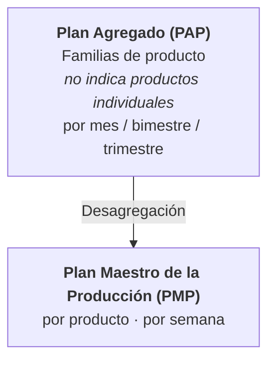
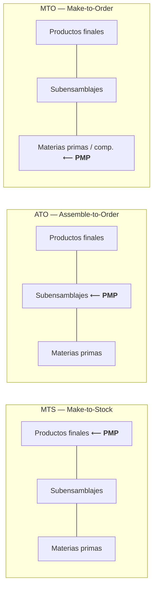
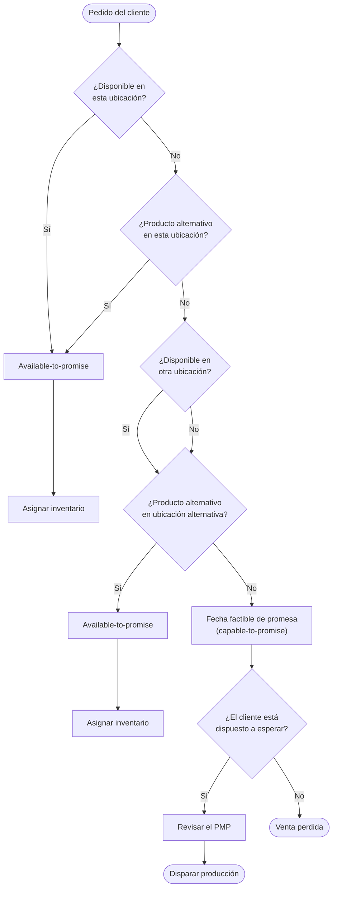
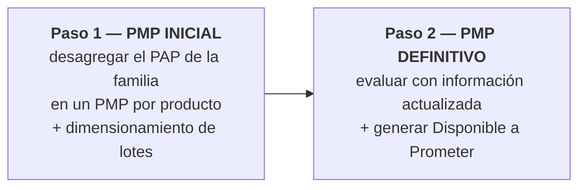

# Apunte 15 — Planificación Maestra de la Producción (PMP / MPS)

> **Unidad 5 — Planificación Jerárquica de la Producción.** Segunda presentación de la unidad. Toma la salida de la **Planificación Agregada (PAP, Apunte 14)** —que planifica **familias** por mes— y la **desagrega** en un plan **por producto y por semana**: el **Plan/Programa Maestro de la Producción (PMP / MPS)**. Desarrolla qué es el PMP y por qué es la **interfaz con los clientes**, los **entornos de producción** (*make-to-stock, assemble-to-order, make-to-order*) y dónde se ubica el PMP en cada uno, sus **entradas y salidas**, el cálculo del **Disponible a Prometer (ATP)** y el **procedimiento en dos pasos**: generar el **PMP inicial** (desagregación + dimensionamiento de lotes) y ajustarlo hasta el **PMP definitivo** (proyección de inventario + reglas de corrección). Cubre los tres temas del plan de la Unidad 5 referidos a PMP, entornos de producción y disponible a prometer.

**Docente responsable:** Dr. Ing. Pablo D. Villarreal

> **Nota terminológica.** La cátedra titula la presentación *"Programación Maestra de la Producción (Master Production Schedule)"* y usa de forma intercambiable **Plan Maestro de la Producción**, **Programa Maestro de la Producción** y **PMP**; el programa analítico lo nombra **Planificación Maestra de la Producción**. En inglés es el **MPS (*Master Production Schedule*)**. En este apunte se usa **PMP** como sigla general.

**Bibliografía de referencia (en línea con la Unidad 5):**

- Russell & Taylor, *Operations Management. Creating Value Along the Supply Chain* (7.ª ed.), John Wiley & Sons, 2011 — Capítulo 14 (*Sales and Operations Planning*; incluye el proceso de promesa de pedidos / ATP).
- F. Robert Jacobs & Richard B. Chase, *Operations and Supply Chain Management*, McGraw Hill, 2018 — Capítulo 19.

---

## Agenda de la presentación

1. Del Plan Agregado al Plan Maestro: la desagregación.
2. Qué es el PMP y sus características.
3. Entornos de producción (MTS, ATO, MTO).
4. El PMP según el entorno de producción.
5. PMP para entornos combinados.
6. Entradas y salidas del PMP.
7. El PMP y la verificación de capacidad.
8. Disponible a Prometer (ATP): concepto, fórmulas y proceso.
9. Procedimiento: PMP inicial → PMP definitivo (con reglas de corrección).

---

## 1. Del Plan Agregado al Plan Maestro

El PMP es el resultado de **desagregar** el Plan Agregado de Producción (PAP): se pasa del nivel de **familia/mes** al nivel de **producto/semana**.



| | Plan Agregado (PAP) | Plan Maestro (PMP) |
|---|---|---|
| **Unidad** | Familias de producto | Productos individuales |
| **Período** | Mes / bimestre / trimestre | Semana |
| **Nivel de la matriz jerárquica** | Familia ↔ planta | Producto ↔ centros críticos |

---

## 2. Qué es el PMP

> **PMP.** Es un **plan o programa de producción de productos** (ítems de **demanda independiente**) expresado en **cantidad por período**.

Características centrales:

- **Deriva del Plan Agregado:** trabaja **dentro de las restricciones** del plan de producción agregado.
- **Es la interfaz con los clientes:** actúa como la **"interfaz" principal** entre el sistema de producción y los **clientes externos**.
- **Representa lo que *necesita* producirse, no lo que *puede* producirse.** Las cantidades indican la necesidad; verificar si son alcanzables exige el **chequeo de capacidades** (ver §7).
- **Horizonte:** el horizonte del plan debe ser **mayor o igual** que el **tiempo de producción** del producto.
- **Permite combinar y evaluar políticas de producción**: *make-to-stock*, *make-to-order*, *assemble-to-order*.

---

## 3. Entornos de producción

El entorno define **en qué punto de la estructura del producto** se desacopla la producción de la demanda del cliente, y por lo tanto **a qué nivel se arma el PMP**.

| Entorno | Sigla | Influencia del cliente en el diseño | Ejemplos |
|---|:--:|---|---|
| **Fabricación para almacenamiento** | **MTS** (*Make-to-Stock*) | **Ninguna** sobre el diseño: el cliente solo elige **comprar o no** un producto ya terminado. Se produce para **stock** y sostener un nivel de servicio. | Productos de consumo masivo |
| **Armado bajo pedido** | **ATO** (*Assemble-to-Order*) | **Parcial**: el cliente influye combinando **subensamblajes / atributos opcionales**. Muchas materias primas y muchas combinaciones finales, pero **pocos subensamblajes**. | Automóviles, notebooks, bicicletas |
| **Fabricación bajo pedido** | **MTO** (*Make-to-Order*) | **Alta**: el cliente influye fuertemente en el diseño final. Se parte de **componentes estándar**, pero hay muchísimas formas de ensamblarlos. | Muebles de cocina / dormitorio |

### 3.1. Lectura geométrica (forma de la estructura de producto)

La presentación representa cada entorno con una **forma** cuyo **ancho a cada nivel** indica la **cantidad de ítems** (variedad) en ese nivel: arriba los **productos finales**, en el medio los **subensamblajes**, abajo los **componentes básicos / materias primas**.

```
        MTS                 ATO                 MTO
   (make-to-stock)    (assemble-to-order)   (make-to-order)

 finales  ▟██████▙       ▜██████▛            ▟██████▙
          ███████         ╲████╱              ╲█████╱
 subens.  ██████           ▐██▌                ╲███╱
          █████           ╱████╲                ╲█╱
 comp.    ▜████▛         ▟██████▙                ▔
        (ancho ≈        (reloj de arena:       (se angosta
        parejo)         angosto en el medio)   hacia abajo)
```

> La idea de fondo: **el PMP se ancla en el nivel "de control"** de cada entorno —el punto donde conviene programar—, que coincide con la parte más estratégica (y, en ATO, la más **angosta**) de la estructura.

---

## 4. El PMP según el entorno de producción



| Entorno | Nivel al que se arma el PMP | Qué cantidades representa el PMP |
|---|---|---|
| **MTS** | **Producto final** | Cantidades de **productos finales** |
| **ATO** | **Subensamblajes principales** | Cantidades de los **módulos / subensamblajes** principales |
| **MTO** | **Componentes / materiales principales** | Cantidades de los **componentes críticos** |

---

## 5. El PMP para entornos combinados

El PMP permite **combinar y evaluar** una política **make-to-stock** con una **make-to-order**, integrando **dos tipos de requerimientos (demanda)**:

- **Basados en pronósticos** → política **make-to-stock**.
- **Basados en órdenes de clientes confirmadas** → política **make-to-order**.

---

## 6. Entradas y salidas del PMP

### 6.1. Entradas

**Información requerida (cantidad) por producto y por período:**

- **Pronósticos** de mediano y corto plazo.
- Órdenes de clientes **confirmadas**.
- Órdenes de clientes **pendientes de entrega** (órdenes retrasadas).
- Órdenes de producción **en curso** (no finalizadas, que se esperan terminar dentro del horizonte).
- **Inventario actual** (al inicio del horizonte de planificación).

**Parámetros requeridos por producto:**

- **Stock de seguridad** ($Ss$).
- **Lote de producción**.

### 6.2. Salidas

**Información (cantidades) definida por producto:**

- **Plan de producción** (según el tamaño de lote).
- **Proyección de inventario disponible**.
- **Disponible a Prometer (*Available-to-Promise*, ATP)**: producción **no comprometida** a un cliente específico; es decir, la cantidad —de lo que se va a producir— que **puede comprometerse** a un cliente. Es la **diferencia** entre órdenes de clientes y producción planificada.

---

## 7. El PMP y la verificación de capacidad

> En principio, el PMP **no es un plan de producción ejecutable**: **no considera** las capacidades de los recursos.

Recién **luego de verificar la capacidad** (en la matriz jerárquica, vía *Rough-Cut Capacity Plan*) y de resultar **factible**, el PMP se convierte en un **plan ejecutable**.

---

## 8. Disponible a Prometer (ATP)

> **ATP — *Available-to-Promise*.** Es la **diferencia entre la producción planificada y las órdenes de clientes**: la **producción no comprometida** a un cliente específico, es decir, **cuánto puede prometerse** a un cliente cuando coloca una orden. Se emplea sobre todo en entornos **Make-to-Order** o **Assemble-to-Order**.

### 8.1. Fórmulas de cálculo

**Primer período:**

$$
ATP = I_0 + \big[\,OPC + Lote_{PMP}\,\big] - Ss - PPE - \!\!\sum_{\text{hasta el período previo al próximo lote}}\!\! PCC
$$

**Período en el que ingresa un lote de producción planificado:**

$$
ATP = \big[\,OPC + Lote_{PMP}\,\big] - \!\!\sum_{\text{hasta el período previo al próximo lote}}\!\! PCC
$$

En ambos casos: **si $ATP < 0 \Rightarrow ATP = 0$**.

Donde: $I_0$ = inventario inicial · $OPC$ = orden de producción en curso · $Lote_{PMP}$ = lote de producción que ingresa · $Ss$ = stock de seguridad · $PPE$ = pedidos pendientes de entrega · $PCC$ = pedidos comprometidos a clientes. La **sumatoria de $PCC$** se acumula **desde el período en cuestión hasta el período previo al ingreso del próximo lote planificado** (es decir, la "ventana" que ese lote debe cubrir).

> **Interpretación.** El ATP de un período con ingreso de lote es lo que ese lote (más lo que ya venía en curso) deja **libre** después de descontar los compromisos con clientes que debe cubrir hasta que entre el siguiente lote. Es la cantidad que un vendedor puede **prometer con seguridad** a un cliente nuevo.

### 8.2. Proceso de promesa de pedido (ATP / CTP)

Cuando llega un pedido, se recorre una cascada: si hay producto (o un alternativo) disponible **donde el cliente lo pide** o en **otra ubicación**, se **promete (ATP)** y se **asigna inventario**; si no, se evalúa una **fecha factible de promesa (*capable-to-promise*)** y, según el cliente espere o no, se **revisa el PMP y se dispara producción** o se **pierde la venta**.



> Diagrama adaptado de la diapositiva de cátedra (*Russell & Taylor*); resume la lógica de **disponible a prometer** frente a **factible a prometer (CTP)**.

---

## 9. Procedimiento de armado del PMP

El PMP se construye en **dos pasos**:



### 9.1. Paso 1 — Generar el PMP inicial

Consiste en **desagregar** el Plan Agregado de la familia en un PMP inicial **por cada producto**, dimensionando los lotes. La planilla típica (por producto, 12 semanas / 3 meses) tiene estas filas:

| Fila | Símbolo | Significado |
|---|:--:|---|
| Plan Agdo. del producto [u/semana] | $PA_s$ | Plan agregado del producto, distribuido por semana → **necesidades brutas** |
| Inv. en exceso s/Plan | $IE_s$ | Inventario en exceso al **inicio** de la semana |
| Orden Prod. en curso | $OPC_s$ | Producción ya lanzada que llega en la semana |
| Nec. Netas Producción | $NN_s$ | Necesidades **netas** de producción |
| PMP inicial del producto | $PMP_s$ | Lote(s) a producir según necesidades netas |

**Algoritmo:**

1. Tomar como entrada, para cada **período mensual $t$**, el **$PAP_t$ de la familia** de productos.
2. Calcular el **porcentaje de cada producto** según el **mix de ventas** de la familia.
3. **Por cada semana $s$:**
   1. Calcular el plan agregado del producto por semana $PA_s$ **distribuyendo** el valor mensual (p. ej., **distribución uniforme** entre las semanas del mes) → **necesidades brutas**.
   2. Calcular las **necesidades netas**:
      $$NN_s = PA_s - IE_s - OPC_s$$
      - **Si $NN_s < 0$** → **no** se requiere orden de producción: alcanza con el inventario en exceso más la producción en curso ($IE + OPC$).
      - **Si no** → se requiere **definir una orden** de producción **según el tamaño de lote**.
   3. Definir el **$PMP_s$** (si es requerido), según las necesidades netas y el lote de producción a usar.
   4. Calcular el **inventario en exceso al inicio del período siguiente**:
      $$IE_s = PMP_{s-1} - NN_{s-1}$$
      (lo que el lote de la semana previa produjo **por encima** de su necesidad neta y queda como excedente).

### 9.2. Paso 2 — Ajustar el PMP inicial y generar el PMP definitivo

Se **importa** el PMP inicial y se calcula la **proyección de inventario**. Aquí $I_s$ representa el **inventario al final** del período $s$:

$$
I_s = I_{s-1} + OPC_s + PMP_s - PPE_s - \underbrace{\big[\, \text{demanda consumida en } s \,\big]}_{\text{ver regla}}
$$

donde la **demanda consumida** en el período sigue la regla del **"mayor entre pronóstico y pedidos"**:

$$
\text{demanda}_s =
\begin{cases}
\max\big(PVCP_s,\; PCC_s\big) & \text{si } PVCP_s > 0 \;\lor\; PCC_s > 0 \\[4pt]
PVMP_s & \text{en caso contrario}
\end{cases}
$$

con $PVCP_s$ = pronóstico de ventas de **corto plazo**, $PCC_s$ = pedidos comprometidos a clientes y $PVMP_s$ = pronóstico de ventas de **mediano plazo**.

**Criterio de aceptación.** Para cada período $s$:

- **Si el inventario $\geq$ stock de seguridad** → el PMP inicial **cubre** la demanda: se **acepta** y es el **definitivo**.
- **Si no** → se debe **corregir** el PMP del período $s$ para volver a cumplir la condición de inventario.

#### Reglas para corregir el PMP

Sea $IF_t$ el **inventario final** del período $t$:

| Regla | Condición | Acción |
|:--:|---|---|
| **1** | $IF_t < Ss$ **y** $IF_{t+1} > Ss$ | **Adelantar** el lote programado de $t+1$ a $t$ |
| **2** | $IF_t < Ss$ **y** $IF_{t+j} < Ss\ \ \forall\, j>0$ | **Agregar** un lote de producción en $t$ |
| **3** | $IF_t > Ss + Lote$ **y** $IF_{t+1} < Ss + Lote$ | **Retrasar** el lote programado de $t$ a $t+1$ |
| **4** | $IF_t > Ss + Lote$ **y** $IF_{t+j} > Ss + Lote\ \ \forall\, j>0$ | **Quitar** el lote de producción programado en $t$ |

> **Lectura.** Las reglas 1–2 atacan **faltantes** (inventario por debajo del $Ss$): adelantar un lote ya programado o, si la escasez persiste, agregar uno nuevo. Las reglas 3–4 atacan **excesos** (inventario por encima de $Ss + Lote$, es decir, holgura para postergar): retrasar un lote o, si el exceso persiste, quitarlo. Una vez aplicada la corrección, se recalcula la proyección de inventario y se generan los **disponibles a prometer (ATP)** del PMP definitivo.

---

## 10. Cierre y conexión con el resto de la unidad

- El **PMP / MPS** desagrega el plan agregado (PAP, Apunte 14) a **producto/semana** y es la **interfaz con los clientes**; según el entorno (**MTS / ATO / MTO**) se ancla en distinto nivel de la estructura de producto.
- Sus **entradas** combinan pronósticos (corto y mediano plazo), pedidos confirmados/pendientes, producción en curso e inventario; sus **salidas** son el plan de producción, la proyección de inventario y el **ATP**.
- El método es **iterativo**: **PMP inicial** (desagregación + lotes) → **proyección de inventario** → **reglas de corrección** → **PMP definitivo** + **ATP**. La verificación de **capacidad** lo vuelve ejecutable.
- **Qué sigue:** el PMP definitivo (productos terminados / demanda independiente) alimenta la **Planificación de Requerimientos de Materiales (MRP, Unidad 6)**, que explota la **lista de materiales** para la demanda **dependiente**. La práctica de PMP (desagregación, PMP inicial/corregido y ATP) se trabaja en la **guía de ejercicios de PMP** de la cátedra.

---

> **Temas del plan analítico cubiertos (Unidad 5):** Planificación Maestra de la Producción · Entornos de Producción: make-to-stock, make-to-order, assemble-to-order · Disponible a prometer.
