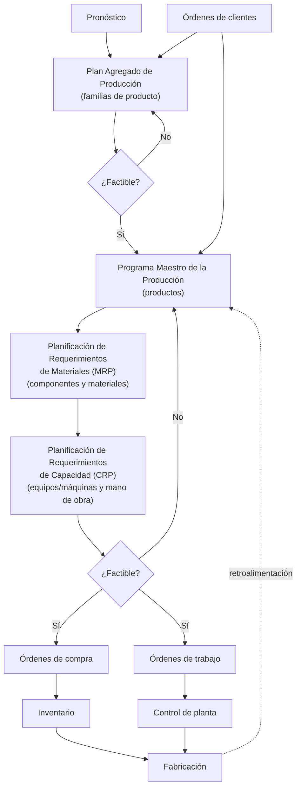
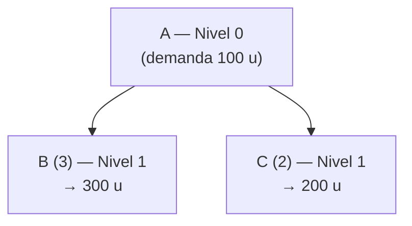
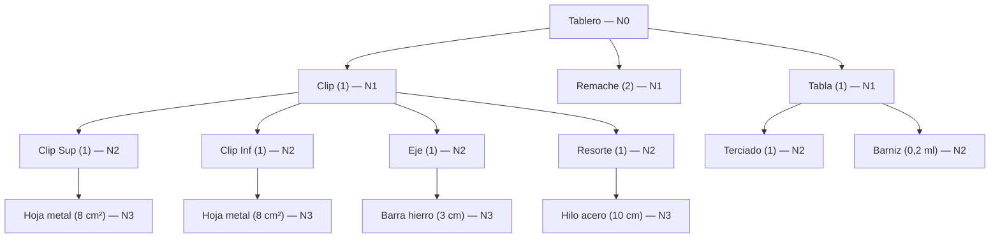
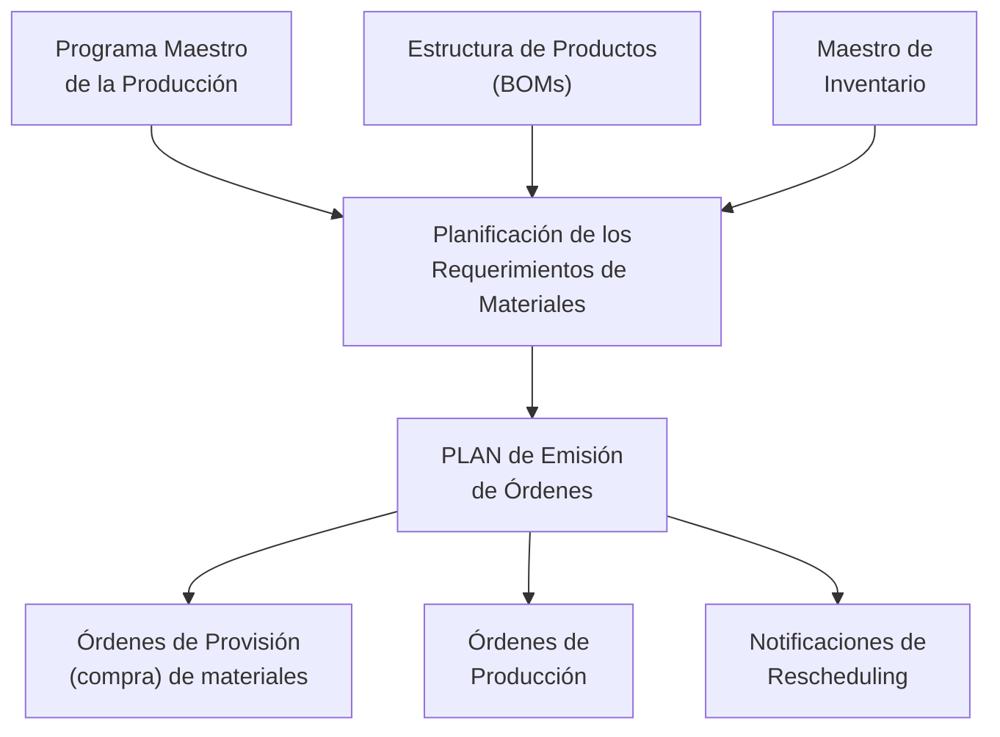
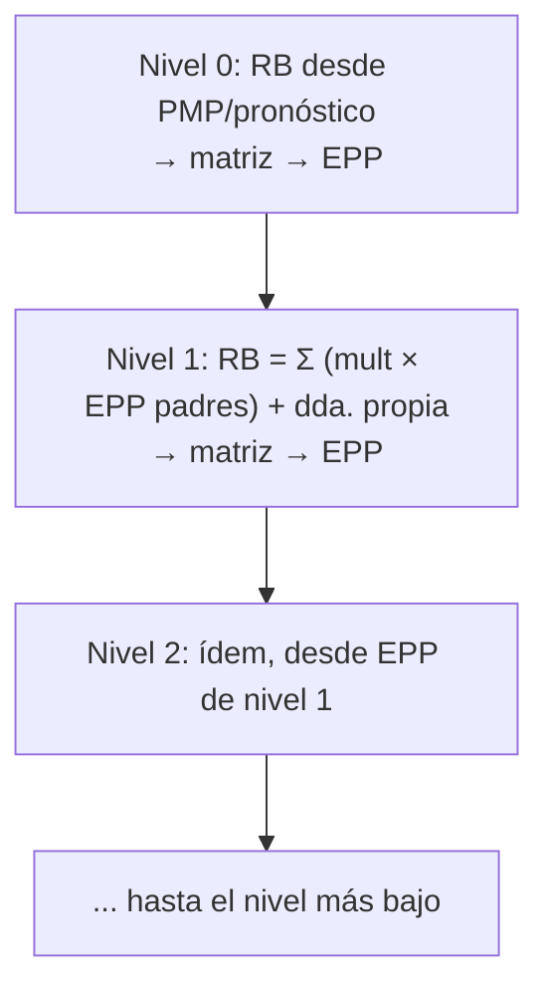

# Apunte 19 — Planificación de los Requerimientos de Materiales (MRP)

> **Unidad 6 — Planificación de los Requerimientos de Materiales.** Teoría completa del **MRP** (*Material Requirements Planning*): dónde encaja en la **planificación jerárquica de la producción**, qué problema resuelve (la **demanda dependiente** definida por la **lista de materiales**), cuáles son sus **entradas** (BOM, Programa Maestro de la Producción, registros de inventario) y **salidas** (plan de emisión de órdenes, proyecciones de inventario, reportes de acción), y el **procedimiento de cálculo** mediante la **matriz MRP** ítem por ítem y nivel por nivel. Cubre los cuatro temas del plan de la unidad. Bibliografía de cátedra: Russell & Taylor, *Operations Management* (7.ª ed., Wiley, 2011, cap. 15 *Resource Planning*); Jacobs & Chase, *Operations and Supply Chain Management* (McGraw Hill, 2018, cap. 21 *Material Requirements Planning*).

> **Cómo se ejercita.** El procedimiento de la matriz se aplica de punta a punta en el **caso de estudio resuelto** (Apunte 20) y en la **guía de ejercicios** (Apunte 21). Conviene leer este apunte y, en paralelo, seguir la matriz del caso resuelto para fijar la mecánica.

---

## 1. Dónde encaja el MRP: la planificación jerárquica de la producción

La planificación de operaciones se organiza en **niveles jerárquicos**: cada nivel planifica un **tipo de ítem** con un horizonte y un detalle distintos, y a cada plan de producción le corresponde un plan de **capacidad** y un **nivel de recurso**. El MRP ocupa el **nivel de componente**.

| Tipo de ítem | Planificación de la **producción** | Planificación de la **capacidad** | Nivel de recurso |
|---|---|---|---|
| **Familia** | Plan Agregado de Producción (*Aggregate Production Plan*) | Plan de Requerimientos de Recursos (*Resource Requirements Plan*) | Planta |
| **Producto** | Programa Maestro de la Producción (*Master Production Schedule*) | Plan de Capacidad Aproximada (*Rough-Cut Capacity Plan*) | Centros críticos de trabajo |
| **Componente** | **Plan de Requerimientos de Materiales (*Material Requirements Plan*)** | Plan de Requerimientos de Capacidad (*Capacity Requirements Plan*) | Todos los centros |
| **Operación** | Programa de Planta (*Shop Floor Schedule*) | Control de Entrada/Salida (*Input/Output Control*) | Equipo/máquina individual |

Cada nivel **alimenta** al siguiente (de familia a operación) y se **retroalimenta** con su contraparte de capacidad. El **MRP** toma como entrada el **Programa Maestro de la Producción** (PMP), lo *explota* a través de la **lista de materiales** y produce el plan de órdenes de **componentes, sub-ensamblajes y materiales comprados**. (Apuntes 14 y 15 para los niveles superiores: PAP y PMP.)

El flujo global de planificación, con sus controles de factibilidad, es:

---

## 2. Qué es un sistema MRP

Un **MRP** es un **sistema de información** para la **planificación de la producción y de los requerimientos de materiales** y el **control de inventarios**. Consiste en procedimientos para gestionar los inventarios de **productos terminados**, **ensamblajes**, **componentes** (productos intermedios) y **materiales a comprar** en un entorno de manufactura. Su rasgo distintivo es que **integra** los datos de inventario, materiales, producción y demanda en **una única base de datos centralizada**, en lugar de gestionar cada inventario con un sistema aislado.

Soporta una estrategia de gestión de las **operaciones internas** centrada en los requerimientos de materiales/productos, y modela la actividad de producción como un conjunto de **procesos relacionados con el material**:

- **producción** (ensamblaje),
- **gestión de inventario**,
- **compras**,
- **entregas** (a clientes).

### 2.1. Objetivos

- Mantener **niveles de inventario bajos**, evitando tanto **excesos** (capital inmovilizado, obsolescencia) como **faltantes** (paradas de producción).
- **Anticipar** la disponibilidad de materiales para la producción.
- **Planificar** las actividades de producción y de compras.

Para lograrlo, el sistema determina, para cada ítem, **cuánto** debe producirse o comprarse y **cuándo**: cuándo producir o comprar, y **cuándo emitir los pedidos** para que el material esté disponible justo en el momento en que se lo requiere. El resultado es un **plan** (*schedule*) de los **ítems requeridos**, las **cantidades** y las **fechas**.

### 2.2. ¿Cuándo conviene usar un MRP?

El MRP es la herramienta indicada cuando se dan estas condiciones:

- **Demanda dependiente:** la demanda del ítem se deriva de la de otro ítem (ver §3), no del mercado.
- **Demanda discreta:** los requerimientos llegan en **lotes** en momentos puntuales, no de forma continua.
- **Productos complejos:** listas de materiales **extensas o profundas**. El MRP **coordina** que todos los componentes estén disponibles **al mismo tiempo** para poder ensamblar.
- **Producción *job shop* / por lotes:** el MRP es aplicable principalmente a la **producción por lotes**.
- **Entornos *assemble-to-order*:** el cliente elige entre opciones; los componentes se **inventarían antes** de recibir la orden y el producto se **completa al recibirla**.

---

## 3. El problema que resuelve: demanda dependiente y la BOM

La distinción central es entre dos tipos de demanda:

- **Demanda independiente:** la de los **productos terminados**; depende del **mercado** y se obtiene por **pronóstico** (Unidad 3). Ej.: *100 mesas*.
- **Demanda dependiente:** la de los **componentes y materiales**; se **calcula** a partir de la demanda del producto padre y de la **lista de materiales**. Ej.: cada mesa lleva *1 tablero* y *4 patas* → *100 mesas → 100 tableros y 400 patas*.

A esto se suma el carácter **continuo vs. discreto** de la demanda: la demanda de productos terminados suele ser relativamente **continua/estable**, mientras que la de componentes, al consolidarse por lotes de producción, es típicamente **discreta** (picos en períodos puntuales).

> **Por qué no alcanza con la gestión tradicional de inventarios.** Si A se ensambla a partir de B y C, gestionar el inventario de A con un sistema y los de B y C con **otro sistema independiente** obliga a **coordinar manualmente** dos lógicas (parámetros, tiempos de provisión, costos) que en realidad están acopladas. El MRP **integra** esos inventarios: pronostica **solo A** y **deduce** B y C de la BOM.

### 3.1. Lista de materiales (BOM — *Bill of Materials*)

La **BOM** es el **documento de ingeniería** que especifica los **componentes, sub-ensamblajes y materiales** requeridos para producir un **producto final**, junto con la **secuencia de tareas** de producción. Se organiza por **niveles**: el **nivel 0** es el producto final; cada nivel inferior contiene los ítems que lo componen, con su **multiplicidad** (cantidad por unidad del padre).

Ejemplo mínimo: el producto **A** (nivel 0) requiere **3 unidades de B** y **2 de C** (nivel 1). Si la demanda de A es **100 u**, la demanda **dependiente** es:

$$
\text{Demanda}(B) = 3 \times 100 = 300 \text{ u} \qquad \text{Demanda}(C) = 2 \times 100 = 200 \text{ u}
$$

### 3.2. Ventajas frente a pronosticar todo

Como la demanda de B y C **se calcula** (no se pronostica):

- Se **reduce la incertidumbre**: solo el producto final arrastra error de pronóstico.
- Se **reducen los inventarios**: no hace falta stock de seguridad sobredimensionado en cada componente.
- Se **coordina** el inventario de materiales que se usan **conjuntamente** (llegan a la vez los que se necesitan a la vez).
- Se **manejan mejor los requerimientos discontinuos** (lotes).

### 3.3. Una BOM más realista (ejemplo del "Tablero")

La BOM puede tener varios niveles. El producto **Tablero** se arma con un **Clip**, **2 remaches** y una **Tabla**; el Clip a su vez se compone de **Clip Superior**, **Clip Inferior**, **Eje** y **Resorte**; y así sucesivamente hasta los materiales comprados (hoja de metal, barra de hierro, hilo de acero, terciado, barniz).

La misma BOM se suele tabular de forma **indentada** (la sangría marca el nivel):

| Nivel | Ítem | Unidad | Cantidad |
|:--:|---|:--:|--:|
| 0 | Tablero | u | 1 |
| · 1 | Clip | u | 1 |
| · · 2 | Clip Superior | u | 1 |
| · · · 3 | Hoja Metal | cm² | 8 |
| · · 2 | Clip Inferior | u | 1 |
| · · · 3 | Hoja Metal | cm² | 8 |
| · · 2 | Eje | u | 1 |
| · · · 3 | Barra Hierro | cm | 3 |
| · · 2 | Resorte | u | 1 |
| · · · 3 | Hilo de Acero | cm | 10 |
| · 1 | Remaches | u | 2 |
| · 1 | Tabla | u | 1 |
| · · 2 | Terciado | u | 1 |
| · · 2 | Barniz | ml | 0,2 |

A cada ítem se le asocia además su **tiempo de producción/provisión**, que es lo que permite **desplazar** las órdenes hacia atrás en el tiempo (§6).

---

## 4. Entradas y salidas del sistema MRP

El proceso MRP transforma **tres entradas** en un **plan de emisión de órdenes** y varios reportes:

### 4.1. Entradas

1. **Programa Maestro de la Producción (PMP):** define el **programa de requerimientos** de los **productos** (cuánto de cada producto terminado y en qué período). Es la **demanda independiente** de entrada al MRP. (Apunte 15.)
2. **Lista de Materiales (BOM):** la estructura de productos con multiplicidades y tiempos (§3).
3. **Registros de inventario (Archivo Maestro de Inventario):** el estado y los parámetros de cada ítem.

El **Archivo Maestro de Inventario** tiene dos partes:

| A — Maestro de datos (parámetros) | B — Estado de inventarios |
|---|---|
| `Nombre_item`, `ID_item` | Cantidades **disponibles** |
| **TS** (tiempo de suministro / *lead time*) | Cantidades **ordenadas** |
| **Stock de seguridad** | Cantidades **reservadas** |
| **Lote de pedido** (algoritmo / regla de lote) | |
| **Nivel** en la lista de materiales | |
| **% defectuosos** | |

### 4.2. Salidas

- **Informe primario / Plan de emisión de órdenes:** los **ítems requeridos**, las **cantidades** y las **fechas**, que se concretan en:
  - **Órdenes de provisión (compra)** de materiales,
  - **Órdenes de producción** (trabajo),
  - **Notificaciones de *rescheduling*** (reprogramar órdenes ya existentes).
- **Proyecciones de inventario** período a período.
- **Informes secundarios** (reportes de acción, excepciones, etc., ver §7).

---

## 5. La matriz MRP

El cálculo se hace con **una matriz por cada ítem**. La cabecera lleva los **parámetros** del ítem (nivel, regla de lote, tiempo de provisión) y las columnas son los **períodos**, precedidas por **PD**:

| Cabecera | Significado |
|---|---|
| **Ítem** | Nombre o número del ítem que se está programando. |
| **Nivel** | El nivel **más bajo** en el que aparece el ítem en la estructura de productos. |
| **Tamaño de orden** (lote) | La regla/política de lote (§6.2). |
| **Tiempo de provisión (TS)** | Tiempo desde que se **emite** una orden hasta que se **recibe** (*lead time*). |
| **PD** (*Past Due*) | Casillero de órdenes **retrasadas o infactibles** (vencidas). |

Las **seis filas** de la matriz, por período, son:

| Fila | Qué representa |
|---|---|
| **Requerimientos Brutos** ($RB_t$) | Cantidad total del ítem necesaria en el período. Para nivel 0 viene del PMP/pronóstico; para niveles inferiores, de la **emisión de pedidos planificados de los padres** (§6.1). |
| **Recepciones Programadas** ($RP_t$) | Cantidades **ya ordenadas** (órdenes en curso) que se **recibirán** en el período. |
| **Disponible Proyectado** ($D_t$) | Inventario **esperado al final** del período. |
| **Requerimientos Netos** ($RN_t$) | Cantidad que realmente **falta** cubrir en el período. |
| **Ingresos / Recepción de Pedidos Planificados** ($RPP_t$) | Requerimientos netos **ajustados por la regla de lote**: la orden que debe **llegar** en el período. |
| **Emisiones de Pedidos Planificados** ($EPP_t$) | Recepción planificada **desplazada hacia atrás** según el tiempo de provisión: cuándo hay que **emitir** la orden. |

### 5.1. Procedimiento de cálculo (por período)

Trabajando de izquierda a derecha, con $D_0$ = inventario inicial **por encima del stock de seguridad** $Ss$ (la convención de cátedra registra en la fila *Disponibilidades* el **margen sobre $Ss$**: si el inventario físico es $I_0$, entonces $D_0 = I_0 - Ss$):

1. **Requerimiento neto.** Lo que falta tras consumir lo disponible y lo ya programado:
$$
RN_t = \max\!\big(0,\; RB_t - RP_t - D_{t-1}\big)
$$

2. **Recepción planificada.** Se cubre $RN_t$ respetando la **regla de lote** $L(\cdot)$ (multiplicar al menos hasta cubrir el neto):
$$
RPP_t =
\begin{cases}
L(RN_t) & \text{si } RN_t > 0 \\[2pt]
0 & \text{si } RN_t = 0
\end{cases}
$$

3. **Disponible proyectado.** El margen que queda para el próximo período:
$$
D_t = D_{t-1} + RP_t + RPP_t - RB_t
$$

4. **Emisión planificada.** La recepción se **adelanta** $TS$ períodos (cuándo lanzar la orden):
$$
EPP_{\,t-TS} = RPP_t
$$

> **Lectura de la convención.** Como $D_t$ se lleva **neto de $Ss$**, el inventario **nunca debe caer por debajo de 0 en esa fila** (equivale a respetar el stock de seguridad). Cuando $RB_t$ haría caer $D_t$ por debajo de 0, ese déficit es exactamente $RN_t$, y la **recepción planificada** (ajustada a lote) lo levanta. Si una **emisión** cae en un período **anterior al 1** (o en **PD**), el plan **no es factible**: hay órdenes que deberían haberse lanzado en el pasado.

### 5.2. Ejemplo de matriz (ítem X)

Ítem **X**, **Nivel 0**, **Lote = 30**, **TS = 2**, inventario inicial **20**:

| X — N0 · Lote 30 · TS 2 | PD | 1 | 2 | 3 | 4 |
|---|--:|--:|--:|--:|--:|
| Requerimientos Brutos | | | 100 | 55 | 60 |
| Recepciones Programadas | | | 60 | | |
| Disponible Proyectado | 20 | 20 | 80 | ... | ... |
| Requerimientos Netos | | | | ... | ... |
| Ingresos de Órdenes Planificadas | | | | ... | ... |
| Emisión de Pedidos | | | 60 | | |

> El cuadro reproduce la diapositiva como **plantilla de lectura** (la presentación lo muestra parcialmente completo). La mecánica completa, con todos los renglones cerrados, está resuelta en el **Apunte 20**.

---

## 6. El proceso MRP completo: explosión por niveles

La matriz no se calcula ítem por ítem en cualquier orden, sino **nivel por nivel, de arriba hacia abajo** (*nivel 0 primero*). La razón es la dependencia: para conocer los requerimientos brutos de un componente hay que haber calculado **primero** la **emisión de pedidos** de **todos sus padres**.

### 6.1. Algoritmo

Para cada **nivel $i$** de la BOM, con $i \ge 0$:

1. **Obtener** los ítems del nivel $i$.
2. Determinar sus **requerimientos brutos**:
   - **Si $i = 0$** (productos/componentes finales): los $RB$ provienen de la **demanda estimada** (pronóstico) o del **Programa Maestro de la Producción**.
   - **Si $i > 0$**: los $RB$ de cada ítem se calculan a partir de la **emisión de pedidos planificados de sus ítems padre**, multiplicada por la **multiplicidad de la BOM**. Si además el ítem tiene **demanda independiente propia**, esta se **suma** a los requerimientos brutos.
3. **Calcular la matriz MRP** de cada ítem del nivel $i$.

$$
RB^{\text{(hijo)}}_t \;=\; \sum_{p \,\in\, \text{padres}} m_{p \to \text{hijo}} \cdot EPP^{\,p}_t \;+\; D^{\text{indep}}_t
$$

donde $m_{p \to \text{hijo}}$ es la cantidad de hijo por unidad de padre. Un ítem que aparece bajo **varios padres** (ej. el material **C** o **E** de los ejercicios) **acumula** las contribuciones de todos ellos antes de armar su matriz; por eso se lo coloca en su **nivel más bajo** y se lo procesa una sola vez, ya consolidado.

### 6.2. Reglas para el tamaño del lote

La función $L(\cdot)$ que ajusta el requerimiento neto a la orden efectiva puede seguir distintas **políticas**:

- **Lote a lote** (*lot-for-lot*): se pide **exactamente** las necesidades netas. Minimiza inventario; maximiza cantidad de pedidos.
- **Tamaño de lote fijo:**
  - **POQ** (*Periodic Order Quantity*): se fija el **período** de pedido (cada cuántos períodos se pide) y la cantidad varía para cubrir esa ventana.
  - **EOQ** (*Economic Order Quantity*): se pide la **cantidad económica** de pedido (Unidad 4).
- **Múltiplos de lote / tamaño de lote:** la orden es **múltiplo** de un tamaño base (ej.: lote = 200 → se pide 200, 400, 600...). Es la regla usada en el caso de estudio y la guía de la unidad.
- **Lote mínimo:** una cantidad mínima fija y, por encima, según necesidades.
- **Lote máximo:** un tope por orden.

---

## 7. Salidas de control: reportes de órdenes y de acción

Más allá del plan, el MRP emite **reportes** que sostienen la operación diaria.

### 7.1. Reporte de órdenes planificadas

Para cada ítem consolida su **estado** (disponible, en orden, asignado/reservado, *lead time*, lote, stock de seguridad) y un detalle período a período con **requerimientos brutos**, **recepciones programadas**, **proyección de disponible** y la **acción** sugerida cuando la proyección se vuelve crítica (p. ej., *expeditar* una recepción programada o *liberar* una orden de compra). Las órdenes se identifican con códigos:

| Código | Significado |
|:--:|---|
| **AL** | *Allocated* — asignado/reservado |
| **CO** | *Customer order* — orden de cliente |
| **PO** | *Purchase order* — orden de compra |
| **WO** | *Work order* — orden de trabajo |
| **SR** | *Scheduled receipt* — recepción programada |
| **GR** | *Gross requirement* — requerimiento bruto |

### 7.2. Reporte de acción

Lista **excepciones** que requieren intervención del planificador, con la **acción** recomendada sobre cada orden:

| Acción | Qué indica |
|---|---|
| **Expedite** | Adelantar una recepción programada (llega tarde para lo que se necesita). |
| **Move forward** | Adelantar una orden. |
| **Move backward** | Retrasar una orden (se necesita más tarde de lo planificado). |
| **De-expedite** | Desacelerar/retrasar una recepción programada. |
| **Release** | Liberar (emitir) una orden de compra (PO) o de trabajo (WO). |

Estos reportes son la cara **operativa** del *rescheduling*: el MRP no solo planifica órdenes nuevas, sino que señala **qué órdenes en curso reajustar** cuando cambian la demanda o las condiciones.

---

## 8. Síntesis

- El MRP planifica el **nivel de componente** dentro de la jerarquía de producción: toma el **PMP**, lo **explota** por la **BOM** y entrega el **plan de órdenes** de componentes y materiales.
- Resuelve la **demanda dependiente**: pronostica **solo los productos finales** y **calcula** el resto, reduciendo incertidumbre e inventario.
- Sus **tres entradas** son **PMP + BOM + registros de inventario**; sus **salidas**, el **plan de emisión de órdenes** (compra, producción, *rescheduling*) y las proyecciones/reportes.
- El **cálculo** se hace con la **matriz MRP** (seis filas) **ítem por ítem** y **nivel por nivel** (0 primero), encadenando la **emisión planificada** de cada padre con los **requerimientos brutos** de sus hijos, ajustando por la **regla de lote** y **desplazando** por el **tiempo de provisión**. Si una emisión cae en el pasado (**PD** o antes del período 1), el plan **no es factible**.

> **Continúa en:** Apunte 20 (caso de estudio resuelto: productos A, B, D + materiales C, E) y Apunte 21 (guía de ejercicios MRP).
