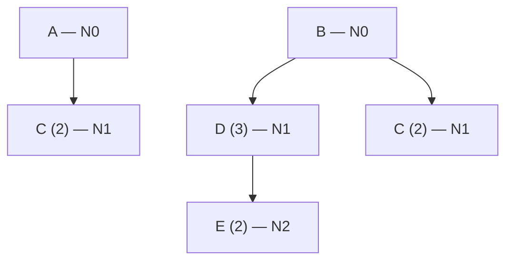

# Apunte 20 — Caso de estudio resuelto (MRP)

> **Unidad 6 — Planificación de los Requerimientos de Materiales.** Caso de estudio **resuelto de punta a punta** que aplica el procedimiento de la **matriz MRP** del Apunte 19: dos productos (**A** y **B**), un componente intermedio (**D**) y dos materiales comprados (**C**, **E**), con explosión **nivel por nivel** y desplazamiento por **tiempo de provisión**. Reúne el **enunciado** de cátedra (`…_02`, con las tablas en blanco) y la **solución** de cátedra (`…_03`, con las matrices completas), aquí transcripta y verificada celda a celda con la lógica MRP. **Tarea:** definir el **plan de órdenes de producción** para A, B y D, y el **plan de órdenes de compra** de materiales C y E.

> **Método de referencia:** Apunte 19, §5–§6 (matriz MRP, requerimientos netos, regla de lote por múltiplos, explosión por niveles). Aquí, la fila *Disponibilidades* se lleva **neta del stock de seguridad** ($D_0 = I_0 - Ss$).

---

## 1. Enunciado

Una empresa fabrica **A** y **B** y debe planificar sus órdenes en un horizonte de **8 períodos**. El **stock de seguridad** es de **50 unidades** para todos los productos y materiales.

### 1.1. Lista de materiales (BOM)

- **A** (nivel 0) requiere **2 C**.
- **B** (nivel 0) requiere **3 D** y **2 C**; cada **D** requiere **2 E**.
- **C** es material comprado y aparece bajo **A y B** (se procesa una sola vez, consolidando ambas contribuciones).
- **E** es material comprado, hijo de **D**.

### 1.2. Datos maestros y requerimientos brutos de productos

| Ítem | Nivel | Lote | TS | Inv. inicial | Ss |
|:--:|:--:|:--:|:--:|:--:|:--:|
| A | 0 | 200 | 1 | 120 | 50 |
| B | 0 | 300 | 2 | 230 | 50 |
| C | 1 | 500 | 2 | 190 | 50 |
| D | 1 | 400 | 2 | 450 | 50 |
| E | 2 *(ver §4)* | 500 | 2 | 250 | 50 |

**Requerimientos brutos de los productos finales** (vienen del Programa Maestro):

| Período | 1 | 2 | 3 | 4 | 5 | 6 | 7 | 8 |
|---|--:|--:|--:|--:|--:|--:|--:|--:|
| **A** | | 250 | | 300 | 100 | 350 | | 500 |
| **B** | 300 | 150 | | 200 | 300 | | 430 | |

**Recepciones programadas** (órdenes en curso): A → **200** en P1; B → **300** en P1; C → **500** en P1; D → **800** en P1.

> El lote sigue la política de **múltiplos**: la recepción planificada es el menor múltiplo del lote que cubre el requerimiento neto.

---

## 2. Resolución — productos de nivel 0 (A y B)

Para nivel 0, los **requerimientos brutos** salen del Programa Maestro. Se calcula, por período: $RN_t=\max(0,\,RB_t-RP_t-D_{t-1})$, la **recepción planificada** ajustada al lote, $D_t=D_{t-1}+RP_t+RPP_t-RB_t$, y la **emisión** desplazada $TS$ períodos.

### Ítem A — Nivel 0 · Lote 200 · TS 1 · ($D_0 = 120-50 = 70$)

| A | Inv/PD | 1 | 2 | 3 | 4 | 5 | 6 | 7 | 8 |
|---|:--:|--:|--:|--:|--:|--:|--:|--:|--:|
| Requerimientos Brutos | | | 250 | | 300 | 100 | 350 | | 500 |
| Recepciones Programadas | | 200 | | | | | | | |
| Disponibilidades | 120/**70** | 270 | 20 | 20 | 120 | 20 | 70 | 70 | 170 |
| Requerimientos Netos | | 0 | 0 | 0 | **280** | 0 | **330** | 0 | **430** |
| Recep. de Pedidos Planif. | | | | | 400 | | 400 | | 600 |
| **Emisión de Pedidos Planif.** | | | | **400** | | **400** | | **600** | |

> Lectura: en P4 falta cubrir 280 → se planifica una recepción de **400** (múltiplo de 200) que, con $TS=1$, se **emite en P3**. Lo mismo en P6 (neto 330 → 400, emisión P5) y P8 (neto 430 → 600, emisión P7).

### Ítem B — Nivel 0 · Lote 300 · TS 2 · ($D_0 = 230-50 = 180$)

| B | Inv/PD | 1 | 2 | 3 | 4 | 5 | 6 | 7 | 8 |
|---|:--:|--:|--:|--:|--:|--:|--:|--:|--:|
| Requerimientos Brutos | | 300 | 150 | | 200 | 300 | | 430 | |
| Recepciones Programadas | | 300 | | | | | | | |
| Disponibilidades | 230/**180** | 180 | 30 | 30 | 130 | 130 | 130 | 0 | 0 |
| Requerimientos Netos | | 0 | 0 | 0 | **170** | **170** | 0 | **300** | 0 |
| Recep. de Pedidos Planif. | | | | | 300 | 300 | | 300 | |
| **Emisión de Pedidos Planif.** | | | **300** | **300** | | **300** | | | |

> Con $TS=2$, las recepciones de P4, P5 y P7 se emiten en P2, P3 y P5 respectivamente.

---

## 3. Resolución — componente y materiales de nivel 1 (C y D)

Los requerimientos brutos de nivel 1 se obtienen **explotando la BOM**: se multiplica la **emisión de pedidos planificados de cada padre** por la multiplicidad.

### Ítem C — Nivel 1 · Lote 500 · TS 2 · ($D_0 = 190-50 = 140$)

C es hijo de **A (×2)** y de **B (×2)**. Se suman ambas contribuciones:

$$
RB_t(C) = 2\cdot EPP_t(A) + 2\cdot EPP_t(B)
$$

| C | Inv/PD | 1 | 2 | 3 | 4 | 5 | 6 | 7 | 8 |
|---|:--:|--:|--:|--:|--:|--:|--:|--:|--:|
| RB (desde A: 2×EPP A) | | | | 800 | | 800 | | 1200 | |
| RB (desde B: 2×EPP B) | | | 600 | 600 | | 600 | | | |
| **Requerimientos Brutos** | | | 600 | 1400 | | 1400 | | 1200 | |
| Recepciones Programadas | | 500 | | | | | | | |
| Disponibilidades | 190/**140** | 640 | 40 | 140 | 140 | 240 | 240 | 40 | 40 |
| Requerimientos Netos | | 0 | 0 | **1360** | 0 | **1260** | 0 | **960** | 0 |
| Recep. de Pedidos Planif. | | | | 1500 | | 1500 | | 1000 | |
| **Emisión de Pedidos Planif.** | | **1500** | | **1500** | | **1000** | | | |

> Netos cubiertos con múltiplos de 500: 1360 → **1500**, 1260 → **1500**, 960 → **1000**. Con $TS=2$, se emiten en P1, P3 y P5.

### Ítem D — Nivel 1 · Lote 400 · TS 2 · ($D_0 = 450-50 = 400$)

D es hijo de **B (×3)**: $RB_t(D) = 3\cdot EPP_t(B)$ = {P2: 900, P3: 900, P5: 900}.

| D | Inv/PD | 1 | 2 | 3 | 4 | 5 | 6 | 7 | 8 |
|---|:--:|--:|--:|--:|--:|--:|--:|--:|--:|
| Requerimientos Brutos | | | 900 | 900 | | 900 | | | |
| Recepciones Programadas | | 800 | | | | | | | |
| Disponibilidades | 450/**400** | 1200 | 300 | 200 | 200 | 100 | 100 | 100 | 100 |
| Requerimientos Netos | | 0 | 0 | **600** | 0 | **700** | 0 | 0 | 0 |
| Recep. de Pedidos Planif. | | | | 800 | | 800 | | | |
| **Emisión de Pedidos Planif.** | | **800** | | **800** | | | | | |

> Netos con múltiplos de 400: 600 → **800**, 700 → **800**. Emisiones (TS=2) en P1 y P3.

---

## 4. Resolución — material de nivel 2 (E) y factibilidad

**E es hijo de D (×2).** Sus requerimientos brutos derivan de la **emisión de D** {P1: 800, P3: 800}:

$$
RB_t(E) = 2\cdot EPP_t(D) = \{\,P1: 1600,\; P3: 1600\,\}
$$

> **Observación sobre el nivel.** El enunciado y la solución de cátedra rotulan la matriz de E como *"Nivel 1"*, pero en la **BOM** E es hijo de **D** (que es nivel 1), por lo que su **nivel más bajo es 2**. Esto **no altera el cálculo** (E se procesa después de D, su padre); se deja anotada la discrepancia del material original.

### Ítem E — Nivel 2 · Lote 500 · TS 2 · ($D_0 = 250-50 = 200$)

| E | PD | 1 | 2 | 3 | 4 | 5 | 6 | 7 | 8 |
|---|:--:|--:|--:|--:|--:|--:|--:|--:|--:|
| Requerimientos Brutos | | 1600 | | 1600 | | | | | |
| Recepciones Programadas | | | | | | | | | |
| Disponibilidades | 250/**200** | 100 | 100 | 0 | 0 | 0 | 0 | 0 | 0 |
| Requerimientos Netos | | **1400** | | **1500** | | | | | |
| Recep. de Pedidos Planif. | | 1500 | | 1500 | | | | | |
| **Emisión de Pedidos Planif.** | **⚠ 1500** | | **1500** | | | | | | |

La recepción planificada de **1500** que E necesita **en P1** debería **emitirse en P(−1)** (= **PD**, período vencido), porque $TS=2$. La cátedra muestra ese primer ciclo (neto 1400 → recepción 1500 → emisión 1500) cayendo en el casillero **PD**.

> **Factibilidad.** El plan **no es factible** tal como está: el material **E genera una orden retrasada**. La cadena **B → D → E** acumula tiempos de provisión (B: 2, D: 2, E: 2) que empujan la primera orden de E **antes del inicio del horizonte**. En la práctica esto dispara una acción correctiva (expeditar/anticipar la provisión de E, revisar el lote o el stock inicial, o adelantar el Programa Maestro de B). El segundo ciclo de E (recepción en P3) sí es factible: se emite en P1.

---

## 5. Plan de órdenes consolidado

**Órdenes de producción** (emisión de pedidos planificados):

| Período de emisión | 1 | 2 | 3 | 4 | 5 | 6 | 7 |
|---|--:|--:|--:|--:|--:|--:|--:|
| **A** (producir) | | | 400 | | 400 | | 600 |
| **B** (producir) | | 300 | 300 | | 300 | | |
| **D** (producir) | 800 | | 800 | | | | |

**Órdenes de compra de materiales** (emisión de pedidos planificados):

| Período de emisión | PD | 1 | 3 | 5 |
|---|--:|--:|--:|--:|
| **C** (comprar) | | 1500 | 1500 | 1000 |
| **E** (comprar) | ⚠ 1500 | | 1500 | |

> La marca **⚠** señala la orden **infactible** de E (debería emitirse antes del período 1). Es el resultado central del caso: el **encadenamiento de lead times** por la BOM puede volver **infactible** un plan aun cuando cada matriz individual cierre correctamente.
