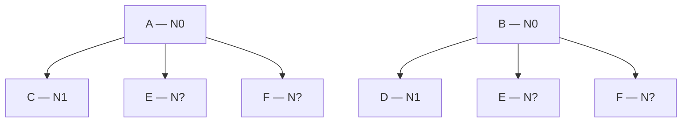
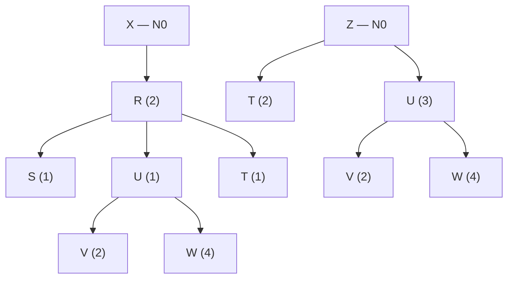

# Apunte 21 — Guía de ejercicios de MRP

> **Unidad 6 — Planificación de los Requerimientos de Materiales.** Guía de ejercicios para aplicar el **sistema MRP**: a partir del **Programa Maestro**, el **archivo maestro de inventario** y las **listas de materiales**, programar la **producción de productos/componentes** y la **compra de materiales**, y **determinar si el plan es factible** (que no genere órdenes retrasadas). Se transcriben los **enunciados** y se anota el **método** (Apuntes 19 y 20). La guía de cátedra entrega solo las **matrices en blanco**: **no publica soluciones numéricas**, por lo que aquí **no se fabrican** resultados (criterio de los Apuntes 10, 13 y 18).

> **Nota sobre la numeración.** El material provisto contiene los ejercicios rotulados **"Ejercicio 1"** y **"Ejercicio 3"**; **no** incluye un "Ejercicio 2". Se respeta la rotulación original.

> **Procedimiento (recordatorio del Apunte 19).**
> 1. Ordenar los ítems por **nivel** (nivel más bajo en la BOM) y procesar **de 0 hacia abajo**.
> 2. **Nivel 0:** requerimientos brutos = Programa Maestro. **Niveles > 0:** $RB_t=\sum_{\text{padres}} m\cdot EPP_t^{\text{padre}}$ (+ demanda independiente propia, si la hay). Un ítem con **varios padres** consolida todas las contribuciones antes de calcular su matriz.
> 3. Por período: $RN_t=\max(0,\,RB_t-RP_t-D_{t-1})$; recepción planificada por **regla de lote**; $D_t=D_{t-1}+RP_t+RPP_t-RB_t$ (neto de $Ss$); **emisión** desplazada $TS$ períodos.
> 4. **Factibilidad:** si alguna **emisión** cae en **PD** o antes del período 1, el plan **no es factible**.

---

## Ejercicio 1 — Productos A y B

Una empresa produce dos productos **A** y **B**.

### Listas de materiales

- **A** se compone de **C, E, F** (multiplicidad 1 cada uno).
- **B** se compone de **D, E, F** (multiplicidad 1 cada uno).
- **E** y **F** son **compartidos** por A y B → se consolidan sus dos contribuciones.

### Programa Maestro de la Producción

| Producto | 1 | 2 | 3 | 4 | 5 | 6 | 7 | 8 |
|---|--:|--:|--:|--:|--:|--:|--:|--:|
| **A** | | | 30 | | 60 | | 30 | |
| **B** | | 25 | | 45 | 60 | | 30 | |

### Archivo Maestro de Inventario

| Ítem | Existencias | Stock de Seguridad | Tiempo de Suministro | Tamaño de Lote (múltiplo) |
|:--:|--:|--:|--:|--:|
| A | 40 | 5 | 2 | 50 |
| B | 35 | 10 | 2 | 1 |
| C | 65 | 8 | 1 | 100 |
| D | 45 | 9 | 1 | 75 |
| E | 55 | 10 | 2 | 40 |
| F | 50 | 9 | 2 | 1 |

### Recepciones programadas

- **40 u de E** para el período 2.
- **50 u de F** para el período 2.

**Consigna:** aplicar el MRP para programar la producción de productos y la compra de materiales. **Determinar si el plan es factible** (no genera órdenes retrasadas).

> **Enfoque.**
> - **Niveles:** A y B son nivel 0; C, D, E, F son nivel 1 (todos hijos directos de un producto). **Orden de cálculo:** A y B → luego C, D, E, F.
> - **Lotes:** A en **múltiplos de 50**; C en **múltiplos de 100**; D en **múltiplos de 75**; E en **múltiplos de 40**; B y F **lote a lote** (múltiplo 1).
> - **Consolidación:** para **E** y **F**, sumar $EPP(A)+EPP(B)$ período a período antes de armar su matriz.
> - **Disponibilidades netas de $Ss$:** $D_0 = \text{Existencias}-Ss$ (p. ej., A: 40−5 = 35; C: 65−8 = 57; E: 55−10 = 45).
> - **Factibilidad:** vigilar los ítems con $TS=2$ (A, B, E, F): como sus padres también tienen $TS=2$, las emisiones se adelantan varios períodos; revisar que ninguna caiga antes del período 1.

---

## Ejercicio 3 — Productos X y Z

Una empresa produce dos productos **X** y **Z**.

### Listas de materiales

- **X** → **R (2)**; **R** → **S (1), U (1), T (1)**; **U** → **V (2), W (4)**.
- **Z** → **T (2), U (3)**; **U** → **V (2), W (4)**.
- **Ítems compartidos:** **T** (bajo R y bajo Z), **U** (bajo R y bajo Z), **V** y **W** (bajo cada U). Se consolidan todas las contribuciones.

### Programa Maestro de la Producción

| Producto | 1 | 2 | 3 | 4 | 5 | 6 | 7 | 8 |
|---|--:|--:|--:|--:|--:|--:|--:|--:|
| **X** | | | | | | 150 | | 250 |
| **Z** | | | | | 100 | | | 350 |

### Archivo Maestro de Inventario

| Ítem | Existencias | Stock de Seguridad | Tiempo de Suministro | Tamaño de Lote (múltiplo) |
|:--:|--:|--:|--:|--:|
| X | 30 | 5 | 1 | 200 |
| Z | 50 | 10 | 2 | 150 |
| R | 35 | 5 | 2 | 1 |
| T | 110 | 20 | 2 | 400 |
| U | 140 | 20 | 2 | ≥ 500 |
| S | 110 | 10 | 1 | 1 |
| V | 175 | 25 | 1 | 900 |
| W | 190 | 30 | 1 | 1500 |

### Recepciones programadas

- **400 u de T** para el período 2.
- **1800 u de V** para el período 1.
- **3000 u de W** para el período 1.

**Consigna:** aplicar el MRP para programar la producción de productos y componentes, y la compra de materiales. **Determinar si el plan es factible**.

> **Enfoque.**
> - **Niveles (por el nivel más bajo en que aparece cada ítem):** X, Z → 0; R → 1; T, U → 2 (T y U aparecen bajo R, que es nivel 1, y U además bajo Z; el nivel más bajo de T y de U es 2); S → bajo R (nivel 1) → su nivel más bajo es 2; V, W → bajo U (nivel 2) → nivel 3. **Orden de cálculo:** X, Z (0) → R (1) → T, U, S (2) → V, W (3).
> - **Explosión con multiplicidades > 1:** atención a los factores (R×2 desde X; T×1 y U×1 desde R; T×2 y U×3 desde Z; V×2 y W×4 desde U). Para **V** y **W**, $RB = 2\cdot EPP(U)$ y $4\cdot EPP(U)$ respectivamente, con $EPP(U)$ ya consolidado de sus dos orígenes (vía R y vía Z).
> - **Lote especial de U:** "**≥ 500**" indica un **lote mínimo** de 500 (pedir al menos 500 y, por encima, según necesidad), no un múltiplo de 500.
> - **Disponibilidades netas de $Ss$:** $D_0=\text{Existencias}-Ss$ (p. ej., X: 30−5 = 25; T: 110−20 = 90; U: 140−20 = 120; V: 175−25 = 150; W: 190−30 = 160).
> - **Factibilidad:** la BOM es **profunda** (hasta nivel 3) y varios ítems tienen $TS=2$ (Z, R, T, U). El encadenamiento **X → R → U → V/W** acumula lead times; vigilar especialmente que las emisiones de **V** y **W** (nivel 3) no caigan en **PD**. Las recepciones programadas de T, V y W en P1–P2 están justamente para **amortiguar** ese arranque.

---

## Cómo verificar el resultado

1. **Coherencia de la explosión:** los requerimientos brutos de cada hijo deben coincidir con la suma de (multiplicidad × emisión planificada) de **todos** sus padres, período a período.
2. **No negatividad:** la fila *Disponibilidades* (neta de $Ss$) nunca debe quedar por debajo de 0; si lo haría, ese déficit es el requerimiento neto que la recepción planificada (ajustada al lote) debe cubrir.
3. **Desplazamiento por TS:** cada recepción planificada en el período $t$ tiene su emisión en $t-TS$.
4. **Factibilidad:** si **alguna** emisión cae en **PD** (o antes del período 1), el plan **no es factible** y debe corregirse (anticipar el Programa Maestro, revisar lotes/stock inicial o expeditar provisiones).
