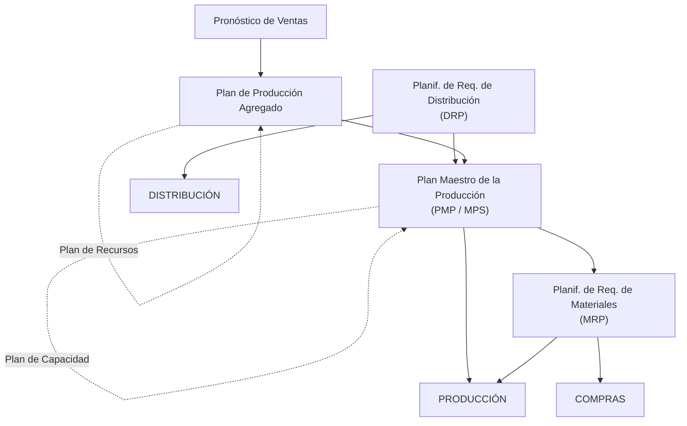
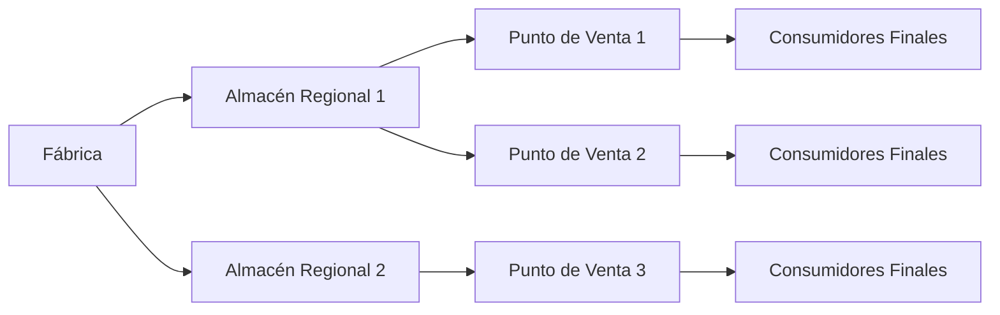
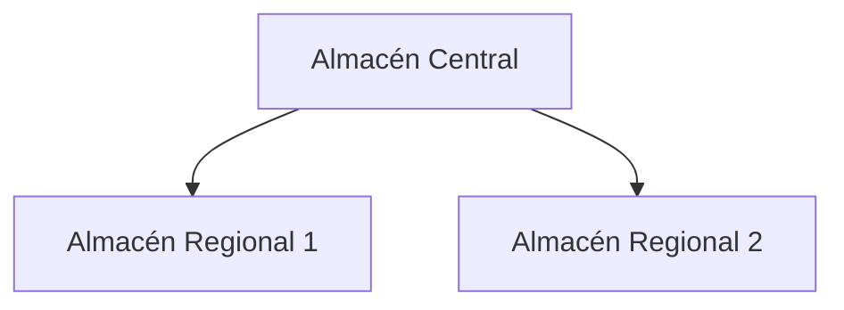
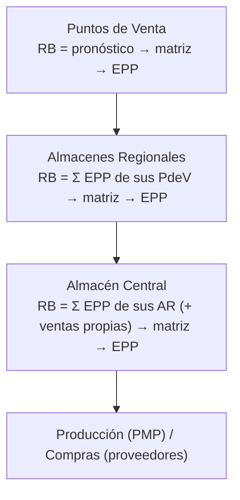

# Apunte 22 — Planificación de los Requerimientos de Distribución (DRP)

> **Unidad 7 — Planificación de los Requerimientos de Distribución.** Teoría completa del **DRP** (*Distribution Requirements Planning*): dónde encaja en la **planificación jerárquica** (es el espejo del MRP, pero sobre la **red de distribución** en lugar de la **estructura del producto**), qué problema resuelve (gestionar de forma **integrada y sincronizada** los inventarios de producto final a lo largo de los **canales de distribución**), cuáles son sus **entradas** (lista de distribución, pronósticos en los puntos de venta, inventarios, parámetros) y **salidas** (qué/cuánto/cuándo/dónde despachar, y la **demanda agregada** que alimenta al PMP), y el **procedimiento de cálculo** con la **matriz DRP** —idéntica a la del MRP— recorriendo la red **desde los puntos de venta hacia el almacén central**. Cubre los tres temas del plan de la unidad. Bibliografía de cátedra: Russell & Taylor, *Operations Management* (7.ª ed., Wiley, 2011); Jacobs & Chase, *Operations and Supply Chain Management* (McGraw Hill, 2018).

> **Cómo se ejercita.** El procedimiento de la matriz se aplica de punta a punta en el **caso de estudio resuelto** (Apunte 23) y en la **guía de ejercicios** (Apunte 24). Conviene leer este apunte y, en paralelo, seguir las matrices del caso resuelto para fijar la mecánica. **Requisito previo:** la matriz MRP del Apunte 19, porque el DRP **reutiliza la misma matriz de seis filas** y la misma lógica de lote y desplazamiento por *lead time*.

---

## 1. Dónde encaja el DRP: planificación de la producción y de la distribución

La planificación jerárquica de operaciones (Apuntes 14, 15 y 19) parte del **pronóstico de ventas** y baja por niveles: del **Plan Agregado** al **Plan Maestro (PMP)** y de ahí al **MRP** (materiales) y al programa de planta. El **DRP** es la pieza que cubre la otra mitad del sistema: el **flujo de los productos terminados hacia el mercado** a través de la **red de distribución**.

La idea clave que aparece en la presentación es que el DRP **no cuelga por debajo** del PMP como el MRP, sino que lo **alimenta por el costado**: el DRP consolida la demanda de toda la red logística y entrega ese **total agregado** como **demanda de entrada al PMP** (§8). En el ciclo *Plan Agregado → Plan Operacional → Ejecución*, el DRP vive en el **plan operacional** de la distribución, en paralelo al de producción y compras.

---

## 2. La distribución como problema

### 2.1. Función de distribución y la pregunta central

> **Función / Operación de Distribución:** proveer los productos a los clientes en la **cantidad**, el **momento** y el **lugar** solicitados.

La operación se apoya en una **red (canal) de distribución**: una estructura de **localizaciones de inventario** —fábrica, almacenes regionales, almacenes locales / puntos de venta— por la que el producto final viaja hasta el **consumidor final**. En cada localización hay **inventario de producto final**.

La pregunta que organiza la unidad es: **¿cómo gestionar en forma integrada y sincronizada los inventarios** de producto final a lo largo de todos los canales/redes de distribución de una organización?

### 2.2. Enfoque tradicional y por qué falla

En el **enfoque tradicional**, cada localización gestiona **su propio inventario de forma aislada**: tiene su *Sistema de Gestión de Inventario* con su **pronóstico**, sus **parámetros** (tiempo de provisión, costos) y emite **órdenes hacia aguas arriba** (el punto de venta pide al almacén regional, el regional al almacén central, el central a la fábrica o al proveedor).

El defecto es que **cada nodo pronostica la demanda del nodo de abajo** en lugar de **conocerla**. Eso arrastra una lista de problemas:

- Se **incrementa la incertidumbre** a lo largo del canal (cada eslabón suma su propio error de pronóstico — es el germen del **efecto látigo** que verá la Unidad 9).
- Hay que **pronosticar en cada lugar** de almacenamiento, no solo donde hay ventas reales.
- Se necesitan **stocks de seguridad mayores y en todos los nodos**.
- **No hay visión global** ni seguimiento de las cantidades almacenadas en todo el canal.
- **Falta integración** entre los almacenes del canal.
- Se implementan **sistemas independientes** para producción, logística y compras, que después deben **intercambiar** información de inventario y pronósticos.
- Se **dificulta anticipar** los faltantes ante cambios de demanda u otros eventos.

---

## 3. El enfoque DRP: demanda dependiente por ubicación

La idea del DRP es la misma intuición que el MRP, trasladada de la **estructura del producto** (BOM) a la **estructura de la red** (lista de distribución):

- En un **punto de venta** (atiende al consumidor final) la demanda es **independiente** → se obtiene por **pronóstico**.
- En un **punto intermedio sin ventas** (almacén regional, almacén central, centro de reexpedición) la demanda es **dependiente**: **no se pronostica**, se **calcula** sumando lo que pidan los nodos que ese punto abastece.

Esto invierte la lógica del enfoque tradicional: en lugar de que cada nodo *pronostique* a su cliente interno, el nodo de abajo le **comunica su plan de pedidos** (su emisión planificada), y el de arriba lo **toma como requerimiento bruto**. Las consecuencias que destaca la presentación:

- **Sin pronósticos** en los puntos intermedios (solo en los puntos de venta).
- **No se usan puntos de pedido** (*re-order points*): el DRP no espera a que el inventario baje de un umbral.
- Planificación **proactiva, no reactiva**: se planifica anticipadamente *qué, cuánto y cuándo* despachar a cada punto de venta o almacén intermedio, o pedir a la planta, o comprar a proveedores.

> **Por qué importa.** Al pronosticar **solo donde hay ventas reales** y *calcular* todo lo demás, el DRP reduce la incertidumbre, baja los stocks de seguridad totales y da una **visión única e integrada** del canal —exactamente los problemas del enfoque tradicional de §2.2.

---

## 4. Qué es el DRP: definición y funciones

> **Definición.** El DRP es un **proceso** que **determina las necesidades por unidad de producto en un lugar de almacenamiento** para un **horizonte de tiempo definido**, y **garantiza que las fuentes de suministro tendrán capacidad para satisfacer la demanda**. **Planifica y controla el flujo de materiales a lo largo de una red de distribución / suministro.**

### 4.1. Funciones principales

- **Planificación de los pedidos de abastecimiento** (qué reponer en cada localización y cuándo).
- **Seguimiento de los pedidos**: pedidos **en tránsito** y pedidos **pendientes**.
- **Asignación de suministros** (repartir lo disponible entre las localizaciones).
- **Planificación de los envíos**.
- **Generación de la previsión de demanda para producción**: el total agregado que entra al **PMP/MRP** (§8).

---

## 5. Entradas del DRP

### 5.1. Conceptos y términos

| Término | Significado |
|:--:|---|
| **ISL** (*Inventory Stocking Location*) | Lugar de almacenamiento de inventario. |
| **SKU** (*Stock Keeping Unit*) | Unidad de producto en inventario. |
| **AC** | Almacén Central. |
| **AR** | Almacén Regional. |
| **AL** | Almacén Local (almacén en el punto de venta). |
| **PR** | Punto (Centro) de Reexpedición. |

### 5.2. Lista de distribución

La **lista de distribución** es una **estructura en árbol** que representa el modelo de la **red / canal de distribución** para **cada producto (SKU)**. Es el análogo de la **BOM** del MRP, pero en vez de descomponer un producto en componentes, describe **por qué localizaciones pasa** el producto.

A diferencia de la BOM, **no hay multiplicidades**: el producto no se transforma, solo se traslada, así que el factor entre un nodo y el de aguas arriba es **1**. Por la red circulan **dos flujos en sentidos opuestos**: el **flujo de materiales** baja (del AC hacia los AR y los puntos de venta) y el **flujo de información** sube (los puntos de venta comunican sus pedidos planificados hacia el AC).

> **Agregación de previsiones.** Las previsiones de venta por SKU se **agregan desde los puntos de venta (PdeV) hacia el Almacén Central**. El árbol puede incluir un **Punto de Reexpedición**, que recibe del AC o de un AR y redistribuye a varios almacenes locales sin mantener inventario propio de venta.

### 5.3. Fuentes de suministro

Cada ISL se abastece de una de **tres fuentes** posibles:

| Fuente | Tipo | Ejemplo |
|---|:--:|---|
| **Logística** | Interna | Un **AR** es abastecido por un **AC** (ambos de la misma empresa). |
| **Producción** | Interna | Un **AC** es abastecido por la **fábrica** (misma empresa). |
| **Compra** | Externa | Un **AC** o **AR** es abastecido por un **proveedor** externo. |

El tipo de fuente determina qué genera el DRP en ese punto: una **orden de traslado** (logística), una **orden de producción** (entra al PMP) o una **orden de compra** (a proveedores).

### 5.4. Datos de entrada

Para correr el DRP se necesita, por producto y por localización:

- **Lista de distribución** por cada producto.
- **Pronóstico de ventas** por SKU y por cada **ISL con punto de venta**.
- **Pedidos de clientes** a entregar.
- **Órdenes de provisión / compra / producción pendientes** de entrega (lo que está **en tránsito**).
- **Plazo de suministro** (logística / compra / producción) — el *lead time* (TS).
- **Inventario disponible** por SKU y por ISL.
- **Stock de seguridad** ($Ss$) por SKU y por ISL.
- **Lote** de provisión, compra o fabricación.

---

## 6. Salidas del DRP

**Salida principal:** **qué** producto se necesita, **cuánto**, **cuándo** y **dónde** (el plan de despachos/órdenes por ISL y período).

**Salidas secundarias:**

- **Inversión en inventarios** necesaria por ISL y **total**.
- **Nivel de producción y/o compra** necesario por SKU y por **fuente de suministro**.
- **Espacio, mano de obra y capacidad de equipos** requeridos en cada ISL y en cada Centro de Reexpedición.

---

## 7. La matriz DRP

El cálculo se hace con **una matriz por cada par (SKU, ISL)**. La cabecera lleva los **parámetros** —SKU, ISL, **lote**, **tiempo de suministro (TS)**, **stock de seguridad ($Ss$)**— y las columnas son los **períodos** (con un casillero **actual / PD** al inicio para el estado de partida y las órdenes vencidas). **Es la misma matriz de seis filas del MRP** (Apunte 19, §5); solo cambian los nombres de algunas filas según el ISL.

| Fila (intermedio) | Fila (punto de venta) | Qué representa |
|---|---|---|
| **(1) Requerimientos Brutos** | **(1) Pronóstico de Ventas** | La demanda del período. En un **PdeV** es el **pronóstico** (demanda independiente); en un **nodo intermedio** es la **suma de las emisiones planificadas** de los ISL que abastece (demanda dependiente). |
| **(2) En tránsito** | **(2) En tránsito** | Órdenes ya emitidas que se **recibirán** en el período (= recepciones programadas). |
| **(3) Disponibilidades** | **(3) Disponibilidades** | Inventario proyectado al final del período, **neto del stock de seguridad** ($D_0 = I_0 - Ss$). |
| **(4) Requerimientos Netos** | **(4) Requerimientos Netos** | Lo que falta cubrir: $\max(0,\,RB_t - \text{tránsito}_t - D_{t-1})$. |
| **(5) Recepción de Pedidos Planificado** | **(5) Recepción de Pedidos Planificado** | Requerimiento neto **ajustado a la regla de lote**: la orden que debe **llegar** en el período. |
| **(6) Emisión de Pedidos Planificados** | **(6) Emisión de Pedidos Planificados** | La recepción **desplazada hacia atrás** $TS$ períodos: cuándo **emitir** la orden. |

### 7.1. Procedimiento de cálculo (por período)

Con $D_0 = I_0 - Ss$ (la fila *Disponibilidades* se lleva **neta de $Ss$**):

$$
RN_t = \max\!\big(0,\; RB_t - T_t - D_{t-1}\big)
$$

$$
RPP_t = \begin{cases} L(RN_t) & RN_t > 0 \\ 0 & RN_t = 0 \end{cases}
\qquad\qquad
D_t = D_{t-1} + T_t + RPP_t - RB_t
$$

$$
EPP_{\,t-TS} = RPP_t
$$

donde $T_t$ es lo en tránsito que llega en $t$ y $L(\cdot)$ ajusta el neto al **lote** (p. ej., el menor múltiplo del lote que cubre $RN_t$). Igual que en el MRP: si una **emisión** cae en un período **anterior al 1** (o en **PD**), el plan **no es factible**.

### 7.2. Dirección del recorrido: de las hojas hacia la raíz

A diferencia del MRP —que **explota hacia abajo** (producto → componentes)—, el DRP **agrega hacia arriba**: se calculan **primero los puntos de venta** (cuya demanda es el pronóstico), y la **emisión planificada** de cada uno se vuelve el **requerimiento bruto** del ISL que lo abastece. Se sube nivel a nivel hasta el **Almacén Central**, cuya emisión es el pedido final a **producción** o a **proveedores**.

Un ISL que abastece a **varios** nodos (un AR con varios PdeV, o el AC con varios AR) **suma** las emisiones de todos ellos para armar su requerimiento bruto. Un nodo que además **vende directo** (p. ej., el AC que atiende a un cliente local) **suma su propio pronóstico** a esos requerimientos dependientes.

---

## 8. DRP y MRP: misma matriz, direcciones opuestas

El DRP y el MRP comparten **exactamente** la mecánica de cálculo (la matriz de seis filas, la regla de lote, el desplazamiento por *lead time* y el chequeo de factibilidad). Lo que cambia es **sobre qué estructura** operan y **en qué sentido** la recorren:

| | **MRP** (Unidad 6) | **DRP** (Unidad 7) |
|---|---|---|
| Estructura que recorre | **Lista de materiales (BOM)** — composición del producto | **Lista de distribución** — topología de la red |
| Naturaleza de la dependencia | Un producto se **transforma** en/desde componentes | Un producto se **traslada** entre localizaciones |
| Multiplicidad | **De la BOM** (≥ 1: "2 C por A") | Siempre **1** (no hay transformación) |
| Sentido del cálculo | **Hacia abajo** (nivel 0 → componentes → materiales) | **Hacia arriba** (puntos de venta → AR → AC) |
| De dónde sale el RB de nivel 0 | Del **PMP** | Del **pronóstico** en los puntos de venta |
| Qué entrega al final | Órdenes de producción y compra de **materiales** | Despachos por ISL **+** demanda agregada al **PMP** |
| Matriz de cálculo | **La misma** (6 filas) | **La misma** (6 filas) |

La relación entre ambos cierra el circuito de la planificación:

> El sistema **DRP** establece la **vinculación y sincronización** entre el **mercado** (demanda), la **administración de la demanda** y el **plan maestro de la producción**. En una empresa de producción, integra **logística, producción y compras**: genera los **totales de demanda de todo el sistema logístico**, y ese total es **la entrada de demanda del PMP**.

Es decir: el DRP **convierte** la demanda dispersa del mercado (muchos puntos de venta, muchos pronósticos) en un **único requerimiento agregado y temporizado** en el Almacén Central, que el **PMP** toma como su demanda independiente. Aguas abajo de ese PMP corre el **MRP** (Apunte 19). Así, **DRP → PMP → MRP** encadena distribución, producción y materiales en un solo flujo planificado.

---

## 9. Síntesis

- El **DRP** planifica el **flujo de productos terminados** por la **red de distribución**: es el **espejo del MRP**, pero sobre la **topología de la red** (lista de distribución) en vez de la **estructura del producto** (BOM).
- Resuelve los problemas del **enfoque tradicional** (incertidumbre acumulada, pronósticos y stocks de seguridad en cada nodo, falta de integración) **pronosticando solo en los puntos de venta** y **calculando** (demanda dependiente) todo lo demás. Sin puntos de pedido; planificación **proactiva**.
- Sus **entradas** son la **lista de distribución**, los **pronósticos en los PdeV**, los inventarios, lo en tránsito y los parámetros (TS, $Ss$, lote); su **salida principal** es **qué/cuánto/cuándo/dónde** despachar, más la **demanda agregada** que alimenta el **PMP**.
- El **cálculo** usa la **misma matriz de seis filas del MRP**, pero recorriendo la red **de los puntos de venta hacia el Almacén Central**, con **multiplicidad 1**. Si una emisión cae en **PD**, el plan **no es factible**.

> **Continúa en:** Apunte 23 (caso de estudio resuelto: productos P1, P2, P3 en una red AC → AR BsAs / AR Córdoba → AL1–AL4) y Apunte 24 (guía de ejercicios de DRP).
