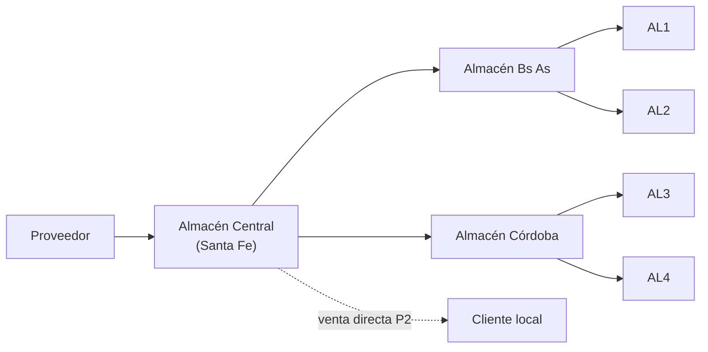
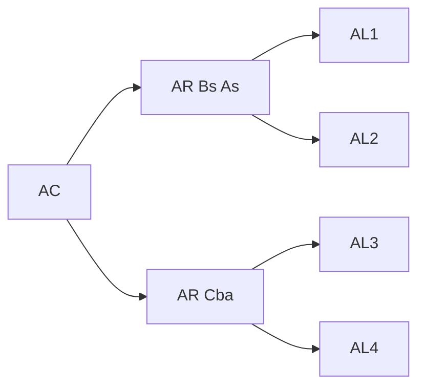
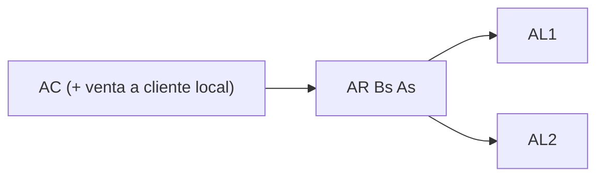
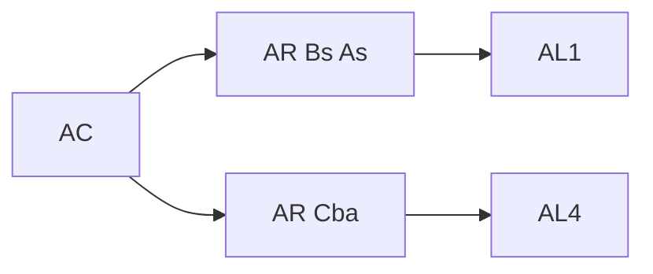

# Apunte 23 — Caso de estudio resuelto (DRP)

> **Unidad 7 — Planificación de los Requerimientos de Distribución.** Caso de estudio que aplica el procedimiento de la **matriz DRP** del Apunte 22 sobre una red de distribución real: una empresa que comercializa **tres productos (P1, P2, P3)** a través de **cuatro almacenes locales**, abastecidos por **dos almacenes regionales** (Bs As y Córdoba) desde un **Almacén Central**, que a su vez compra a un **único proveedor**. Primero se arman las **listas de distribución** y se cuentan **pronósticos** y **tablas DRP** necesarias (incisos a–d); luego se **resuelve el DRP completo del producto P2** (inciso e), recorriendo la red **desde los puntos de venta hacia el Almacén Central**. Reúne el **enunciado** de cátedra (`…_02`, con las tablas en blanco) y la **solución** de cátedra (`…_03`), aquí transcripta y **verificada celda a celda**.

> **Método de referencia:** Apunte 22, §7–§8 (matriz DRP, agregación hacia la raíz, pronóstico en los puntos de venta y requerimientos brutos en los nodos intermedios). La fila *Disponibilidades* se lleva **neta del stock de seguridad** ($D_0 = I_0 - Ss$), igual que en el MRP (Apunte 19/20).

---

## 1. Enunciado

Una empresa de distribución abastece los productos **P1, P2 y P3**. Los productos se comercializan a través de **4 locales comerciales**, cada uno con su almacén. La empresa **compra todos** los productos a un **único proveedor**.

- **P1** se comercializa en los **4** almacenes locales (AL1, AL2, AL3, AL4).
- **P2** se comercializa solo en **AL1 y AL2**. Además, desde el **Almacén Central** se vende **P2** a un **cliente local**.
- **P3** se comercializa en **AL1 y AL4**.

La red: **Proveedor → Almacén Central (Santa Fe) → {Almacén Bs As, Almacén Córdoba} → {AL1…AL4} → Clientes**. El **Almacén Bs As** abastece **AL1 y AL2**; el **Almacén Córdoba**, **AL3 y AL4**.

---

## 2. Listas de distribución (inciso a)

Una **lista de distribución por producto**: solo incluye los nodos por los que ese SKU realmente circula.

**P1** (los 4 locales):

**P2** (AL1 y AL2 vía Bs As; más venta directa en el AC):

**P3** (AL1 vía Bs As; AL4 vía Córdoba):

---

## 3. Pronósticos y tablas DRP (incisos b, c, d)

**b) ¿Dónde se realizan pronósticos de venta?** En **todos los almacenes locales (AL)** y en el **AC** (por su venta directa al cliente local). En los **almacenes regionales** *no* se pronostica: su demanda es **dependiente** (se calcula).

**c) ¿Cuántos pronósticos?** Uno por cada **(SKU, ISL con venta)**:

| Producto | ISL con venta | Pronósticos |
|:--:|---|:--:|
| **P1** | AL1, AL2, AL3, AL4 | **4** |
| **P2** | AL1, AL2, AC | **3** |
| **P3** | AL1, AL4 | **2** |
| | **Total** | **9** |

**d) ¿Cuántas tablas / matrices DRP?** Una por cada **(SKU, ISL)** que el producto atraviesa:

| Producto | ISL involucrados | Tablas |
|:--:|---|:--:|
| **P1** | AL1, AL2, AL3, AL4, AR Bs As, AR Cba, AC | **7** |
| **P2** | AL1, AL2, AR Bs As, AC | **4** |
| **P3** | AL1, AL4, AR Bs As, AR Cba, AC | **5** |
| | **Total** | **16** |

> Comparar **c)** con **d)**: hay **9** pronósticos pero **16** tablas. La diferencia (7) son las matrices de los **nodos intermedios** (almacenes regionales y central), que **no se pronostican** sino que **se calculan** agregando lo de aguas abajo.

---

## 4. Resolución del DRP de P2 (inciso e)

Se resuelve **solo el producto P2**, sobre su lista de distribución: **AL1, AL2 → AR Bs As → AC → Proveedor**. El horizonte es de **6 días**.

### 4.1. Datos

**Previsiones de venta de P2** (demanda independiente, solo donde hay venta):

| Previsión de venta | 1 | 2 | 3 | 4 | 5 | 6 |
|---|--:|--:|--:|--:|--:|--:|
| **P2 en AL2** | 100 | 200 | 150 | 100 | 120 | 100 |
| **P2 en AC** *(cliente local)* | 0 | 200 | 100 | 300 | 100 | 200 |

**Inventario actual y en tránsito:**

| ISL | Inv. actual | En tránsito |
|---|--:|---|
| **P2 en AL2** | 130 | 200 a ingresar el **día 2** |
| **P2 en AR Bs As** | 80 | 200 a ingresar el **día 1** |
| **P2 en AC** | 550 | 400 a ingresar el **día 2** (desde proveedor) |

> **Anomalía de rótulo (documentada).** En el enunciado, la fila de previsión del AC figura como **"P2 en AF"**. Como la empresa es **distribuidora** (no tiene fábrica) y el texto dice que *"desde el Almacén Central se vende a un cliente local el producto P2"*, "AF" es un **rótulo erróneo**: corresponde a la **venta directa del propio AC**. La solución de cátedra lo confirma al titular esa fila **"Pronóstico de Venta de P2 en AC"**. Se adopta **AC**.
>
> **Sobre AL1.** El enunciado **no** da pronóstico de P2 en AL1 ni pide resolver su matriz: entrega **directamente su fila de emisión** como dato (abajo), para que alimente al AR Bs As. Por eso aquí AL1 figura **dado**, y se resuelven **AL2, AR Bs As y AC**.

### 4.2. AL1 — dato de entrada (Lote 50 · $Ss$ 10 · TP 1)

La emisión de pedidos planificados de **AL1** viene **provista** por el enunciado:

| AL1 | 1 | 2 | 3 | 4 | 5 | 6 |
|---|--:|--:|--:|--:|--:|--:|
| **(6) Emisión de Pedidos Planificados** | 100 | 150 | | 200 | 100 | |

### 4.3. AL2 — punto de venta (Lote 50 · $Ss$ 10 · TP 2 · $D_0 = 130-10 = 120$)

Demanda = **pronóstico** (independiente). Lote en **múltiplos de 50**.

| AL2 | actual | 1 | 2 | 3 | 4 | 5 | 6 |
|---|:--:|--:|--:|--:|--:|--:|--:|
| (1) Pronóstico de Ventas | | 100 | 200 | 150 | 100 | 120 | 100 |
| (2) En tránsito | | | 200 | | | | |
| (3) Disponibilidades | **120** | 20 | 20 | 20 | 20 | 0 | 0 |
| (4) Requerimientos Netos | | 0 | 0 | **130** | **80** | **100** | **100** |
| (5) Recepción de Pedidos Planificado | | | | 150 | 100 | 100 | 100 |
| **(6) Emisión de Pedidos Planificados** | | **150** | **100** | **100** | **100** | | |

> Lectura: el inventario y lo en tránsito (200 en d2) alcanzan hasta el día 2; desde el día 3 hay faltante. Netos 130/80/100/100 → recepciones 150/100/100/100 (múltiplos de 50) que, con **TP = 2**, se **emiten dos días antes**: en d1, d2, d3 y d4.

### 4.4. AR Bs As — nodo intermedio (Lote 200 · $Ss$ 20 · TP 1 · $D_0 = 80-20 = 60$)

Demanda = **requerimientos brutos** (dependiente): suma de las **emisiones** de AL1 y AL2 (multiplicidad 1). Lote en **múltiplos de 200**.

$$
RB_t(\text{AR Bs As}) = EPP_t(\text{AL1}) + EPP_t(\text{AL2})
$$

| AR Bs As | actual | 1 | 2 | 3 | 4 | 5 | 6 |
|---|:--:|--:|--:|--:|--:|--:|--:|
| Emisión Ped. Plan **AL1** | | 100 | 150 | | 200 | 100 | |
| Emisión Ped. Plan **AL2** | | 150 | 100 | 100 | 100 | | |
| **(1) Requerimientos Brutos** | | 250 | 250 | 100 | 300 | 100 | 0 |
| (2) En tránsito | | 200 | | | | | |
| (3) Disponibilidades | **60** | 10 | 160 | 60 | 160 | 60 | 60 |
| (4) Requerimientos Netos | | 0 | **240** | 0 | **240** | 0 | 0 |
| (5) Recepción de Pedidos Planificado | | | 400 | | 400 | | |
| **(6) Emisión de Pedidos Planificados** | | **400** | | **400** | | | |

> Netos 240 y 240 → recepciones de **400** (múltiplo de 200) en d2 y d4; con **TP = 1**, se **emiten en d1 y d3**.

### 4.5. AC — almacén central (Lote 200 · $Ss$ 50 · TP 2 · $D_0 = 550-50 = 500$)

Demanda = **requerimiento dependiente** (emisión del AR Bs As) **+ venta directa propia** (pronóstico de P2 en AC). La fuente de suministro es **externa**: la emisión del AC es una **orden de compra al proveedor**.

$$
RB_t(\text{AC}) = EPP_t(\text{AR Bs As}) + \text{Pronóstico}_t(\text{P2 en AC})
$$

| AC | actual | 1 | 2 | 3 | 4 | 5 | 6 |
|---|:--:|--:|--:|--:|--:|--:|--:|
| Emisión Ped. Plan **AR Bs As** | | 400 | | 400 | | | |
| Pronóstico de Venta **P2 en AC** | | 0 | 200 | 100 | 300 | 100 | 200 |
| **(1) Requerimientos Brutos** | | 400 | 200 | 500 | 300 | 100 | 200 |
| (2) En tránsito (desde proveedor) | | | 400 | | | | |
| (3) Disponibilidades | **500** | 100 | 300 | 0 | 100 | 0 | 0 |
| (4) Requerimientos Netos | | 0 | 0 | **200** | **300** | 0 | **200** |
| (5) Recepción de Pedidos Planificado | | | | 200 | 400 | | 200 |
| **(6) Emisión de Pedidos Planificados** | | **200** | **400** | | **200** | | |

> Netos 200/300/200 → recepciones 200/400/200 (múltiplos de 200) en d3, d4 y d6; con **TP = 2**, se **emiten en d1, d2 y d4**. Esta última fila es el **plan de compra al proveedor**.

---

## 5. Factibilidad y plan consolidado

**Factibilidad.** Todas las emisiones de las cuatro matrices caen **dentro del horizonte** (ninguna en **PD** ni antes del día 1): el plan **es factible**. Es el contraste con el caso de MRP (Apunte 20), donde el encadenamiento de *lead times* por la BOM volvía infactible la primera orden de un material.

**Plan consolidado de P2** (cada emisión es una orden del nodo sobre su fuente de suministro):

| Orden (emisión) | Fuente | 1 | 2 | 3 | 4 | 5 | 6 |
|---|---|--:|--:|--:|--:|--:|--:|
| AL1 ← **AR Bs As** *(dato)* | Logística | 100 | 150 | | 200 | 100 | |
| AL2 ← **AR Bs As** | Logística | 150 | 100 | 100 | 100 | | |
| AR Bs As ← **AC** | Logística | 400 | | 400 | | | |
| AC ← **Proveedor** | **Compra** | 200 | 400 | | 200 | | |

> Se ve la **agregación hacia arriba** del DRP: los pedidos de los dos puntos de venta confluyen en el AR Bs As; los del AR (más la venta directa del AC) confluyen en el AC; y el AC consolida todo en un **único plan de compra** al proveedor. Ese total agregado en el AC es, justamente, la **demanda que el DRP entrega aguas arriba** (Apunte 22, §8) — aquí, al proveedor, por tratarse de una empresa **distribuidora** (si fuera productora, alimentaría el **PMP**).
