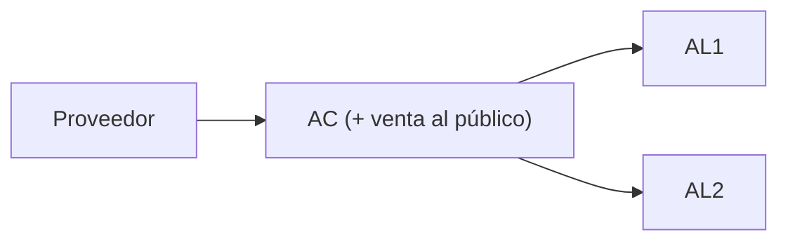
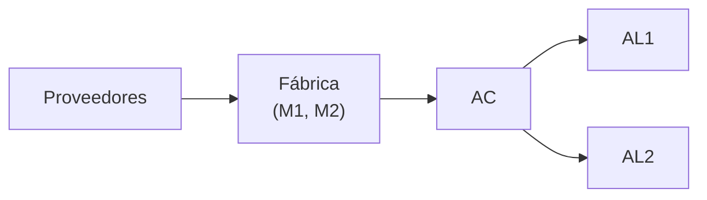
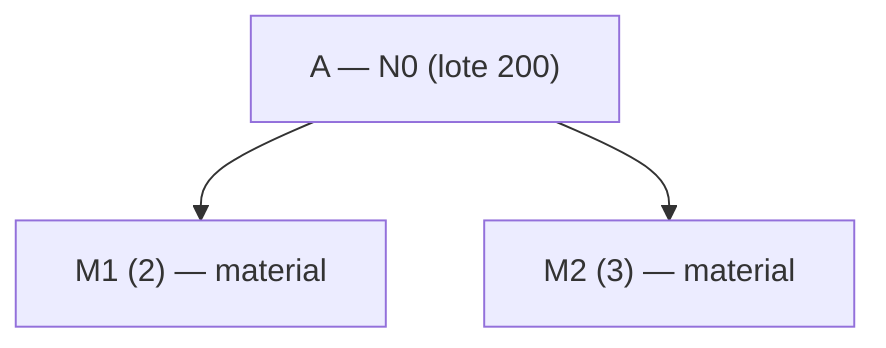
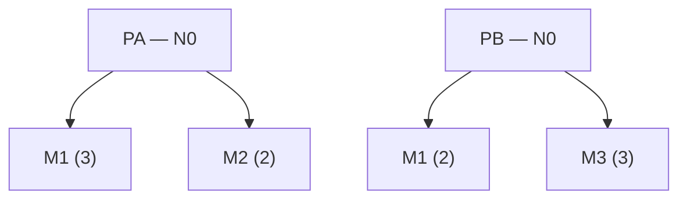
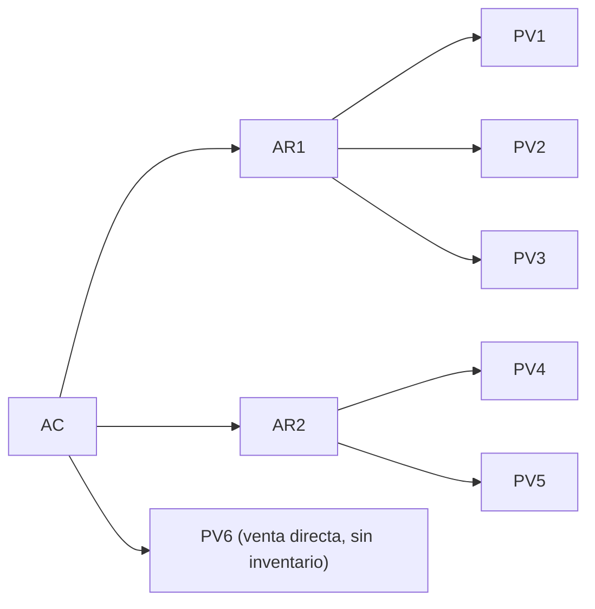
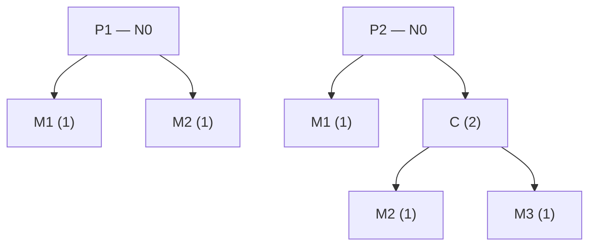

# Apunte 24 — Guía de ejercicios de DRP

> **Unidad 7 — Planificación de los Requerimientos de Distribución.** Guía de **5 ejercicios** para aplicar el **sistema DRP**: armar **listas de distribución**, decidir **dónde pronosticar**, contar **tablas DRP/MRP** y **resolver las matrices** recorriendo la red **desde los puntos de venta hacia el almacén central**. Los ejercicios 2, 3 y 5 son **integrados DRP + MRP** (redes propiedad de un productor: el DRP entrega su demanda agregada al PMP/MRP) e incorporan **dimensionamiento de stock de seguridad y de lotes** (Unidad 4). Se transcriben los **enunciados** y se **anota el método** (Apuntes 22 y 23, y 19 para el MRP). La cátedra entrega solo las **matrices en blanco** (con algunas filas de emisión ya dadas como dato): **no publica soluciones numéricas**, por lo que aquí **no se fabrica la clave** (criterio de los Apuntes 10, 13, 18 y 21).

> **Procedimiento (recordatorio del Apunte 22).**
> 1. Armar la **lista de distribución por producto** y ordenar los ISL **de las hojas (puntos de venta) hacia la raíz (AC)**.
> 2. **Puntos de venta:** requerimiento = **pronóstico** (demanda independiente). **Nodos intermedios:** $RB_t = \sum_{\text{hijos}} EPP_t^{\text{hijo}}$ (+ venta directa propia, si la hay). Multiplicidad **1** (es traslado, no transformación).
> 3. Por período: $RN_t=\max(0,\,RB_t - T_t - D_{t-1})$; recepción planificada por **regla de lote**; $D_t=D_{t-1}+T_t+RPP_t-RB_t$ (neto de $Ss$); **emisión** desplazada $TS$ períodos.
> 4. **Factibilidad:** si alguna **emisión** cae en **PD** o antes del período 1, el plan **no es factible**.
> 5. En las redes **propiedad del productor** (ej. 2, 3, 5): la **emisión del Almacén Central/Fábrica** es la **demanda de entrada al PMP/MRP**; de ahí en más se **explota la BOM** hacia abajo (Apunte 19).

---

## Ejercicio 1 — Empresa minorista (AC + 2 almacenes locales)

Red: **Proveedor → AC → {AL1, AL2} → Clientes**. El **AC** además **vende al público** directamente. Un único producto **P**, horizonte de **6 semanas**.

**Previsiones de venta (semanas 1–6):**

| Previsión | 1 | 2 | 3 | 4 | 5 | 6 |
|---|--:|--:|--:|--:|--:|--:|
| **AL1** | 80 | 90 | 30 | 120 | 100 | 70 |
| **AL2** | 75 | 75 | 75 | 75 | 75 | 75 |
| **AC (venta al público)** | 45 | 45 | 45 | 45 | 60 | 60 |

**Parámetros e inventario:**

| | AC | AL1 | AL2 |
|---|--:|--:|--:|
| Inventario actual | 350 | 60 | 57 |
| Tiempo de suministro | 2 sem | 1 sem | 1 sem |
| Lote de suministro | 100 u | 50 u | 25 u |
| Stock de seguridad ($Ss$) | 40 | 10 | 9 |
| En tránsito a ingresar en sem. 1 | 300 | 100 | 75 |

**Consigna.** A) Plan de provisión para cada AL y **plan de compra** a proveedores. B) Proyección de inventario en cada ISL.

> **Enfoque.**
> - **Orden de cálculo:** AL1 y AL2 (pronóstico) → AC.
> - **Disponibilidades netas de $Ss$:** AL1 $D_0=60-10=50$; AL2 $D_0=57-9=48$; AC $D_0=350-40=310$.
> - **AC con venta propia:** su tabla suma **tres contribuciones** como requerimiento bruto — la **emisión de AL1**, la **emisión de AL2** y su **propia previsión al público**. La plantilla las separa en las filas *(a)*, *(b)* y *Previsión de ventas*, y las consolida en *(1) Previsión de ventas TOTAL*. Es decir: $RB_t(\text{AC}) = EPP_t(\text{AL1}) + EPP_t(\text{AL2}) + \text{Prev}_t(\text{AC})$.
> - **Lotes:** AL1 múltiplos de 50; AL2 múltiplos de 25; AC múltiplos de 100.
> - **Plan de compra:** la **fila (6) del AC** es el plan de compra al proveedor (fuente externa).
> - **Factibilidad:** el AC tiene $TS=2$; verificar que sus emisiones no caigan antes de la semana 1.

---

## Ejercicio 2 — Red propiedad del productor (DRP + MRP + lotes)

Una empresa **produce A** a partir de **2 M1 + 3 M2**, en lotes de **200**, y lo almacena en el **AC de fábrica** hasta despacharlo a **AL1 y AL2**. La red de distribución es **propiedad del productor**. Horizonte **6 semanas**.

**Previsiones de venta (semanas 1–6):** AL1 = 120, 90, 110, 120, 100, 100 · AL2 = 49, 60, 55, 75, 60, 60.

**Inventario y parámetros:**

| | Fábrica | AC | AL1 | AL2 |
|---|--:|--:|--:|--:|
| Producto A | — | 270 | 60 | 57 |
| Material M1 | 350 | — | — | — |
| Material M2 | 510 | — | — | — |
| Tiempo de suministro | 1 sem (5 d) * | 2 sem | 1 sem | 1 sem |
| En producción/tránsito a ingresar en sem. 1 | 500 (M2), 300 (M1) | 300 (A) | 100 | 75 |

\* TS de M1 y M2 (igual para ambos). El AC **no** tiene $Ss$ (las varianzas se cubren con los $Ss$ de los AL); ídem los materiales en fábrica.

**Datos adicionales:** demanda anual de A en AL1 = **5700 u** ($\sigma=5$ u/día) y en AL2 = **3100 u** ($\sigma=3$ u/día); nivel de servicio **95 %**. Costo de mantener: **100 \$/u·año** en AL. Costo de transporte (fijo por envío): AC→AL1 = **\$200**, AC→AL2 = **\$140**. $TS=1$ sem = **5 días** (lun–vie). M1 y M2 se compran en lotes de **150** y **250**.

**Consigna.** a) Tipo de sistemas para la cadena interna; b) $Ss$ en cada AL; c) lote de provisión a cada AL que minimiza los costos; d) plan de provisión de A; e) plan de producción de A; f) plan de compras de M1 y M2; g) proyección de inventario por ISL.

> **Enfoque.**
> - **a) Sistemas:** la cadena interna combina **DRP** para la **distribución** de A (AC → AL1, AL2) y **MRP** para la **producción** de A y la **compra** de M1/M2 en fábrica. Fuentes: AL ← AC (**logística**), AC ← fábrica (**producción**), materiales ← proveedor (**compra**).
> - **b) Stock de seguridad** (demanda variable, Unidad 4): $Ss = z\cdot\sigma_d\cdot\sqrt{L}$, con $z_{95\%}\approx 1{,}645$ y $L=5$ días. *(Según el método:* AL1 $\approx 1{,}645\cdot5\cdot\sqrt5 \approx 19$ u; AL2 $\approx 1{,}645\cdot3\cdot\sqrt5 \approx 12$ u — **verificar con la cátedra**.)
> - **c) Lote de provisión** (EOQ con el **transporte como costo de orden**): $Q^*=\sqrt{2\,C_o\,D/C_c}$, con $C_c=100$ \$/u·año. *(Según el método:* AL1 $=\sqrt{2\cdot200\cdot5700/100}\approx 151$ u; AL2 $=\sqrt{2\cdot140\cdot3100/100}\approx 93$ u — **verificar**.)
> - **d) Provisión de A:** matrices DRP de **AL1 y AL2** (con el $Ss$ de b y el lote de c) → consolidar sus emisiones como **requerimiento bruto del AC**; matriz DRP del **AC** (sin $Ss$, $TS=2$).
> - **e) Producción de A:** la **emisión del AC** es el **requerimiento bruto de A en fábrica** → matriz (MRP/PMP) de **A** con **lote 200**, $TS=1$ sem.
> - **f) Compras M1/M2:** explotar la BOM ($RB(M1)=2\cdot EPP(A)$, $RB(M2)=3\cdot EPP(A)$) → matrices MRP de **M1 (lote 150)** y **M2 (lote 250)**, $TS=1$ sem.
> - **g) Proyección:** es la fila **Disponibilidades** de cada matriz.

---

## Ejercicio 3 — Dos productos, red de un productor (conceptual + 1 matriz)

Una empresa en **Santa Fe** elabora **PA** (= **3 M1 + 2 M2**) y **PB** (= **2 M1 + 3 M3**), comercializados por **4 almacenes locales**. Red: **Proveedores → Almacén Materiales → Fábrica → Almacén Fábrica → {AR Bs As, AR Córdoba} → {AL1…AL4} → Clientes** (Bs As → AL1, AL2; Córdoba → AL3, AL4).

**Consigna.** a) Lista de distribución; b) BOMs; c) dónde pronosticar; d) cuántos pronósticos; e) cuántas tablas DRP/MRP y para qué producto; f) cuántas tablas MRP y para qué material; g) 2 costos del lote de **transporte**; h) 2 costos del lote de **producción**; i) datos para el $Ss$ en los AL; j) completar la matriz DRP de **PA en AL1**.

**Datos del inciso j:** previsión de **PA en AL1** (días 1–6) = 150, 190, 180, 150, 200, 290. Inventario actual de PA en AL1 = **270**; en tránsito al AL1 a ingresar el **día 2** = **200**. Matriz: **Lote 100 · $Ss$ 20 · TP 2 días**.

> **Enfoque.**
> - **a) Lista de distribución:** la **misma red** para ambos productos (Almacén Fábrica → AR Bs As / Córdoba → AL1–AL4); se grafica una lista por producto.
> - **b) BOMs:** PA → 3 M1 + 2 M2; PB → 2 M1 + 3 M3 (diagrama de arriba).
> - **c–d) Pronósticos:** en **los 4 AL** (donde hay venta al público), **por producto**. Si **ambos** productos se venden en los 4 AL → **8 pronósticos**. *(El enunciado no restringe qué producto va a qué AL; si hubiera restricción, ajustar el conteo — comparar con el caso del Apunte 23, donde P2 y P3 sí estaban restringidos.)*
> - **e) DRP/MRP por producto:** por cada **producto terminado** (PA, PB), una matriz DRP en cada ISL de su red — AL1, AL2, AL3, AL4, AR Bs As, AR Córdoba, Almacén Fábrica (**7 por producto**) — y la **emisión del Almacén Fábrica** es la entrada de **producción** (PMP) de ese producto.
> - **f) MRP por material:** **M1** (compartido por PA ×3 y PB ×2 → **consolidar**), **M2** (solo PA) y **M3** (solo PB) → **3 matrices MRP** en el Almacén de Materiales.
> - **g) Lote de transporte:** lo definen el **costo de transporte/envío** (costo de orden) y el **costo de mantener inventario** (EOQ).
> - **h) Lote de producción:** lo definen el **costo de preparación/*setup*** (orden de producción) y el **costo de mantener inventario**.
> - **i) Datos para $Ss$ en los AL:** el **desvío de la demanda** ($\sigma$), el **nivel de servicio** deseado (→ $z$) y el **tiempo de suministro** ($L$): $Ss=z\,\sigma\sqrt{L}$.
> - **j) Matriz de PA en AL1:** $D_0=270-20=250$; demanda = pronóstico; lote múltiplos de 100; emisión desplazada $TP=2$ días.

---

## Ejercicio 4 — Distribución de fertilizante (red con reexpedición y venta directa)

Una empresa distribuye un fertilizante según la red del dibujo. **$Ss = 20$ u en todo ISL.** Horizonte **6 semanas**. **PV6** corresponde a ventas **despachadas directamente desde el AC**: a diferencia de los otros cinco puntos de venta, **no hay inventario en PV6**.

**Previsiones de venta (semanas 1–6):** PV1 = 150, 100, 150, 150, 100, 100 · PV6 = 60, 60, 60, 60, 60, 60. *(Las previsiones de PV2–PV5 no se dan: sus matrices se entregan con la fila de **emisión ya cargada** como dato.)*

**Datos y emisiones provistas:**

| ISL | Lote | TP | En tránsito | Disp. actual | Emisión de Pedidos Planificados (dato) |
|---|:--:|:--:|:--:|:--:|---|
| **PV1** | 20 | 1 | 200 (sem 1) | 60 | *(a resolver)* |
| **PV2** | — | — | — | — | 80 (s1), 80 (s3), 100 (s5) |
| **PV3** | — | — | — | — | 100 (s3), 100 (s5), 40 (s6) |
| **PV4** | — | — | — | — | 80 (s1), 120 (s3), 100 (s5) |
| **PV5** | — | — | — | — | 160 (s?), 180 (s?) |
| **AR1** | 20 | 1 | 200 (sem 1) | 120 | *(a resolver)* |
| **AR2** | 20 | 1 | 260 (sem 1) | 80 | *(a resolver)* |
| **AC** | — | — | — | — | *(a resolver)* |

**Consigna.** Definir un **plan de distribución** para toda la cadena (completar las matrices).

> **Enfoque.**
> - **Orden de cálculo:** puntos de venta (PV1 con pronóstico; PV2–PV5 ya traen su emisión) → AR1 y AR2 → AC.
> - **AR1** consolida las emisiones de **PV1, PV2, PV3**; **AR2** las de **PV4, PV5**. ($RB_{AR}=\sum EPP$ de sus PV.)
> - **PV6 es el caso especial:** **sin inventario**, su **demanda pasa directo como requerimiento al AC** (no tiene matriz propia con disponibilidades; su pronóstico se suma al $RB$ del AC).
> - **AC:** $RB_t(\text{AC}) = EPP_t(\text{AR1}) + EPP_t(\text{AR2}) + \text{Prev}_t(\text{PV6})$.
> - **Disponibilidades netas de $Ss=20$** en todos los ISL con inventario; $D_0(\text{PV1})=60-20=40$, $D_0(\text{AR1})=120-20=100$, $D_0(\text{AR2})=80-20=60$.

---

## Ejercicio 5 — Producto + componente que también es repuesto (DRP + MRP cruzados)

Una empresa fabrica **P1** y **P2** (familia F1), distribuidos en **3 puntos de venta**. Producción: **P1 = 1 M1 + 1 M2**; **P2 = 1 M1 + 2 C**, donde el **componente C = 1 M2 + 1 M3** lo elabora la propia empresa. Distribución: **P1** en PV1, PV2, PV3; **P2** solo en **PV3**; y en **PV3** se vende además **C como repuesto** de P2. Red: **AMP (materiales) → AC ← Fábrica; AC → AR → PV1, PV2 (P1); AC → PV3 (todos los productos y C)**. Horizonte **6 días**.

**Listas de distribución:** P1 → AC → AR → PV1, PV2 y AC → PV3; P2 → AC → PV3; C (repuesto) → AC → PV3.

**Previsiones de venta (días 1–6):** P1 en PV1 = 50, 70, 60, 50, 80, 90 · P2 en PV3 = 20, 30, 25, 30, 40, 35 · C en PV3 = 10, 15, 20, 15, 15, 20.

**Inventario actual:** P1 en PV1 = 70 · P1 en AR = 30 · P1 en AC = 260 · P2 en PV3 = 50 · P2 en AC = 90 · C en Fábrica = 30 · C en PV3 = 0.

**En tránsito / producción:** P1 al PV1 (día 2) = 100 · P1 al AR (día 1) = 100 · P1 en producción a ingresar en AC (día 3) = 360 · P2 en producción a ingresar en AC (día 1) = 100.

**Emisiones provistas (dato):** P1 en **PV2** (lote 70, $Ss$ 10, TP 2): 70 (d1), 70 (d3), 140 (d5). P1 en **PV3** (lote 40, $Ss$ 0, TP 2): 40 (d1), 40 (d3), 80 (d5).

**Matrices a completar:** P1 en PV1 (100/10/2), P1 en AR (100/0/1), P2 en PV3 (100/10/1), C en PV3 (20/10/1), P1 en AC (120/0/2), P2 en AC (100/0/2), C en AC (30/0/1), M1 en AMP (50/20/2), M2 en AMP (100/30/2), M3 en AMP (50/10/2). *(formato: lote / $Ss$ / TP.)*

**Consigna.** a) Listas de distribución; b) BOMs; c) dónde pronosticar; d) cuántos pronósticos; e) cuántas tablas DRP/MRP en total; f–g) completar las matrices.

> **Enfoque.**
> - **c–d) Pronósticos:** P1 en **PV1, PV2, PV3** (3) + P2 en **PV3** (1) + C en **PV3** (1) = **5 pronósticos**.
> - **e) Tablas:** **DRP** de P1 (PV1, PV2, PV3, AR, AC = 5), de P2 (PV3, AC = 2) y de C como repuesto (PV3, AC = 2); **MRP/producción** de P1, P2 y C, y **MRP de materiales** M1, M2, M3 en el AMP. *(Contar según las matrices pedidas en f–g.)*
> - **El punto fino — C tiene demanda mixta.** En el AC, el requerimiento bruto de **C** suma **dos orígenes**: la **emisión DRP de C desde PV3** (repuesto, demanda **independiente**) **+** la explosión **MRP** desde la producción de P2 (**$2\cdot EPP(\text{P2})$**, demanda **dependiente**). Es el ejemplo donde un mismo SKU es a la vez **artículo de venta** y **componente**.
> - **Encadenado DRP→MRP:** la **emisión de P1 y P2 en el AC** es la **demanda de producción** (entra al PMP); de ahí se explotan las BOM para **M1, M2, M3** en el AMP. **M1** lo consumen P1 (×1) y P2 (×1); **M2** lo consumen P1 (×1) y C (×1); **M3** solo C (×1) → **consolidar** los compartidos.
> - **Disponibilidades netas de $Ss$** en cada matriz (p. ej., P1 en PV1: $70-10=60$; P2 en PV3: $50-10=40$; C en PV3: $0-10=-10$ → arranca **por debajo del $Ss$**, lo que fuerza una reposición temprana).
> - **Factibilidad:** varias matrices tienen $TP=2$; vigilar las cadenas PV→AR→AC y la producción/compra para que ninguna emisión caiga en **PD**.

---

## Cómo verificar el resultado

1. **Coherencia de la agregación:** el requerimiento bruto de cada nodo intermedio debe ser la **suma exacta** de las emisiones de los ISL que abastece (más su venta directa, si la tiene), período a período.
2. **No negatividad:** la fila *Disponibilidades* (neta de $Ss$) nunca queda por debajo de 0; si lo haría, ese déficit es el requerimiento neto que la recepción planificada (ajustada al lote) cubre.
3. **Desplazamiento por TS:** toda recepción planificada en $t$ tiene su emisión en $t-TS$.
4. **Cruce DRP↔MRP (ej. 2, 3, 5):** la **emisión del nodo raíz de la red** (AC o Almacén de Fábrica) es la **demanda de entrada a producción**; desde ahí se explota la **BOM** hacia los materiales (Apunte 19).
5. **Factibilidad:** si **alguna** emisión cae en **PD** (o antes del período 1), el plan **no es factible** y hay que corregirlo (anticipar pedidos, revisar lotes/stock inicial o expeditar provisiones).
