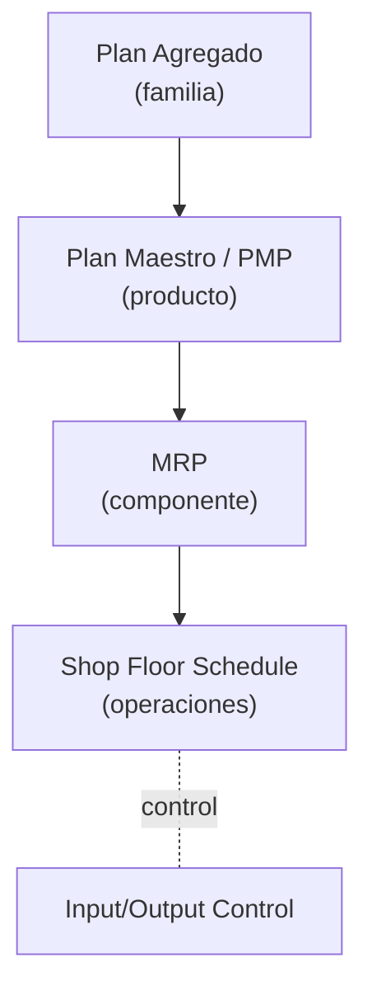
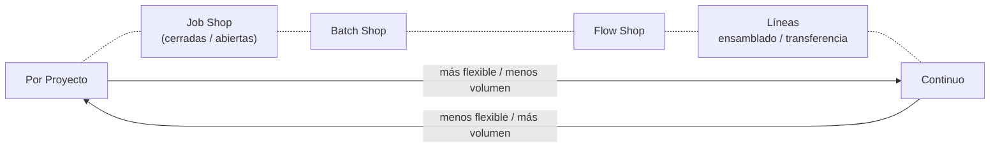

# Apunte 25 — Scheduling (Programación de la Producción)

> **Unidad 8 — Programación de la Producción (Scheduling).** Teoría completa del **scheduling**: dónde encaja en la **planificación jerárquica de la producción** (es su **última etapa**, la de mayor detalle, sobre equipos y máquinas individuales), qué problema resuelve (**asignar recursos a tareas** para optimizar uno o varios objetivos), y todo el aparato conceptual: las **tres etapas** del proceso (secuenciamiento, asignación/carga, evaluación), los **tipos de sistema de producción** (de proyecto, job shop, batch, flow shop, celda, líneas, continuo), las **estrategias** y **enfoques de implementación**, los **objetivos** (flowtime, makespan, tardanza), las **reglas de secuenciamiento** (FCFS, SPT, DDATE, SLACK, CR…), la **regla de Johnson** para dos máquinas en serie, la **manufactura sincrónica (OPT)** por cuello de botella, el **monitoreo** (Gantt y control Input/Output) y las **heurísticas** (algoritmos genéticos). Cubre los nueve temas del plan de la unidad. Bibliografía de cátedra: Russell & Taylor, *Operations Management* (Prentice-Hall, 2011), cap. 17 *Scheduling*; Jacobs & Chase, *Operations and Supply Chain Management* (McGraw Hill, 2018), cap. 22 *Workcenter Scheduling*.

> **Cómo se ejercita.** Los ejemplos numéricos de la presentación (reglas de secuenciamiento, regla de Johnson, OPT y algoritmo genético) están **transcriptos y verificados** en este apunte. La cátedra anunció **casos de estudio y guías de ejercicios** adicionales para esta unidad: cuando se incorporen, sumarán apuntes de práctica que aplican esta mecánica de punta a punta. **Requisitos previos:** la planificación jerárquica (Apuntes 14, 15, 19) y, para el monitoreo Input/Output, la noción de carga de capacidad.

---

## 1. Dónde encaja el scheduling: la última etapa de la planificación jerárquica

La planificación de operaciones baja por **niveles de detalle**, y en cada nivel se acopla un plan de producción con un plan de capacidad. El scheduling es el **escalón más fino**: trabaja sobre **operaciones individuales** y **equipos/máquinas individuales**.

| Tipo de ítem | Planificación de la Producción | Planificación de la Capacidad | Nivel de recurso |
|---|---|---|---|
| Familia | Plan Agregado de Producción (APP) | Plan de Requerimientos de Recursos (RRP) | Planta |
| Producto | Plan Maestro de Producción (MPS / PMP) | Plan de Capacidad de Grano Grueso (RCCP) | Centros críticos de trabajo |
| Componente | Plan de Requerimientos de Materiales (MRP) | Plan de Requerimientos de Capacidad (CRP) | Todos los centros |
| **Operaciones** | **Programa de planta (Shop Floor Schedule)** | **Control Input/Output** | **Equipos / máquinas individuales** |



El **scheduling**:

- Es la **última etapa** del proceso de planificación jerárquica.
- **Especifica cuándo** el trabajo/tareas, el equipamiento y las instalaciones serán requeridos para producir un producto o prestar un servicio.
- Trata el problema de **asignar recursos a tareas** para alcanzar/optimizar uno o varios objetivos.
- Genera un **cronograma** de: trabajos a realizar, y equipamiento/instalaciones a utilizar.

---

## 2. El proceso de scheduling: tres etapas

El proceso se descompone siempre en las mismas tres decisiones:

1. **Secuenciamiento.** Dado un conjunto de **órdenes (trabajos)**, definir el **orden de procesamiento**. Es el proceso de **priorizar** los trabajos.
2. **Asignación / Carga.** **Asignar** la secuencia a los **recursos**, respetando las **restricciones** (disponibilidad, precedencia, capacidad).
3. **Evaluación de la función objetivo.** Medir el cronograma resultante contra el/los objetivo(s) (tardanza, makespan, etc.).

> Toda la sección de reglas (§9), de Johnson (§10) y de OPT (§11) son, en el fondo, **maneras distintas de hacer la etapa 1 (secuenciar)** y resolver la etapa 2 (cargar), para luego evaluar (etapa 3).

---

## 3. Tipos de sistemas de producción

La **estructura del proceso de producción** condiciona por completo cómo se hace el scheduling. Es el primer punto de la agenda porque define qué técnica aplica.

### 3.1. Catálogo de estructuras

**Por Proyecto.** Producción de un **producto único a la vez**, a pedido del cliente. Tarda mucho en completarse e involucra gran inversión de fondos y recursos. Las operaciones se programan según la **estructura específica del producto**. *Ej.:* construcción de un edificio, construcción naval, fabricación de aviones, desarrollo de una nueva aplicación de software.

**Job Shop.** Producción de una **gran variedad de productos especiales** (ambientes *Assemble-to-Order* o *Make-to-Order*). La alta variedad exige **procesos flexibles** y mano de obra más calificada. Las máquinas se agrupan en **centros de trabajo** con funciones similares, y el trabajo se mueve de un centro a otro según una **ruta** definida para cada trabajo. *Ej.:* un centro para perforado, otro para rectificado, un área de pintura. Tiene dos variantes:

- **Órdenes Cerradas (Classic Job Shop):** cada orden tiene una **ruta única predefinida**; las operaciones de un lote de partes se mueven **juntas**; no hay inventarios intermedios fuera de la orden; una orden **no puede tomar** partes en proceso de otra. *Ventaja:* muy flexible. *Desventaja:* complejo de gestionar.
- **Órdenes Abiertas (Open Job Shop):** las órdenes se agrupan en **varias rutas (productos) comunes**; hay varios clientes de los mismos productos; hay **inventario común** (intermedio y final) y varias órdenes pueden usar partes del mismo inventario; las rutas **no están predefinidas**. *Ventaja:* muy flexible. *Desventaja:* complejo de gestionar.

**Por Lotes (Batch Shop).** Muchos trabajos distintos al mismo tiempo, en **grupos o lotes** (típicamente a pedido). Similar a Órdenes Abiertas pero con **mayor estandarización de rutas**; logra **economía de escala** procesando lotes mayores; el **lote es independiente de la orden**; flujo no lineal pero menos complejo que en Órdenes Abiertas. *Ej.:* impresoras, panaderías, talleres de maquinaria, fabricación de muebles.

**En Flujo (Flow Shop).** Similar al proceso por lotes pero con **flujo lineal** de operaciones (**máquinas en serie**). El flujo puede ser discreto, continuo o intermitente. **Todas las tareas siguen la misma ruta** (misma secuencia de equipos). Terminada una tarea en una máquina, se agrega a la **cola** de la siguiente; si las colas operan **FIFO**, el flow shop es **permutativo**. *Ventaja:* más simple de gestionar que el job shop. *Desventaja:* menos flexible.

**Celda de Manufactura.** Combina la **flexibilidad** del job shop con el **bajo costo y simpleza** del flow shop. Los ítems se agrupan en **familias**, cada familia es servida por una **celda** (grupo automatizado de máquinas diversas). Las órdenes fluyen entre celdas como si fuera flow shop, y cada celda adopta su propio programa de tareas.

**Líneas de Ensamblado.** Rutas de procesamiento que producen componentes que se **combinan** en componentes más complejos (**convergencia de rutas**); inventario solo al comienzo de la línea; **flow shop discreto** (usa mucha mano de obra).

**Líneas de Transferencia.** Líneas **automatizadas** de producción; **sin inventarios**; flow shop discreto (usa poca mano de obra).

**Continuo.** Productos **básicos de gran volumen y muy estandarizados**; sistema altamente automatizado que opera **24 h continuas**. *Ej.:* refinación de combustibles, petroquímica, agua tratada, pinturas, productos químicos, alimentos. Es un **flow shop continuo**.

**Híbridos o Combinados.** Combinaciones de los anteriores. *Ej.:* un químico producido en proceso **continuo** y luego empaquetado en un ambiente **por lotes**.



### 3.2. Scheduling según el tipo de proceso

La técnica de programación **difiere considerablemente** según la estructura:

- **Por proyecto** → técnicas de scheduling de proyectos, como **PERT/CPM**.
- **Flow shop** es aplicable a: **por lote, líneas de ensamblaje y continuo**.
- **Job shop** es aplicable a: **por trabajo, por lote, también por proyecto**.

---

## 4. Estrategias de scheduling

Son los **criterios** con los que se arma el cronograma. Se combinan entre sí.

### 4.1. Forma de asignar el tiempo

- **De Intervalo:** agenda formal mediante **asignación de intervalos de tiempo**. Útil cuando varios recursos críticos deben coordinarse. Tiende a ser **ineficiente** (grandes lagunas de tiempo).
- **Despacho (dispatching):** **no hay** programa anticipado; el énfasis está en programar **recurso por recurso**: cuando un recurso se libera, se le asigna la **tarea de mayor prioridad** en espera.

### 4.2. Qué se cronograma primero

- **Tarea Crítica:** se cronograman **todas las actividades de la tarea más crítica**, luego la siguiente, y así sucesivamente.
- **Recurso Crítico:** se cronograma **primero** el recurso más importante (**cuello de botella**) y los demás recursos se arman **alrededor** de él. *(Es la idea de la manufactura sincrónica, §11.)*
- **Operación Crítica:** combinación de las dos anteriores; se identifica el **par actividad/recurso** de mayor prioridad y se cronograma primero.

### 4.3. Dirección temporal

- **Directo (Forward):** se cronograman las tareas en **secuencia temporal creciente** (desde "ahora" hacia adelante). Produce cronogramas **factibles y compactos**, pero **usualmente viola las fechas de entrega**.
- **Reverso (Backward):** se cronograma **a partir de las fechas de entrega**, en secuencia temporal **decreciente**. Puede generar cronogramas **infactibles** (tareas que deberían empezar antes de "ahora").

En ambos casos la secuencia interna puede ser **de despacho** o **crítica**.

### 4.4. Inteligencia del despacho

- **Despacho Heurístico:** despacho directo donde, en cada punto de decisión (secuencia, tiempo, ruteo), se usan **índices de prioridad** obtenidos por alguna **regla heurística**.
- **Despacho Avanzado:** despacho heurístico que **predice de forma dinámica** futuros problemas con fechas de entrega y recursos críticos.

### 4.5. Búsqueda de óptimos

- **Combinacional:** se evalúa **algún subconjunto** de los cronogramas posibles buscando combinaciones; persigue **soluciones óptimas** vía **programación matemática entera**. *Contras:* grandes tiempos de cómputo y demanda de memoria, soluciones poco intuitivas y más complejas, y **poca reacción** frente a imprevistos.

### 4.6. Restricciones de capacidad y almacenamiento

| Dimensión | Variante infinita | Variante finita |
|---|---|---|
| **Capacidad de recursos** | Supone **capacidad infinita**: carga sin mirar capacidad, luego nivela y secuencia. | Supone **capacidad limitada**: secuencia como parte de la decisión de carga; **nunca** carga por encima de la capacidad. |
| **Almacenamiento intermedio** | Supone **buffer infinito** entre equipos: carga sin mirar el almacén. | Tiene en cuenta la **capacidad del almacén** en el scheduling. |

- **Política Zero Wait (ZW):** una vez completada una operación, el producto debe pasar **inmediatamente** al equipo siguiente, que **debe estar disponible**. **No** se admite almacenamiento intermedio.

---

## 5. Enfoques de implementación

Cómo se implementa, en la práctica, el motor de scheduling: **Manual–Intervalos**, **Manual–Despacho**, **Simulación–Despacho**, **Matemático exacto**, **Matemático heurístico**, **Sistema experto puro** y **Sistemas mixtos AI/OR/DSS**.

### 5.1. Métodos manuales

Usualmente **despacho directo con reglas**; tamaños de lote fijos (provenientes de algún modelo de inventario); las alteraciones se manejan **por experiencia** (división de lotes, tiempos ociosos deliberados, salidas de servicio, favorecimiento de prioridades); la **simulación** sirve de apoyo a la decisión manual.

- **Ventajas:** combinación rápida y precisa de experiencia humana y prioridades formales; gran adaptabilidad a crisis.
- **Desventajas:** imposibilidad de manejar muchas prioridades distintas o estimar el efecto de varias decisiones; dificultad para combinar experiencias; baja velocidad de respuesta; complejidad creciente.

### 5.2. Métodos matemáticos

Modelan el problema con **decisiones** (secuencias, ruteos, tiempos), **restricciones** (disponibilidad, precedencia) y **objetivo** (tardanza, makespan, etc.), y lo resuelven con **programación entera** (*branch and bound*) o **métodos aproximados de búsqueda** (algoritmos genéticos, vecindad, relajación Lagrangiana).

> **El problema de las combinaciones.** Secuenciar **30 órdenes en 1 recurso** da $30! \approx 2\times10^{32}$ alternativas. El scheduling es **NP-completo**: no existen métodos de solución que **no** crezcan exponencialmente con el tamaño. La presentación lo ilustra de forma drástica: si 50 tareas en un recurso tardan $X$, **55 tareas tardan $\approx 4\times10^{8}\,X$**.

### 5.3. Métodos mixtos

Heurísticos; **algoritmos genéticos** (entre otros, §13); **métodos de cuello de botella** (§11); **sistemas expertos / IA**; **propagación de restricciones**. Son la respuesta práctica a la explosión combinatoria: renuncian al óptimo garantizado a cambio de **buenas soluciones en tiempo razonable**.

---

## 6. Objetivos de scheduling

Tres **medidas de tiempo** fundamentales y la lista de objetivos derivados:

| Medida | Definición |
|---|---|
| **Flowtime** (*completion time*, ciclo/tiempo de flujo) | Tiempo desde que una **orden ingresa** hasta que **sale** del sistema. |
| **Makespan** (tiempo total de terminación) | Tiempo para que **un grupo** de órdenes sea **completado** en su totalidad. |
| **Tardiness** (tardanza) | Diferencia entre la **fecha de finalización** de una orden y su **fecha de entrega comprometida** (*Due Date*). Solo cuenta si es **positiva**. |

Objetivos típicos (a menudo en conflicto entre sí): **cumplir fechas de entrega**; **minimizar** tardanza, tiempo de respuesta, tiempo de terminación, tiempo en el sistema, horas extra, tiempo ocioso e **inventario de trabajo en proceso (WIP)**; y **maximizar** la utilización de máquinas y mano de obra.

---

## 7. Flow Shop Scheduling

En un flow shop **cada tarea pasa por una serie de máquinas en el mismo orden**. Variantes:

- **Normal:** todas las tareas recorren las máquinas $1\to2\to3\to\dots$ en serie.
- **Salteo de máquinas (Skip shop):** algunas tareas **omiten** máquinas de la serie.
- **Reentrante:** una tarea **vuelve** a una misma máquina más de una vez (p. ej. $1\to2\to3\to2\to4\to2$).
- **Flexible Flow Shop (etapas/máquinas compuestas):** cada **etapa** tiene **varias máquinas en paralelo**.
- **Colas finitas:** entre etapas hay buffers $Q_1, Q_2, \dots$ de **capacidad limitada**.

```
Normal:        1 → 2 → 3 → 4 → 5 → 6
Salteo:        1 → 2 → 3 → 4 → 5 → 6   (algunas tareas saltan máquinas)
Reentrante:    1 → 2 → 3 → 2 → 4 → 2   (R = retorno a la máquina 2)

Flexible (etapas con máquinas en paralelo):
   Etapa 1     Etapa 2     Etapa 3
   [1a]        [2a]        [3a]
   [1b]   →    [2b]   →    [3b]
   [1c]                    [3c]

Colas finitas:  1 →(Q1)→ 2 →(Q2)→ 3   (Q de capacidad limitada)
```

**Otras variantes / supuestos:**

- **Tiempo ocioso deliberado:** se permite **no arrancar** una tarea que está esperando, para "guardar" el recurso para una tarea de **mayor prioridad** que llegará.
- **Scheduling permutativo ($n!$):** **todas las máquinas** procesan las tareas en la **misma secuencia**.
- **Disponibilidad estática / dinámica** (de máquinas y de tareas): si todo está disponible desde el inicio (estática) o si las tareas/máquinas se incorporan a lo largo del tiempo (dinámica).

---

## 8. Job Shop Scheduling

Es el caso **más difícil** de programar. Sus dificultades inherentes:

- **Variedad** de trabajos (clientes) procesados.
- **Distintas rutas** y requerimientos de producción para cada trabajo/cliente.
- **Varias órdenes diferentes** en la instalación al mismo tiempo.
- **Competición** por recursos comunes.

Por eso el job shop se aborda, en la práctica, con **reglas de secuenciamiento** (§9) y/o heurísticas (§13).

---

## 9. Scheduling en base a reglas (reglas de secuenciamiento)

Cuando un recurso se libera, una **regla de prioridad** decide qué trabajo entra. Las principales:

| Sigla | Regla | Criterio de prioridad |
|---|---|---|
| **FCFS** | *First-come, first-served* | El que llegó primero. |
| **LCFS** | *Last-come, first-served* | El que llegó último. |
| **SPT** | *Shortest processing time* | Menor tiempo de procesamiento. |
| **DDATE** | *Earliest due date* | Fecha de entrega más temprana. |
| **SLACK** | *Smallest slack* | Menor holgura. |
| **RWK** | *Remaining work* | Trabajo restante en **todas** las operaciones. |
| **CUSTPR** | *Highest customer priority* | Cliente de mayor prioridad. |
| **SETUP** | *Similar setup* | Agrupar trabajos de **setup similar**. |
| **CR** | *Critical Ratio* | Menor razón crítica. |

**Holgura (slack):**
$$\text{Slack} = (\text{Due Date} - \text{hoy}) - \text{tiempo de procesamiento restante}$$

**Razón crítica (Critical Ratio):**
$$CR = \frac{\text{tiempo restante hasta la entrega}}{\text{trabajo restante}} = \frac{\text{Due Date} - \text{hoy}}{\text{tiempo de procesamiento restante}}$$

- $CR > 1$ → el trabajo va **adelantado** (*ahead of schedule*).
- $CR < 1$ → el trabajo va **atrasado** (*behind schedule*).
- $CR = 1$ → el trabajo va **en horario** (*on schedule*).

### 9.1. Ejemplo comparativo (5 trabajos, 1 máquina)

Datos (hoy = día 1). Hay $5! = 120$ secuencias posibles:

| Trabajo | Tiempo de proceso | Fecha de entrega | Slack | CR |
|:--:|:--:|:--:|:--:|:--:|
| A | 5 | 10 | $(10-1)-5=4$ | $9/5=1.80$ |
| B | 10 | 15 | $(15-1)-10=4$ | $14/10=1.40$ |
| C | 2 | 5 | $(5-1)-2=2$ | $4/2=2.00$ |
| D | 8 | 12 | $(12-1)-8=3$ | $11/8=1.37$ |
| E | 6 | 8 | $(8-1)-6=1$ | $7/6=1.16$ |

Se evalúa cada regla armando la secuencia y acumulando tiempos. Resultados por regla:

**FCFS — secuencia A, B, C, D, E**

| Sec. | Inicio | Proceso | Finalización | Entrega | Tardanza |
|:--:|:--:|:--:|:--:|:--:|:--:|
| A | 0 | 5 | 5 | 10 | 0 |
| B | 5 | 10 | 15 | 15 | 0 |
| C | 15 | 2 | 17 | 5 | 12 |
| D | 17 | 8 | 25 | 12 | 13 |
| E | 25 | 6 | 31 | 8 | 23 |
| | | | **Prom. 18.60** | | **Prom. 9.6** |

**DDATE — secuencia C, E, A, D, B** (por fecha de entrega creciente)

| Sec. | Inicio | Proceso | Finalización | Entrega | Tardanza |
|:--:|:--:|:--:|:--:|:--:|:--:|
| C | 0 | 2 | 2 | 5 | 0 |
| E | 2 | 6 | 8 | 8 | 0 |
| A | 8 | 5 | 13 | 10 | 3 |
| D | 13 | 8 | 21 | 12 | 9 |
| B | 21 | 10 | 31 | 15 | 16 |
| | | | **Prom. 15.00** | | **Prom. 5.6** |

**SLACK — secuencia E, C, D, A, B** (holguras: A‑4, B‑4, C‑2, D‑3, E‑1; menor holgura primero)

| Sec. | Inicio | Proceso | Finalización | Entrega | Tardanza |
|:--:|:--:|:--:|:--:|:--:|:--:|
| E | 0 | 6 | 6 | 8 | 0 |
| C | 6 | 2 | 8 | 5 | 3 |
| D | 8 | 8 | 16 | 12 | 4 |
| A | 16 | 5 | 21 | 10 | 11 |
| B | 21 | 10 | 31 | 15 | 16 |
| | | | **Prom. 16.40** | | **Prom. 6.8** |

**CR — secuencia E, D, B, A, C** (CR: A‑1.80, B‑1.40, C‑2.00, D‑1.37, E‑1.16; menor CR primero)

| Sec. | Inicio | Proceso | Finalización | Entrega | Tardanza |
|:--:|:--:|:--:|:--:|:--:|:--:|
| E | 0 | 6 | 6 | 8 | 0 |
| D | 6 | 8 | 14 | 12 | 2 |
| B | 14 | 10 | 24 | 15 | 9 |
| A | 24 | 5 | 29 | 10 | 19 |
| C | 29 | 2 | 31 | 5 | 26 |
| | | | **Prom. 20.8** | | **Prom. 11.2** |

**SPT — secuencia C, A, E, D, B** (menor tiempo de proceso primero)

| Sec. | Inicio | Proceso | Finalización | Entrega | Tardanza |
|:--:|:--:|:--:|:--:|:--:|:--:|
| C | 0 | 2 | 2 | 5 | 0 |
| A | 2 | 5 | 7 | 10 | 0 |
| E | 7 | 6 | 13 | 8 | 5 |
| D | 13 | 8 | 21 | 12 | 9 |
| B | 21 | 10 | 31 | 15 | 16 |
| | | | **Prom. 14.80** | | **Prom. 6** |

### 9.2. Resumen y lectura

| Regla | Tiempo medio de finalización | Tardanza media | N.º trabajos tardíos | Tardanza máxima |
|---|:--:|:--:|:--:|:--:|
| FCFS | 18.60 | 9.6 | 3 | 23 |
| DDATE | 15.00 | **5.6** ✱ | 3 | **16** ✱ |
| SLACK | 16.40 | 6.8 | 4 | **16** ✱ |
| CR | 20.80 | 11.2 | 4 | 26 |
| SPT | **14.80** ✱ | 6.0 | 3 | **16** ✱ |

> ✱ = mejor valor de la columna. Lecturas clave: **SPT** minimiza el **tiempo medio de finalización** (y por ende el WIP/flowtime promedio); **DDATE** minimiza la **tardanza media**; **DDATE, SLACK y SPT** empatan en la mejor **tardanza máxima**. **No hay una regla que gane en todo**: la elección depende del objetivo priorizado (§6). El **makespan es el mismo (31)** en todas, porque en una sola máquina sin tiempos muertos el total de proceso no cambia con el orden.

---

## 10. Scheduling de trabajos en dos máquinas en serie: regla de Johnson

Aplicable a **flow shop de dos máquinas** (todas las tareas pasan por la máquina 1 y luego por la 2). Construye la secuencia que **minimiza el makespan**.

**Algoritmo:**

1. Listar los tiempos de cada trabajo en cada máquina. Armar un vector de secuencia con tantos casilleros como trabajos.
2. Elegir el **menor** tiempo de procesamiento entre **ambas** máquinas. Si está en la **máquina 1**, ubicar el trabajo **lo más al principio** posible de la secuencia.
3. Si el menor tiempo está en la **máquina 2**, ubicar el trabajo **lo más al final** posible.
4. **Remover** ese trabajo de la lista.
5. Repetir 2–4 hasta completar todos los casilleros.

**Ejemplo:**

| Trabajo | Centro 1 | Centro 2 |
|:--:|:--:|:--:|
| A | 6 | 8 |
| B | 11 | 6 |
| C | 7 | 3 |
| D | 9 | 7 |
| E | 5 | 10 |

Desarrollo (menor tiempo en cada paso, **negrita** = elegido): $C_2=3$ → al **final**; $E_1=5$ → al **principio**; $B_2=6$ → al final disponible; $A_1=6$ → al principio disponible; queda $D$ en el centro.

$$\boxed{\text{Secuencia óptima: } E \;\to\; A \;\to\; D \;\to\; B \;\to\; C}$$

---

## 11. Manufactura sincrónica (OPT)

Idea (de la *Teoría de las Restricciones* / OPT, *Optimized Production Technology*): **no todos los recursos se usan por igual**; conviene **concentrarse en el cuello de botella** (*bottleneck*), **sincronizar el flujo** a través de él y **mover el producto** con tamaños de lote de **proceso** y de **transferencia** distintos.

**Método de solución:**

1. **Identificar el cuello de botella (CB):** para cada centro de trabajo (CT), **sumar** los tiempos de todas las operaciones que pasan por él; el mayor es el CB.
2. **Programar primero** el ítem cuyo **tiempo de provisión** al CB sea **menor o igual** al **tiempo de procesamiento** del CB.
3. **Schedule Forward** (hacia adelante) de la **máquina CB**.
4. **Schedule Backward** (hacia atrás) de las **otras** máquinas, para sostener el programa del CB.
5. El **lote de transporte no** tiene por qué igualar al **lote de producción**; idealmente, el lote de transporte debería ser **1**.

### 11.1. Ejemplo

**Datos.** Demanda = **100 unidades de A**. Una unidad de B, C y D se usa para fabricar una de A. Cada ítem (B, C, D) requiere **tres operaciones** repartidas en **3 centros de trabajo**. **Setup de recursos = 60 minutos.** Rutas (operación → centro, tiempo unitario en min):

- **B:** $B_1$ (CT1, 5) → $B_2$ (CT2, 3) → $B_3$ (CT1, 7)
- **C:** $C_1$ (CT3, 2) → $C_2$ (CT1, 10) → $C_3$ (CT2, 15)
- **D:** $D_1$ (CT3, 10) → $D_2$ (CT2, 8) → $D_3$ (CT3, 5)

**Paso 1 — Identificación del cuello de botella** (suma de tiempos por centro):

| CT 1 | min | CT 2 | min | CT 3 | min |
|:--:|:--:|:--:|:--:|:--:|:--:|
| $B_1$ | 5 | $B_2$ | 3 | $C_1$ | 2 |
| $B_3$ | 7 | $C_3$ | 15 | $D_3$ | 5 |
| $C_2$ | 10 | $D_2$ | 8 | $D_1$ | 10 |
| **Total** | **22** | **Total** | **26** ✱ | **Total** | **17** |

$$\boxed{\text{Cuello de botella} = \text{CT 2 (26 min/unidad)}}$$

**Paso 2 — Secuencia de órdenes en el CB.** Para cada ítem, su tiempo de **procesamiento** en CT2 y su tiempo de **provisión** (operaciones previas que lo alimentan):

| Orden | Proceso en el CB (CT2) | Provisión al CB |
|:--:|:--:|:--:|
| B | 3 | 5 ($B_1$) |
| C | 15 | 12 ($C_1+C_2 = 2+10$) |
| D | 8 | 10 ($D_1$) |

Regla: **primero** el ítem con provisión $\le$ proceso del CB. Solo **C** cumple ($12 \le 15$); B y D no ($5>3$, $10>8$). Entonces se arranca por C y se completan B y D:

$$\boxed{\text{Secuencia en el CT2: } C \;\to\; B \;\to\; D}$$

**Pasos 3–4 — Gantt (forward del CB, backward del resto).** El cronograma resultante de la cátedra (procesando los lotes de 100 u con setups de 60 min) arroja estos tramos:

```
Máquina 1:  [ C2 ]──Setup──[ B1 ]──Setup──[ B3 ]
            2     1002 1062  1562 1622     2322

Máquina 2:  [    C3    ]─Setup─[ B2 ]─Setup─[   D2   ]
            12        1512 1572 1872 1932          2732

Máquina 3:  [C1]─Setup─[  D1  ]─Setup─[ Esperando D2 ]─[   D3   ]
            200  260   1260  1320      1320    1940           2737
```

El bloque rojo "**Esperando D2**" en la máquina 3 ($1320 \to 1940$) muestra el **tiempo ocioso forzado**: $D_3$ no puede arrancar hasta que $D_2$ (en el CB) esté disponible. El **makespan** del plan es **≈ 2737 minutos**.

> *Nota de transcripción:* las marcas de tiempo del Gantt se leyeron de la diapositiva de cátedra y se reproducen tal cual; ilustran cómo el **CB marca el ritmo** y cómo el resto de las máquinas se acomodan a su alrededor (con esperas deliberadas). La aritmética exacta por barra (lotes ×100 + setups) no es del todo reconstruible solo desde el texto; lo central del ejemplo es la **lógica de sincronización**, no los segundos.

---

## 12. Monitoreo de la evolución de un schedule

Una vez lanzado el programa, hay que **controlar** su avance. Dos herramientas:

### 12.1. Diagrama de Gantt

Muestra las **actividades planeadas** y **completadas** contra una **escala de tiempo**, por instalación/recurso. Permite ver de un vistazo si un trabajo está **adelantado**, **en horario** o **atrasado** respecto de "hoy".

```
            1  2  3  4  5  6  7  8  9 10 11 12   Días
            |--|--|--|--|--|--|--|--|--|--|--|
Inst. 1   [== Job 12A ==][···· Job 11C ····]      ← hoy
Inst. 2   [==== Job 23C ====]
Inst. 3   [== Job 32B ==]
                    ▲ Today's Date
  [==] Actividad completada    [··] Actividad planeada
  Posiciones relativas a "hoy": adelantado / en horario / atrasado
```

### 12.2. Control Input/Output

Monitorea el **input** (entrada de trabajo) y el **output** (salida) de **cada centro de trabajo**, comparando lo **planeado** contra lo **real** y arrastrando el **backlog** (cola pendiente).

| | Período 1 | 2 | 3 | 4 | Total |
|---|:--:|:--:|:--:|:--:|:--:|
| Input planeado | 60 | 65 | 70 | 75 | 270 |
| Input real | 60 | 60 | 65 | 65 | 250 |
| **Desvío input** | 0 | −5 | −5 | −10 | **−20** |
| Output planeado | 75 | 75 | 75 | 75 | 300 |
| Output real | 70 | 70 | 65 | 65 | 270 |
| **Desvío output** | −5 | −5 | −10 | −10 | **−30** |
| **Backlog** | 30 | 20 | 10 | 10 | 10 |

> Lectura: el backlog evoluciona como $\text{backlog}_t = \text{backlog}_{t-1} + \text{input real}_t - \text{output real}_t$. Partiendo de 30 con saldos negativos de entrada y salida, la cola baja de 30 a 10. El reporte revela si el centro **se está quedando atrás** y dónde se acumula el trabajo.

---

## 13. Métodos heurísticos: algoritmos genéticos

### 13.1. Qué es

> Un **algoritmo genético** es un algoritmo matemático que permite encontrar **BUENAS soluciones** a problemas de **gran complejidad computacional**, mediante un mecanismo que **simula el proceso de evolución genética**.

Es la respuesta práctica al carácter **NP-completo** del scheduling (§5.2): en vez de explorar las $n!$ secuencias, **evoluciona** una población de soluciones hacia mejores valores objetivo.

### 13.2. Terminología

| Término | Significado |
|---|---|
| **Población total** | Número total de posibles miembros de la población (todas las soluciones imaginables). |
| **Región factible** | Número total de **soluciones factibles**. |
| **Población permanente** | Número **actual** de individuos (soluciones factibles vigentes). |
| **Fitness** (aptitud) | **Valor de la función objetivo** para una solución factible. |
| **Cromosoma** | *String* que **representa a un individuo** (p. ej., una secuencia `12345`). |
| **Individuo padre** | El **mejor** individuo de la población actual, elegido para reproducirse. |
| **Individuo hijo** | Individuo **generado** a partir de un padre. |
| **Operador genético** | Estrategia de **modificación** del cromosoma padre para generar el hijo. |

### 13.3. Operadores genéticos

**Cruzamiento Adyacente.** Intercambia la posición $i$ con la $i+1$.

```
posición i = 6
padre: 1 2 3 9 7 5 6 0 4 8
hijo:  1 2 3 9 7 6 5 0 4 8     (se intercambian 5 ↔ 6)
```

**Cruzamiento PMX (Partially Mapped Crossover).** Dados dos padres, se **copia un substring de tres elementos** de uno de ellos a las **mismas posiciones** del hijo; las posiciones restantes se llenan con los valores **aún no usados**, en el **orden** en que aparecen en el otro padre.

```
posición i = 4   (substring copiado: posiciones 4-5-6 del padre 1)
padre 1: 1 2 4 [6 3 7] 5 8 0 9
padre 2: 5 4 1  2 7 0  6 8 3 9
hijo:    5 4 1 [6 3 7] 2 8 0 9
```

### 13.4. Ejemplo: minimizar la tardanza total

**Datos** (5 trabajos en 1 máquina; $Tp$ = tiempo de proceso, $FE$ = fecha de entrega):

| Orden | $Tp$ | $FE$ |
|:--:|:--:|:--:|
| 1 | 4 | 5 |
| 2 | 3 | 6 |
| 3 | 7 | 8 |
| 4 | 2 | 8 |
| 5 | 2 | 17 |

**Cálculo del fitness (tardanza) — secuencia `12345`:**

| Orden | $Tp$ | Fecha fin | $FE$ | Tardanza |
|:--:|:--:|:--:|:--:|:--:|
| 1 | 4 | 4 | 5 | 0 |
| 2 | 3 | 7 | 6 | 1 |
| 3 | 7 | 14 | 8 | 6 |
| 4 | 2 | 16 | 8 | 8 |
| 5 | 2 | 18 | 17 | 1 |
| | | | **Tardanza total** | **16** |

**Evolución** (población total $N! = 120$; población inicial = 3 individuos aleatorios; en cada generación el mejor padre genera un hijo y se conservan los 3 mejores):

| Gen. | Individuos (fitness = tardanza) | Hijo generado |
|:--:|---|---|
| 1 | `25314` (25), `14352` (17), `12345` (16) | `12345` → `13245` (20) |
| 2 | `13245` (20), `14352` (17), `12345` (16) | `12345` → `12354` (17) |
| 3 | `12354` (17), `14352` (17), `12345` (16) | `12345` → `12435` (11) |
| 4 | `14352` (17), `12345` (16), `12435` (**11**) | … |

> La población **mejora generación a generación**: el mejor fitness baja de **16** a **11** (verificación de `12435`: tardanzas $0+1+1+8+1 = 11$). El algoritmo no garantiza el óptimo, pero **converge a buenas soluciones** sin recorrer las 120 secuencias —y esa ventaja se vuelve decisiva cuando $n$ crece y $n!$ explota.

---

## 14. Síntesis

- El **scheduling** es la **última y más detallada etapa** de la planificación jerárquica: asigna **recursos a tareas** sobre máquinas individuales, en tres pasos —**secuenciar, cargar, evaluar**.
- La **estructura del proceso** (proyecto / job shop / batch / flow shop / celda / líneas / continuo) determina la técnica: **PERT/CPM** para proyectos, métodos de **flow shop** o de **job shop** para el resto.
- Hay muchas **estrategias** (intervalo vs. despacho; crítica de tarea/recurso/operación; forward vs. backward; finito vs. infinito; ZW) y **enfoques de implementación** (manual, simulación, matemático exacto/heurístico, mixto), porque el problema es **NP-completo** ($n!$).
- Los **objetivos** (flowtime, makespan, tardanza) suelen estar **en conflicto**, así que **ninguna regla gana en todo**: **SPT** minimiza el flowtime medio, **DDATE** la tardanza media.
- **Johnson** resuelve óptimamente el **flow shop de 2 máquinas**; **OPT** programa alrededor del **cuello de botella**; **Gantt** y **Input/Output** sirven para **monitorear**; y los **algoritmos genéticos** dan **buenas soluciones** cuando el óptimo exacto es inalcanzable.
