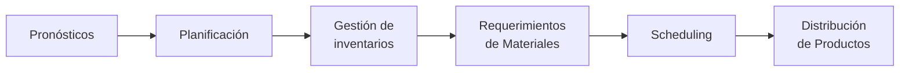
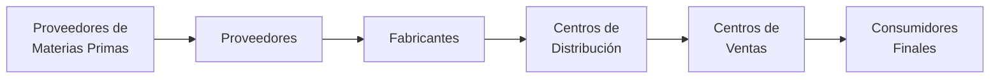
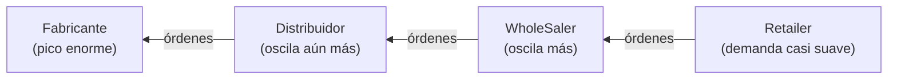
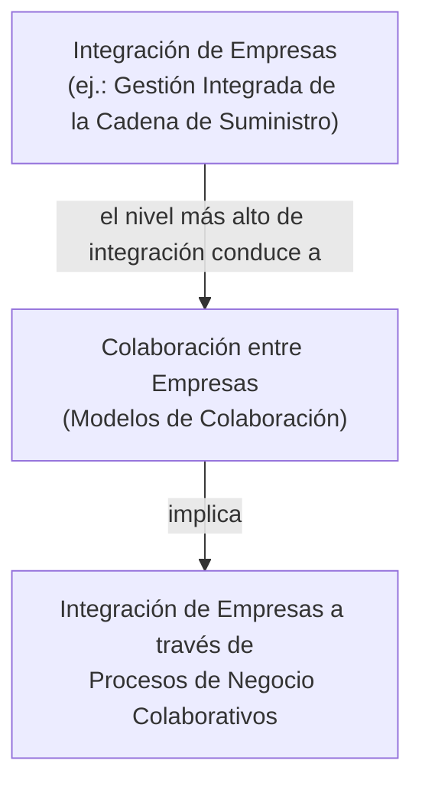
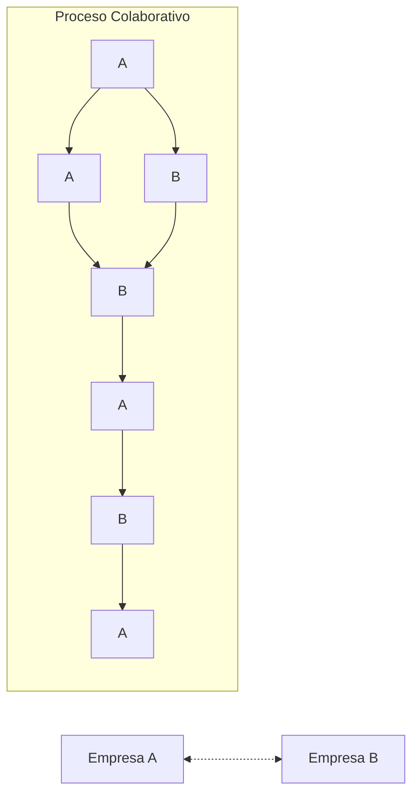
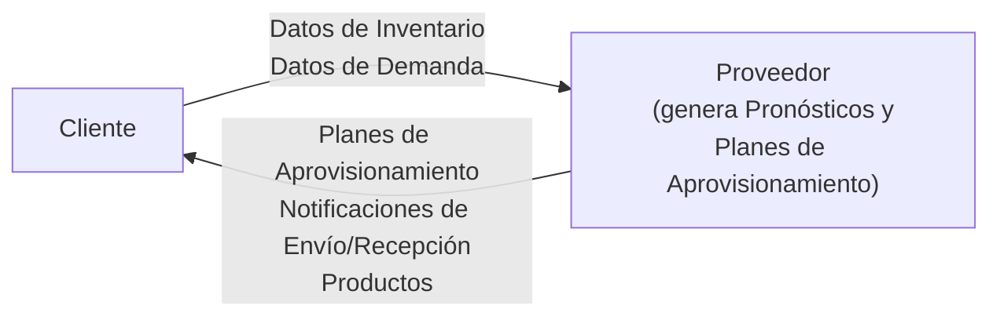
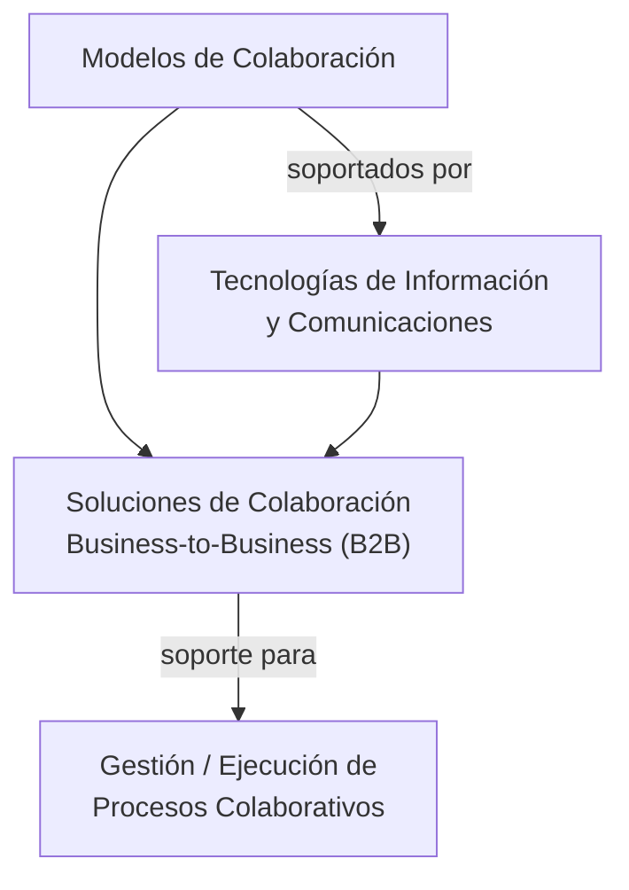

# Apunte 28 — Gestión Integrada de la Cadena de Suministro

> **Unidad 9 — Gestión Integrada de la Cadena de Suministro.** Teoría completa de la última unidad: cómo la **gestión integrada** sube un escalón respecto de todo lo visto hasta acá (pronósticos, planificación, inventarios, MRP, scheduling, distribución) al **extender la integración más allá de los límites de una sola organización**, a lo largo de toda la **cadena de suministro**. El apunte recorre qué es una cadena de suministro y qué persigue su gestión; el problema central que aparece cuando **no se comparte información** (el **efecto bullwhip** o **látigo**) y sus causas; la solución —**compartir información y colaborar**— y cómo se materializa en **niveles de integración**, **procesos de negocio colaborativos** y **modelos de colaboración de referencia** (**VMI, CPFR, DAMA, SCOR**); y, por último, las **tecnologías de la información** que la facilitan (**B2B**: e-marketplaces vs. peer-to-peer, y las tendencias actuales). Bibliografía de cátedra: Russell & Taylor, *Operations Management. Creating Value Along the Supply Chain* (Wiley, 2011); Jacobs & Chase, *Operations and Supply Chain Management* (McGraw Hill, 2018); con los aportes clásicos de Simchi-Levi y de Lambert & Cooper para las definiciones.

> **Cómo se ejercita.** Esta presentación es el **apunte de clase de teoría** de la Unidad 9 y abarca el bloque conceptual completo del plan. La unidad contempla además el **estudio de las problemáticas a través de simulación (juego de la cerveza)** y **estudio de casos**: cuando la cátedra entregue ese material, se sumarán los apuntes de práctica correspondientes siguiendo el patrón del proyecto. **Requisitos previos:** toda la cadena de planificación de operaciones vista en las Unidades 3 a 8 —pronósticos (Apunte 7), inventarios (12), planificación jerárquica (14, 15), MRP (19), DRP (22) y scheduling (25)—, porque la integración de la cadena es, precisamente, la **coordinación de todas esas piezas entre empresas distintas**.

---

## 1. El punto de partida: de la integración interna a la integración de la cadena

Toda la asignatura vino **integrando la gestión de operaciones** dentro de una organización. Las piezas estudiadas no son islas: forman una secuencia que se alimenta entre sí.

Todas esas operaciones están **involucradas en procesos de negocio**, y los procesos involucran **tareas realizadas por personas y/o sistemas de software** dentro de la organización. Las **TI (Sistemas de Gestión)** sostienen ese andamiaje por dos vías:

- **Soporte a actividades basadas en datos y en conocimiento** → Sistemas Soporte de Decisión / herramientas analíticas.
- **Automatización de procesos de negocio** → Sistemas de Gestión de Procesos de Negocio (BPMS).

### Tres niveles de digitalización

La presentación encadena la idea en tres pasos de alcance creciente:

| Nivel | Qué integra | Resultado |
|---|---|---|
| **Digitalización de la organización** | Operaciones + Procesos de Negocio + Sistemas de Gestión **dentro** de una organización | Gestión integrada **interna**; alineación de los sistemas con los procesos y las operaciones |
| **Gestión Integrada de la Cadena de Suministro** | Los procesos de negocio y las operaciones **a lo largo de toda una cadena de suministro** (varias organizaciones) | Integración **inter-organizacional** |

El salto conceptual de la Unidad 9 es ese segundo nivel: **dejar de optimizar puertas adentro** y empezar a **integrar procesos y operaciones entre empresas**.

---

## 2. Qué es una cadena de suministro

La presentación ofrece dos miradas complementarias.

**Definición operativa.** Una cadena de suministro es una **red de empresas autónomas o semiautónomas** responsables de los procesos y actividades que van **desde la obtención de la materia prima hasta la entrega del producto final al consumidor**, pasando por la producción, fabricación y distribución, asociadas con una o más familias de productos relacionados.

**Definición estructural.** Una **red compleja de recursos, funciones y medios de distribución** involucrados en producir y entregar productos o servicios a los consumidores.

La cadena se ordena en **eslabones** y la atraviesan **dos flujos en sentidos opuestos**:

- **Flujo de materiales / productos:** **aguas abajo** (downstream), del proveedor hacia el consumidor.
- **Flujo de información** (demanda, órdenes, etc.): **aguas arriba** (upstream), del consumidor hacia el proveedor.

> El vocabulario de la cadena suele usar capas o *tiers* de proveedores (Tier 1, Tier 2, Tier 3…) según su distancia al fabricante, y reconoce nodos típicos: proveedores → fábrica → depósito (*warehouse*) → centro de distribución → tienda (*store*) → cliente. **Aguas arriba** = hacia el origen (materias primas); **aguas abajo** = hacia el consumidor.

---

## 3. Gestión de la cadena de suministro: definiciones y objetivos

La presentación cita dos definiciones de referencia:

**Definición 1 (Simchi-Levi y otros, 1999).** Conjunto de **estrategias** para integrar de forma eficiente a proveedores, fabricantes, depósitos y centros de venta, de modo que los productos se produzcan y distribuyan en las **cantidades correctas**, en el **lugar correcto** y en el **momento correcto**, **al menor costo** y con el **nivel de servicio requerido**.

**Definición 2 (Lambert y Cooper, 1998).** La **integración de los procesos de negocio claves** que van desde el consumidor final hasta los proveedores originales que suministran productos, servicios e información, **agregando valor a los clientes**.

> **El interés central de la gestión integrada** es la gestión coordinada de **tres flujos**: el de **materiales**, el de **información** y el **financiero**.

El objetivo, en una frase: **el producto correcto, en el lugar y momento correctos, al menor costo y con el nivel de servicio requerido** —y para lograrlo no alcanza con que cada empresa optimice lo suyo por separado.

---

## 4. El problema central: incertidumbre, inventarios y el efecto bullwhip (látigo)

### 4.1. Gestión tradicional

En una cadena tradicional, cada eslabón (fabricante ← distribuidor ← mayorista/*wholesaler* ← *retailer*) **solo ve las órdenes de su cliente inmediato**. La información de la demanda del consumidor **no se comparte**: se transmite, deformada, a través de las órdenes que cada eslabón coloca al anterior.

### 4.2. Qué es el efecto bullwhip

> **Efecto bullwhip (efecto látigo).** Las **variaciones del inventario y del tamaño de las órdenes se amplifican aguas arriba** de la cadena, desde el *retailer* hasta el fabricante. Una pequeña fluctuación en la demanda del consumidor se convierte en oscilaciones cada vez mayores a medida que sube por la cadena.

Dos observaciones que se ven en las gráficas de la presentación:

- **Los tamaños de las órdenes se incrementan aguas arriba.** El *retailer* ve una demanda relativamente suave; el fabricante recibe picos enormes.
- **Los niveles de inventario y de faltantes se incrementan aguas arriba.** Las mismas oscilaciones producen sobrestock en unos períodos y quiebres en otros, y el problema empeora hacia el origen.

> *Lectura del diagrama:* las flechas marcan el **flujo de información (órdenes) aguas arriba**; la **amplitud de la variación crece** en cada salto. El nombre *látigo* viene de eso: un leve movimiento en el mango (consumidor) produce un latigazo enorme en la punta (fabricante).

### 4.3. Problemas que causa

- **Altos niveles de inventario.**
- **Bajo nivel de servicio** (retrasos en las órdenes, faltantes).
- **Altos costos** en cada componente y en toda la cadena.
- Una **fluctuación alta de la demanda** agrava todo: provoca mayores variaciones de inventarios y de tamaños de órdenes.
- La variación obliga a sobredimensionar **capacidad** de despacho, de producción y de inventario para amortiguar los picos. Pero **esa capacidad está ociosa la mayor parte del tiempo** → mayores costos de inversión, mantenimiento y operación.

### 4.4. Factores que contribuyen al efecto bullwhip

| Factor | Cómo amplifica la variabilidad |
|---|---|
| **Pronósticos** | Cambios en los pronósticos cambian los **stocks de seguridad**: los proveedores no solo reaccionan a la demanda, además **reajustan su stock de seguridad**, lo que **suma variabilidad**. La **imprecisión** de los pronósticos genera variabilidad en las órdenes. |
| **Tamaño de lotes** | Comprar **por lotes** agrega variabilidad: una semana con una orden grande, seguida de semanas sin órdenes o con órdenes pequeñas. |
| **Fluctuaciones de precios** | Promociones y descuentos distorsionan la demanda: cuando los precios bajan, **el stock se acumula** (se ordena más de lo necesario), creando picos artificiales. |
| **Órdenes infladas** | En tiempos de faltantes, los clientes colocan **órdenes mayores que su demanda real** esperando ser abastecidos proporcionalmente. Cubierto el faltante, sobrevienen **cancelaciones**. |

### 4.5. Consideraciones sobre el lead time

- El efecto bullwhip ocurre **independientemente del tamaño de los lead times**: acortarlos no lo elimina.
- No obstante, **menores lead times → mejor desempeño** del sistema y de cada componente: los productos pasan **menos tiempo en el sistema** → menores costos de inventario y de transporte.

### 4.6. En resumen

En las cadenas tradicionales, la información de la demanda del consumidor **solo se pasa a lo largo de la cadena a través de las órdenes**. Por lo tanto, **la información de la demanda se pierde entre los eslabones**, lo que resulta en **altos niveles de inventario** y **bajos niveles de servicio**.

> La causa raíz es una sola: **no se comparte información entre los participantes (organizaciones) de la cadena.**

---

## 5. La solución: compartir información → Gestión Integrada de la Cadena de Suministro

Si la causa es la falta de información compartida, la solución es directa:

> **Requerimiento clave: COMPARTIR INFORMACIÓN** de demanda, inventarios, planificaciones, despachos, capacidades, etc., entre los participantes de la cadena de suministro.

Eso es, precisamente, lo que persigue la **Gestión Integrada de la Cadena de Suministro**: amortiguar las variaciones de inventarios y órdenes (el bullwhip) dando **visibilidad** a la información que la gestión tradicional ocultaba entre eslabones.

---

## 6. Integración y colaboración entre empresas

Las empresas adoptan **nuevas filosofías de gestión** que ponen el énfasis en **relaciones más estrechas** con proveedores, clientes, etc. Los propósitos:

- **Intercambiar información** para disminuir las incertidumbres del flujo de información (p. ej., el bullwhip).
- **Coordinar actividades** para mejorar los beneficios y disminuir los costos.
- **Alcanzar metas de negocio comunes**, preservando a la vez los objetivos propios de cada empresa.

### 6.1. El nivel más alto: colaboración entre empresas

El **mayor nivel de integración** es la **colaboración entre empresas**, que supone definir un **acuerdo de colaboración**:

- **Período** de la relación: mediano o largo plazo.
- **Productos y servicios** a intercambiar.
- **Metas de negocio comunes.**
- **Comunicación bidireccional** entre las partes.
- Las organizaciones **toman decisiones en forma conjunta** mientras **preservan sus propios objetivos**.
- Los **procesos privados** de cada organización se integran a través de **procesos de negocio colaborativos**.

Propósitos: alcanzar metas comunes, mejorar beneficios y disminuir costos. La **ejecución conjunta** de procesos colaborativos **reduce las distorsiones y manipulaciones unilaterales** en pronósticos, planificación, etc., y provee un **mecanismo de confianza** entre los socios.

### 6.2. La cadena de implicaciones

---

## 7. Procesos de negocio colaborativos

Un **proceso de negocio colaborativo** (o inter-organizacional):

- Se **extiende a través de varios participantes** (empresas u organizaciones).
- Define el **intercambio de información** y la **coordinación de actividades** entre los socios de negocio.
- Tiene como **propósito alcanzar una meta de negocio común**.
- Es **definido y ejecutado conjuntamente** entre las partes.
- Define la **vista global** de la colaboración (no la vista privada de una sola empresa).

> La idea clave es que el proceso colaborativo es una **vista compartida y pública** que entrelaza tareas de la Empresa A y de la Empresa B: cada empresa sigue ejecutando sus tareas privadas, pero ahora **acopladas** en un proceso común con visibilidad mutua.

---

## 8. Modelos de colaboración de referencia

Un **modelo de colaboración de referencia** es un modelo de negocio y/o de gestión que define:

- La **estructura de red** y las **relaciones** entre las organizaciones.
- Las **reglas de negocio/gestión** a aplicar en la relación inter-organizacional.
- Los **procesos de negocio colaborativos** a llevar a cabo.
- Las **metas de negocio comunes** a alcanzar.
- Los **indicadores de rendimiento**.

Los modelos para Gestión Integrada de la Cadena de Suministro que presenta la cátedra:

| Modelo | Sigla | Idea central |
|---|---|---|
| **Vendor Managed Inventory** | VMI | El **proveedor** gestiona el inventario del cliente |
| **Collaborative Planning, Forecasting and Replenishment** | CPFR | Planificación, pronóstico y reabastecimiento **conjuntos** |
| **Demand Activated Management Architecture** | DAMA | Gestión **activada por la demanda** real |
| **Supply Chain Operations Reference Model** | SCOR | Modelo de **referencia de procesos** (Plan-Source-Make-Deliver-Return) |
| **Colaboración Socio-a-Socio** | — | Relación directa entre dos socios |

### 8.1. VMI (Vendor Managed Inventory)

**Objetivos:** reducir los niveles de inventario **tanto en el cliente como en el proveedor** y gestionar de forma colaborativa el aprovisionamiento.

**Mecánica:** el **proveedor** es responsable de **planificar el aprovisionamiento y controlar los niveles de inventario del cliente**; a cambio, el **cliente** debe proveer **datos actuales de inventario y de ventas (demanda)**.

**Beneficios:**

- El **cliente no incurre** en costos de colocación de órdenes ni de control de inventario.
- El **proveedor también baja costos**: cuenta con **información más certera de la demanda** del cliente, lo que le permite **gestionar mejor su producción**.

**Características:**

- Es el **modelo más difundido**.
- Habitual en la **industria de bienes empaquetados al consumidor**.
- Se aplica a relaciones entre un **proveedor** y un **centro de distribución o de venta al consumidor (retailer)**.
- **Variantes:** **consignación** del inventario del cliente (el proveedor mantiene la posesión) y **VMI basado en pronósticos**.

### 8.2. CPFR (Collaborative Planning, Forecasting and Replenishment)

**Objetivo:** alinear de la mejor manera el **suministro y la demanda** mediante el intercambio de datos, la **gestión basada en excepciones** y la **colaboración estructurada** entre socios, para satisfacer las expectativas de los consumidores finales.

A diferencia del VMI, las partes definen **en forma conjunta** no solo **pronósticos de ventas**, sino también **pronósticos de órdenes** y el **manejo de excepciones**. Se aplica principalmente a relaciones entre empresas de **producción (proveedores)** y **centros de distribución o venta (clientes)**.

**Los ocho procesos colaborativos del CPFR:**

| # | Proceso | Qué hace |
|:--:|---|---|
| 1 | **Acuerdo de colaboración** | Define metas, alcance, roles y responsabilidades; **criterios de excepción**; e información a compartir (frecuencia, metodología de pronóstico, etc.) |
| 2 | **Plan de negocio conjunto** | Acuerda el plan y los **eventos** que afectan oferta y demanda (promociones, políticas de inventario, días de apertura, lanzamientos) |
| 3 | **Pronóstico de ventas** | Proyección **conjunta** de la demanda en los puntos de venta, con información causal y eventos planificados |
| 4 | **Pronóstico (planificación) de órdenes** | Plan de órdenes y entregas según pronósticos de venta, inventarios, tiempos de provisión y otros factores |
| 5 | **Generación de órdenes** | Convierte los pronósticos de órdenes en **órdenes firmes** |
| 6 | **Cumplimiento de las órdenes** | Producir, embarcar, entregar y almacenar los productos |
| 7 | **Gestión de excepciones** | Monitorea planificación y ejecución según los **criterios de excepción** del acuerdo |
| 8 | **Evaluación del rendimiento** | Calcula métricas clave para evaluar metas comunes, detectar tendencias y desarrollar alternativas |

### 8.3. SCOR (Supply Chain Operations Reference Model)

- Es **cross-industry**: aplicable a cualquier tipo de industria.
- **Objetivo:** permitir a las organizaciones **manejar, mejorar y comunicar** las prácticas de gestión integrada de la cadena de suministro.
- Se apoya en **tres pilares**: (1) **describe** la cadena en términos de **procesos**; (2) provee métricas para **medir y evaluar el desempeño**; (3) habilita la **aplicación de técnicas conocidas** (modelado/reingeniería de procesos, lean manufacturing, six-sigma, etc.).
- Está **estructurado en cinco procesos de gestión**:

| Proceso SCOR | Significado |
|---|---|
| **Plan** | Planificar |
| **Source** | Aprovisionar (abastecimiento) |
| **Make** | Producir / fabricar |
| **Deliver** | Entregar / distribuir |
| **Return** | Devolver (logística inversa) |

Estos cinco procesos se replican a lo largo de toda la cadena —proveedor del proveedor → proveedor → *tu empresa* → cliente → cliente del cliente—, lo que da un **lenguaje común** para describir y comparar cadenas.

### 8.4. Centralizados vs. descentralizados

La cátedra ordena los modelos según **dónde reside la toma de decisiones**:

| Gestión **centralizada** | Gestión **descentralizada** |
|---|---|
| DAMA, VMI, CPFR, SCOR | VMI, CPFR, SCOR |

> VMI, CPFR y SCOR aparecen en **ambas** columnas: pueden implementarse con una coordinación centralizada (un nodo concentra decisiones e información) o de manera descentralizada (las empresas deciden e intercambian de igual a igual). **DAMA** figura solo como centralizado. La distinción es importante porque **anticipa la elección tecnológica** de la sección siguiente: gestión centralizada ↔ e-marketplaces; gestión descentralizada ↔ sistemas peer-to-peer.

---

## 9. Las TI como facilitadoras: soluciones B2B

> Las **Tecnologías de la Información** son las principales **facilitadoras** de la Gestión Integrada de la Cadena de Suministro.

La relación entre las capas es:

### 9.1. Vocabulario del comercio electrónico

| Término | Definición |
|---|---|
| **E-Commerce** | Compra y venta de bienes y servicios realizada **por personas** en forma electrónica a través de TICs |
| **E-Business** | Transacciones comerciales (compra y venta) realizadas **por empresas** a través de medios electrónicos |
| **B2C (Business-to-Consumer)** | Transacciones comerciales **entre empresas y consumidores** mediante TICs |
| **B2B (Business-to-Business)** | Transacciones comerciales y comunicaciones **entre empresas** mediante TICs |

La integración de la cadena de suministro vive en el **B2B**. Según la **topología de la relación**, hay dos arquitecturas.

### 9.2. E-Marketplaces (gestión centralizada)

Un **hub** —sistema de información operado por un **tercero independiente**— media las conexiones **muchos-a-muchos** entre los sistemas de proveedores y clientes.

- Generalmente enfocados en **mercados verticales**.
- **Tipos:** **transaccionales** (procesos de compra y venta) y **colaborativos** (soporte a procesos colaborativos).
- Implican **gestión centralizada de los procesos**.

**E-Marketplaces colaborativos — ventajas y desventajas:**

| Ventajas | Desventajas |
|---|---|
| Un **único vínculo** de comunicación con el e-marketplace | **Problemas de confianza** sobre el control y la distribución de la información compartida |
| **Menores costos** de instalación y mantenimiento de la integración B2B | Los socios pueden requerir soluciones **más específicas** que el proceso estandarizado del marketplace |
| **Único estándar B2B** para intercambio y ejecución de procesos | Las empresas deben **pagar** por los servicios del e-marketplace |
| **Visibilidad** para todos los socios sobre la información y el estado de los procesos | Difícil **mantener actualizada** la información de los socios |
| | **Pérdida de autonomía** sobre la gestión y el control de la información y los procesos |

### 9.3. Sistemas peer-to-peer (gestión descentralizada)

El intercambio de información y la ejecución de procesos se hacen por **intercambio directo** entre los sistemas de las partes. **No hay intermediario**: cada empresa actúa **como cliente y servidor a la vez**. Reflejan la idea de que cada empresa es **autónoma** e interactúa de forma **descentralizada**.

**Peer-to-peer — ventajas y desventajas:**

| Ventajas | Desventajas |
|---|---|
| Cada empresa **mantiene el control** de la información que comparte | Con **varios socios**, los costos de desarrollo y mantenimiento son **más altos** |
| Mismo **estatus y poder** entre socios | La solución de integración puede ser **única para cada par** de empresas |
| **Escalabilidad** de las relaciones de colaboración | |
| **Alto nivel de autonomía** | |
| **Gestión descentralizada** de información y procesos | |
| **Personalización** del proceso colaborativo por cada relación | |
| Cada par puede **elegir el estándar B2B** según sus requerimientos | |

> **El trade-off de fondo:** los **e-marketplaces** simplifican (un solo vínculo, un solo estándar, menor costo) **a cambio de autonomía y confianza**; los **peer-to-peer** preservan **control y autonomía** **a cambio de mayor costo y complejidad** de mantener muchas integraciones a medida. Es el mismo eje **centralización ↔ descentralización** que ordena los modelos de colaboración en §8.4.

---

## 10. Tendencias en TI para la integración de la cadena

**Requerimientos / desafíos actuales:**

- **Conectividad, interoperabilidad y visibilidad** a través de toda la red de organizaciones.
- Integración **end-to-end** (de punta a punta).
- **Detección anticipada** de eventos disruptivos y **gestión de excepciones**.
- **Planificación integrada** de toda la cadena.
- **Alineación** entre planificación, programación (scheduling) y ejecución.
- **Velocidad y precisión** en los datos compartidos.

**Tecnologías habilitadoras:**

| Tecnología | Para qué |
|---|---|
| **Cloud-based software** | Vincular empresas (procesos y datos) y sus sistemas |
| **Inteligencia Artificial** | *Business analytics* |
| **Blockchain** | Trazabilidad, rechazo (no repudio) y confianza |
| **IA / Internet of Things (IoT)** | Recolección de datos y **monitoreo en tiempo real** |

---

## 11. Síntesis

- La **Gestión Integrada de la Cadena de Suministro** es el **nivel más alto de integración**: extiende la coordinación de operaciones (pronósticos, planificación, inventarios, MRP, scheduling, distribución) **más allá de una sola organización**, a lo largo de toda la cadena.
- Una **cadena de suministro** es una **red de empresas** que lleva el producto de la materia prima al consumidor, atravesada por un **flujo de materiales aguas abajo** y un **flujo de información aguas arriba**; gestionarla bien significa **el producto correcto, en el lugar y momento correctos, al menor costo y con el nivel de servicio requerido**, coordinando los flujos de **materiales, información y dinero**.
- El problema central de la gestión **tradicional** es el **efecto bullwhip (látigo)**: como **no se comparte información**, la variabilidad de órdenes e inventarios **se amplifica aguas arriba**, elevando inventarios y costos y bajando el nivel de servicio. Sus causas: **pronósticos, tamaño de lotes, fluctuaciones de precios y órdenes infladas**.
- La **solución** es **compartir información y colaborar**: definir **acuerdos de colaboración**, ejecutar **procesos de negocio colaborativos** (vista global, conjunta) y apoyarse en **modelos de colaboración de referencia** —**VMI** (el proveedor gestiona el inventario del cliente), **CPFR** (planificación, pronóstico y reabastecimiento conjuntos en 8 procesos), **DAMA** y **SCOR** (modelo de referencia Plan-Source-Make-Deliver-Return).
- Las **TI son las facilitadoras**: las soluciones **B2B** se implementan como **e-marketplaces** (hub centralizado: simple y barato, pero con menor autonomía y confianza) o como **peer-to-peer** (descentralizado: autónomo y controlado, pero más costoso de mantener). Las **tendencias** apuntan a **visibilidad end-to-end** con **cloud, IA/analytics, blockchain e IoT**.
