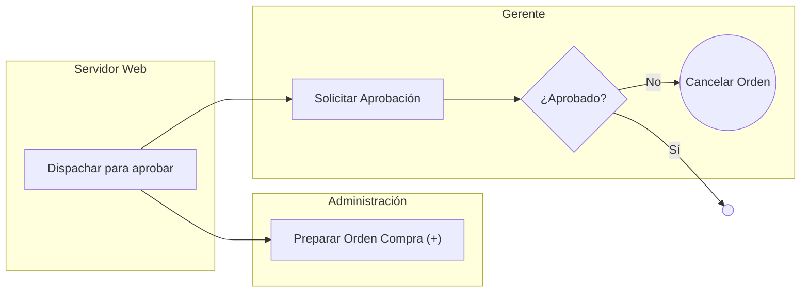
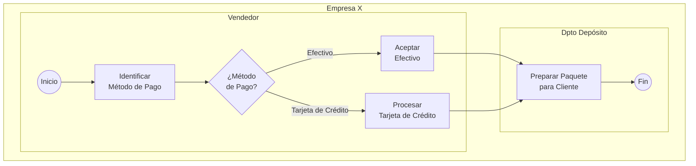
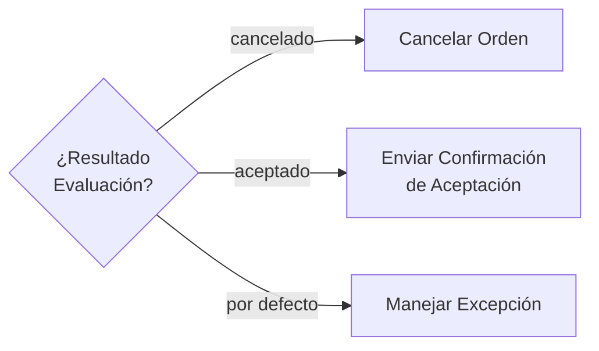
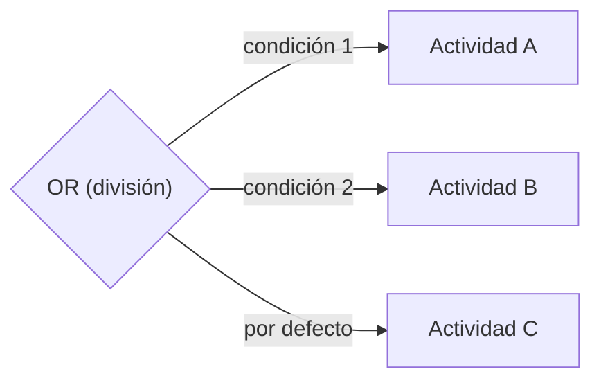
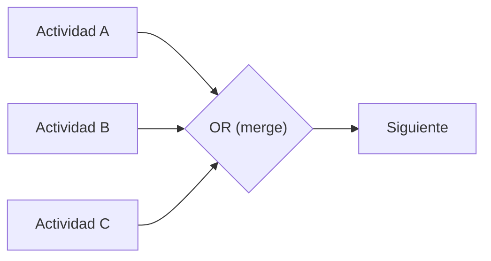
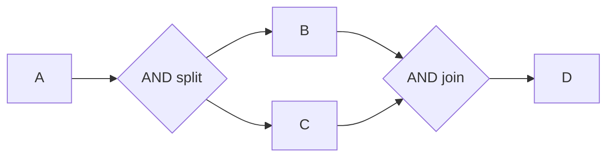
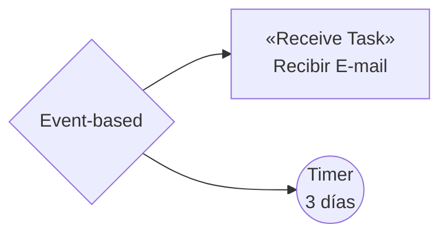

# Apunte 4 — Diseño y Modelado Conceptual de Procesos de Negocio: BPMN

> **Unidad 2 — Gestión de Procesos de Negocio.** Tercera presentación de la unidad. Desarrolla el **modelado de procesos de negocio** y, en particular, el lenguaje **BPMN (Business Process Model and Notation)**, ambos temas del plan analítico. Recorre las perspectivas (vistas) de un modelo de proceso, los tipos de diagramas BPMN, el catálogo completo de elementos básicos (objetos de flujo, conexión, datos, swimlanes y artefactos), la semántica de ejecución basada en *tokens*, el detalle de actividades (tareas y subprocesos), gateways y eventos (con sus tablas de triggers), los marcadores, el manejo de excepciones y compensación, y cierra con las perspectivas que BPMN cubre y las herramientas de modelado.

**Docente responsable:** Dr. Pablo D. Villarreal

**Bibliografía de referencia de la presentación:**

- Marlon Dumas, Marcello La Rosa, Jan Mendling, Hajo A. Reijers, *Fundamentals of Business Process Management*, Springer-Verlag Berlin Heidelberg, 2013 — Capítulos 3 y 4.
- Object Management Group, *Business Process Model and Notation (BPMN) 2.0.2*, http://www.omg.org/spec/BPMN/2.0.2/ (enero 2014) — www.bpmn.org

> **Nota sobre las figuras.** Los símbolos de la columna *Notación* se incrustan desde la carpeta `bpmn-icons/`, que debe acompañar a este archivo (los íconos se adaptan al tema claro/oscuro). Los diagramas de flujo de ejemplo se reconstruyen en Mermaid (flujos de control) o en arte ASCII (los que usan *boundary events*, compensación o asociaciones de datos, que Mermaid no representa bien).

---

## Agenda de la presentación

1. Perspectivas (vistas) de un modelo de proceso.
2. BPMN: qué es y tipos de diagramas.
3. Elementos básicos de BPMN.
4. Semántica de ejecución: el token.
5. Actividades: tareas y subprocesos.
6. Gateways.
7. Eventos.
8. Marcadores.
9. Manejo de excepciones y compensación.
10. Perspectivas soportadas por BPMN y complemento con UML.
11. Herramientas de modelado.

---

## 1. Perspectivas (vistas) de un modelo de proceso

Un modelo de proceso puede visualizarse desde **diferentes perspectivas o vistas**, cada una expresada mediante diagramas distintos. La presentación distingue cinco:

| Perspectiva | Qué describe |
|---|---|
| **Funcional** | Las actividades a realizar. |
| **Control (Flujo de Control)** | El orden de ejecución de las actividades, mediante constructores de flujo de control (secuencia, decisiones, paralelismo, etc.). |
| **Datos (Información)** | Los documentos u objetos (información) que se pasan entre actividades —precondiciones y poscondiciones de su ejecución— y las variables del proceso, consultadas por las reglas de los constructores de flujo. |
| **Operacional (Aplicaciones)** | Las aplicaciones que soportan la ejecución de cada actividad. |
| **Recurso u Organizacional** | Los recursos humanos a cargo de la ejecución de las tareas y sus interacciones con el sistema. |

Como se verá al final del apunte, BPMN no cubre por sí solo todas estas perspectivas; las que quedan pendientes (especialmente la operacional y la estructura de los datos) se complementan con UML.

---

## 2. Business Process Model and Notation (BPMN)

BPMN es un **estándar de-facto** impulsado por el consorcio de empresas **Object Management Group (OMG)**. La versión de referencia de la cátedra es **BPMN 2.0.2**.

**Propósitos:**

- Ser un **lenguaje estándar** para representar gráficamente y comunicar modelos de procesos de negocio.
- Ser **entendible por diferentes usuarios**, desde analistas de negocio hasta desarrolladores de software.
- Mantener **independencia** respecto de la tecnología de implementación y de las metodologías de re/diseño de procesos de negocio.

### Tipos de diagramas

| Diagrama | Qué representa |
|---|---|
| **Diagrama de Proceso** | Modela procesos privados o públicos. |
| **Diagrama de Colaboración** | Describe las interacciones entre dos o más organizaciones. |
| **Diagrama de Conversación** | Describe escenarios de intercambio de mensajes entre organizaciones. |
| **Diagrama de Coreografía** | Describe el comportamiento y la vista global de las interacciones entre organizaciones. |

El foco de esta presentación está en el **diagrama de proceso**.

---

## 3. Elementos básicos de BPMN

Un **modelo de proceso BPMN es un grafo** cuyos elementos definen la semántica de ejecución del proceso. Los elementos básicos se agrupan en cuatro categorías:

- **Objetos de Flujo (Flow Objects):** Actividades, Eventos y Gateways.
- **Objetos de Conexión (Connecting Objects):** Flujo de Secuencia, Flujo de Mensaje, Asociación y Asociación de Dato.
- **Datos:** Data Object, Data Input, Data Output, Data Store.
- **Swimlanes:** Pool y Lane.

A ellos se suman los **Artefactos** (Grupo y Anotación).

### 3.1. Objetos de Flujo (Flow Objects)

Son los principales elementos para definir el comportamiento de un proceso de negocio.

| Objeto | Descripción | Notación |
|---|---|:---:|
| **Actividad** | Representa el trabajo a realizar. Puede ser **atómica o compuesta**. Tipos: *Subprocess*, *Task*, *Call Activity*. |  |
| **Evento** | Algo que sucede durante el curso del proceso. Tiene una **causa (trigger)** o un **impacto (resultado)**. Tipos: *Start*, *Intermediate*, *End*. |  |
| **Gateway** | Representa la **división y unión (o fusión)** de flujos: selecciones, paralelismo, fusiones y uniones de caminos. |  |

### 3.2. Objetos de Conexión (Connecting Objects)

Definen cómo se conectan los objetos de flujo y los artefactos.

| Objeto | Uso | Notación |
|---|---|:---:|
| **Flujo de Secuencia (Sequence Flow)** | Representa el orden de ejecución de las actividades. Su origen y destino deben ser objetos de flujo (Eventos, Actividades, Gateways). **No puede cruzar los límites de un pool**. |  |
| **Flujo de Mensaje (Message Flow)** | Representa el flujo de mensajes entre dos participantes preparados para enviar y recibir mensajes. |  |
| **Asociación (Association)** | Asocia artefactos con objetos de flujo. |  |
| **Asociación de Dato (Data Association)** | Asocia datos con objetos de flujo. |  |

### 3.3. Datos

Representan los datos o información consumidos o producidos por las actividades.

- **Objetos de Dato (Data Object):** información que las actividades requieren para ejecutarse y/o que producen. Pueden representar un objeto particular o una **colección**. Sirven para mostrar cómo los datos y documentos se usan y actualizan dentro del proceso, para definir la información de entrada/salida de las actividades, y permiten definir **estados** que muestren cómo un objeto cambia (p. ej., `Orden [Aceptada]` / `Orden [Rechazada]`).
- **Entradas de Dato (Data Input):** información requerida para ejecutar un proceso.
- **Salidas de Dato (Data Output):** información producida por un proceso.
- **Almacenes de Dato (Data Store):** información recuperada o actualizada por actividades que **persiste por fuera del alcance** de las instancias del proceso.
- **Properties:** propiedades que se agregan a procesos, actividades o eventos. **No son visibles en los diagramas.** Por ejemplo, las propiedades de un proceso representan atributos de instancia del proceso.

| Elemento | Notación |
|---|:---:|
| Data Object |  |
| Colección (Collection) |  |
| Data Input |  |
| Data Output |  |
| Data Store |  |

**Ejemplo de uso de Data Objects con estados** (proceso *Aprobar Orden*) — reconstruido en ASCII para mostrar las asociaciones de dato punteadas:

```
                      ┌──────────────────┐
                 ┌╌╌╌╌╌╌►  Orden          ╌╌╌╌╌╌┐
                 ╎    │  [Aceptada]       │      ╎ (data association)
                 ╎    └──────────────────┘      ▼
   ┌──────────┐  ╎                      Sí   ┌──────────────┐
   │ Aprobar  ├──┴──►  ◇ ¿Aprobada? ◇ ───────►│ Cumplir Orden│
   │  Orden   ├──┐                            └──────────────┘
   └──────────┘  ╎                            ┌──────────────┐
                 ╎                       ───────►│Rechazar Orden│
                 ╎    ┌──────────────────┐     └──────────────┘
                 └╌╌╌╌╌►  Orden          ╌╌╌╌╌╌┘
                      │  [Rechazada]      │
                      └──────────────────┘
```

### 3.4. Swimlanes

Permiten **agrupar** elementos de modelado.

- **Pool:** representa un **participante (organización)** en un proceso. Actúa como contenedor gráfico para agrupar las actividades de esa organización, generalmente en escenarios inter-organizacionales. En otros términos, representa **el proceso de una organización**.
- **Lane:** una **sub-partición dentro de un pool**. Suele usarse para categorizar y organizar actividades realizadas por **roles o unidades organizacionales**, aunque puede representar cualquier característica deseada (p. ej., sistemas).

| Elemento | Notación |
|---|:---:|
| Pool |  |
| Lane |  |

**Ejemplo de lanes** (proceso con lanes Administración / Gerente / Servidor Web):



### 3.5. Artefactos

Los artefactos **no tienen efecto directo** en la semántica del flujo de secuencia o de mensajes.

| Artefacto | Descripción | Notación |
|---|---|:---:|
| **Grupo** | Agrupación de actividades con propósitos de **documentación o análisis**. |  |
| **Anotación (Text Annotation)** | Provee **información adicional** a un diagrama. |  |

### 3.6. Convenciones de nombres sugeridas

| Elemento | Convención | Ejemplo |
|---|---|---|
| **Actividades** | VERBO + NOMBRE (primera letra mayúscula) | *Aprobar orden* |
| **Eventos** | NOMBRE + PARTICIPIO (primera letra mayúscula) | *Factura emitida* |
| **Procesos** | NOMBRE + ADJETIVO (minúsculas) | *Gestión de pagos* |

Además: **evitar nombres muy largos** (menos de 5 palabras) y **evitar verbos genéricos** (p. ej., "Hacer").

### 3.7. Ejemplo integrador de elementos básicos

Proceso de la *Empresa X* (lanes *Vendedor* y *Dpto Depósito*) que ilustra evento de inicio, tareas, gateway de decisión y evento de fin:



---

## 4. Semántica de ejecución: el Token

El **token** define la semántica del flujo de secuencia a través de los objetos de flujo de un proceso. El comportamiento de un proceso puede describirse **siguiendo el camino del token** por el flujo de secuencia, actividades, eventos y gateways.

- Se usa para representar la **ejecución de una instancia** de un proceso.
- Tiene un **ID** que representa la instancia. El ID permite distinguir múltiples tokens, que pueden existir por:
  - diferentes **instancias concurrentes** del proceso;
  - la **división del token** en flujos de secuencia en paralelo dentro de una misma instancia.
- **No** se pasa a través del flujo de mensajes ni de las asociaciones de datos: mensajes y datos no tienen efecto directo sobre la semántica del flujo del proceso.
- Un **evento de inicio genera** un token que debe ser **consumido** por un evento de fin.

### Semántica de ejecución de actividades (según el token)

- Una actividad **se instancia cuando al menos un token arriba** desde uno de sus flujos de secuencia de entrada.
- **No espera** por el arribo de *todos* los tokens de los flujos de entrada para instanciarse.
- Por **cada token** que arriba desde un flujo de entrada, se crea **una instancia** de la tarea.
- Cuando una instancia de la actividad finaliza, se genera **un token por cada flujo de secuencia de salida**.

```
    token ●                  ● (al finalizar la actividad,
       │   ↘                 │   un token por cada salida)
       │    ┌──────────┐    ↗│
   ────┼───►│          ├────●─────►
       │    │  Tarea   │
   ────┼───►│          ├────●─────►
            └──────────┘
```

---

## 5. Actividades: Tareas y Subprocesos

### 5.1. Tarea (Task)

Es una **actividad atómica** dentro de un proceso. Generalmente la ejecuta un **usuario y/o una aplicación**.

**Tipos de tarea** (cada tipo lleva un marcador-ícono en la esquina superior izquierda):

| Tipo | Descripción | Notación |
|---|---|:---:|
| **Servicio (Service)** | Servicio automatizado provisto por una aplicación. |  |
| **Usuario (User)** | Tarea de workflow donde una persona la ejecuta con asistencia de una aplicación; es planificada a través del **manejador de lista de trabajos** de un BPMS. |  |
| **Manual** | Tarea ejecutada **sin** la asistencia de una aplicación o BPMS. |  |
| **Envío (Send)** | Envío de un mensaje a un participante externo. Cuando el mensaje se envió, la tarea finaliza. |  |
| **Recepción (Receive)** | Espera del arribo de un mensaje desde un participante externo. Cuando se recibe, la tarea finaliza. |  |
| **Regla de Negocio (BusinessRule)** | Ejecución de una regla de negocio por una **máquina de reglas**: envía la entrada a la máquina y obtiene la salida. |  |
| **Script** | Un script ejecutado por la **máquina de proceso** del BPMS, escrito en el lenguaje de script que el BPMS provee. |  |

**Atributos de algunos tipos de tarea:**

- **Service:** `DataInput`/`DataOutput` (entradas y salidas de información); `InMessageRef` (mensaje recibido al comenzar la tarea, tras la disponibilidad de sus flujos de entrada); `OutMessageRef` (su envío marca la finalización); `Implementation` (Web Service | Otro | No especificado); `operationRef` (operación invocada).
- **Send:** `MessageRef` (mensaje a enviar); `Implementation`; `operationRef`; `DataInput` (dato de entrada que se pasa automáticamente al mensaje).
- **Receive:** `MessageRef` (mensaje a recibir); `Instantiate` (booleano: mecanismo de inicio e instanciación de un proceso); `Implementation`; `operationRef`; `DataOutput` (dato de salida copiado automáticamente desde el mensaje).
- **User:** `InMessage` (recibido al comenzar); `OutMessage` (su envío marca la finalización); `Implementation`; `operationRef`.

### 5.2. Subproceso

Es una **actividad compuesta** dentro de un proceso. Tipos: **embebido**, **reusable (Call Activity)**, **de evento** y **transacción**.

| Tipo | Descripción | Notación |
|---|---|:---:|
| **Embebido** | Definido dentro de un proceso; **no puede reusarse** en otro. Define un **alcance** (visibilidad, transacciones, excepciones, eventos, compensaciones). Se ve **colapsado** (marcador `+`) o **expandido**. |  |
| **Reusable (Call Activity)** | **Invocación** a otro proceso predefinido; transfiere el control al proceso llamado. (Borde grueso.) |  |
| **De Evento** | Se inicia ante un **evento de inicio asociado**. **No** es parte del flujo de secuencia normal del padre (sin flujos de entrada/salida). Puede ocurrir o no, y **varias veces**. (Borde punteado.) |  |

---

## 6. Gateways

Los gateways **definen los tipos de comportamiento del flujo de secuencia** y **dividen y unen** los flujos.

| Tipo | Notación |
|---|:---:|
| **Exclusive Gateway (XOR)** |  |
| **Inclusive Gateway (OR)** |  |
| **Parallel Gateway (AND)** |  |
| **Event-Based Gateway** |  |
| **Parallel Event-Based Gateway** |  |
| **Complex Gateway** |  |

### 6.1. Exclusive Gateway (XOR)

Punto del proceso donde el flujo puede tomar **dos o más caminos alternativos mutuamente excluyentes** → **solo uno** se selecciona. Conocido como **XOR basado en datos**.

- Para cada camino alternativo existe una **expresión condicional**; las expresiones usan valores de datos del proceso para decidir.
- Cuando la evaluación de un camino retorna *True*, se selecciona el flujo correspondiente.
- Si **ningún** camino se selecciona, se toma el **camino por defecto** (si está definido).
- Con varios flujos de **entrada**, actúa como **merge** de caminos alternativos mutuamente excluyentes.



### 6.2. Inclusive Gateway (OR)

Punto del proceso donde el flujo puede tomar **uno o más caminos alternativos** → puede seleccionarse **más de un camino**. Sirve para crear caminos alternativos y también paralelos.

- Los caminos se basan en **expresiones lógicas** definidas en cada flujo de salida.
- Cada camino es **independiente**: todas las combinaciones pueden ocurrir, desde cero a todos.
- Debería diseñarse de modo que **al menos un camino** se seleccione → se recomienda definir el **camino por defecto**.
- Notación opcional: uso de **flujos de secuencia condicionales**.



**Como merge:** cuando se usa para unir, **espera por (sincroniza) todos los tokens** que se hayan producido en los caminos alternativos y paralelos; **no** requiere que todos los caminos hayan producido un token.



### 6.3. Parallel Gateway (AND)

Se usa para **crear y sincronizar flujos paralelos**. Aunque no son estrictamente necesarios para crear paralelismo, pueden usarse **por claridad**.



### 6.4. Event-Based Gateway

Punto del proceso donde la selección de los caminos alternativos se basa en la **ocurrencia de eventos** (p. ej., recepción de un mensaje, un *timer* o un error).

- El destino de los caminos alternativos es una **tarea de recepción** o bien un **evento intermedio** (mensaje, timer, etc.).
- Puede usarse para **comenzar un proceso**.



**Variantes** (para expresar que un proceso puede comenzar de diferentes maneras):

- Una variante indica **caminos alternativos basados en eventos** al inicio del proceso, pero **solo uno** se ejecutará (rombo con pentágono interno).
- Otra variante indica que el proceso puede **iniciarse cuando ocurren varios eventos en paralelo** (rombo con `+` interno).

---

## 7. Eventos

Tipos de eventos según su posición en el proceso:

- **Inicio (Start):** indican dónde **comienza** un proceso.
- **Intermedio (Intermediate):** indican dónde algo puede ocurrir **entre** el inicio y el fin.
- **Fin (End):** indican dónde **finaliza** un camino del proceso.

A su vez se clasifican en dos categorías:

- **Eventos que capturan un trigger (catching):** todos los de inicio y algunos intermedios.
- **Eventos que lanzan/generan un resultado (throwing):** todos los de fin y algunos intermedios.

### 7.1. Evento de Inicio (Start Event)

- Indica dónde comienza el flujo de secuencia. **No debe tener** flujos de secuencia de entrada.
- **Genera un token** que debe ser consumido por un evento de fin.
- Cuando ocurre su *trigger*, **se crea una instancia** del proceso y se generan tokens por cada flujo de salida del evento.
- Un proceso **podría no tener** evento de inicio: en ese caso, las actividades sin flujo de entrada se instancian al crearse la instancia del proceso.
- Si existe un evento de fin, debe existir al menos un evento de inicio.
- Pueden definirse **varios** eventos de inicio (independientes); la instancia se crea cuando **uno** de ellos se dispara.

**Tipos de Eventos de Inicio para Procesos:**

| Trigger | Descripción | Notación |
|---|---|:---:|
| **None** | No distingue el tipo de evento de inicio ni su trigger. |  |
| **Message** | Un mensaje arriba desde un participante externo y dispara el comienzo del proceso. |  |
| **Timer** | Una fecha-hora o un ciclo de tiempo (p. ej., cada lunes a las 18:00) que, al cumplirse, dispara el comienzo. |  |
| **Conditional** | Se dispara cuando una expresión condicional retorna *true*. La expresión puede referirse a atributos estáticos o datos del entorno, **pero no a atributos del proceso**. |  |
| **Signal** | Una señal **emitida (broadcast)** desde otro proceso dispara el comienzo. |  |
| **Multiple** | Existen **múltiples maneras** de comenzar el proceso; solo una es requerida. |  |
| **Parallel Multiple** | Existen **múltiples triggers requeridos** que deben ocurrir para crear la instancia. |  |

**Eventos de Inicio para Subprocesos embebidos:** el **único** evento usado es el **None Start Event**. No se utiliza otro trigger, ya que el subproceso se ejecuta cuando un token arriba desde el proceso padre que lo dispara.

**Eventos de Inicio para Subprocesos de Evento** (distinguen variante **interrumpe** —borde sólido— vs. **no interrumpe** —borde punteado— el proceso padre):

| Trigger | Descripción | Interrumpe | No interrumpe |
|---|---|:---:|:---:|
| **Message** | Arriba un mensaje desde un participante externo. |  |  |
| **Timer** | Fecha-hora o ciclo de tiempo que dispara el comienzo del subproceso. |  |  |
| **Escalation** | Medidas para acelerar/agilizar la terminación de una actividad. |  |  |
| **Error** | Dispara el subproceso ante un error e **interrumpe** el proceso que lo contiene. |  | — |
| **Compensation** | Dispara el subproceso ante una compensación. **No** interrumpe el proceso que lo contiene. | — |  |
| **Conditional** | Se dispara cuando una expresión condicional retorna *true*. |  |  |
| **Signal** | Una señal emitida (broadcast) desde otro proceso dispara el comienzo. |  |  |
| **Multiple** | Múltiples maneras de comenzar el subproceso. |  |  |
| **Parallel Multiple** | Múltiples triggers requeridos que deben ocurrir para crear la instancia. |  |  |

### 7.2. Evento de Fin (End Event)

- Indica dónde finaliza un flujo de secuencia. **No debe tener** flujos de secuencia de salida.
- **Consume** un token generado desde un evento de inicio. **Todos** los tokens generados deben ser consumidos por un evento de fin antes de que el proceso finalice.
- Un proceso puede tener **múltiples** eventos de fin.
- Si **no** se definen eventos de fin, todos los objetos de flujo sin flujo de salida definen el fin de un camino; el proceso finaliza cuando **todos los caminos en paralelo** han finalizado.

**Tipos de Eventos de Fin:**

| Trigger | Descripción | Notación |
|---|---|:---:|
| **None** | No distingue el tipo de evento de fin ni resultado. |  |
| **Message** | Un mensaje es **enviado** a un participante externo al finalizar el proceso. |  |
| **Error** | Se genera un error; todos los caminos activos del proceso se terminan. El error será capturado por un evento intermedio con el mismo `errorCode` dentro del contexto. |  |
| **Escalation** | Se genera una *escalation*. |  |
| **Cancel** | Usado dentro de un **subproceso de transacción**: indica que la transacción debe cancelarse y dispara un evento intermedio *Cancel* adjunto al subproceso; además, envía un mensaje *Cancel* del protocolo de transacción a las entidades involucradas. |  |
| **Compensation** | Indica que se necesita una **compensación** para una o varias actividades. La actividad a compensar debe ser visible desde donde se definió el evento. |  |
| **Signal** | Una señal será **emitida** al finalizar el proceso. |  |
| **Interrupción (Terminate)** | **Todas** las actividades del proceso se finalizan **inmediatamente**, incluidas instancias múltiples. El proceso finaliza **sin** compensación ni manejo de evento. |  |
| **Multiple** | Múltiples maneras de finalizar el proceso; **todas** ocurrirán. |  |

### 7.3. Evento Intermedio (Intermediate Event)

- Ocurre **entre** un evento de inicio y uno de fin, y **afecta el flujo** del proceso. Indica cómo un proceso puede ser **interrumpido o demorado**.
- Se usa para: representar dónde se reciben/envían mensajes; representar **demoras o deadlines**; **interrumpir el flujo normal** mediante el manejo de excepciones; mostrar trabajo extra para una **compensación**.
- Puede estar **asociado a una tarea o subproceso** (como *boundary event*).
- Puede corresponder a la **captura** de un trigger o al **disparo** del trigger del evento.

**Tipos de Eventos Intermedios** (cuando el trigger admite captura y disparo, se muestran ambas notaciones):

| Trigger | Descripción | Captura | Lanza |
|---|---|:---:|:---:|
| **Ninguno (None)** | No distingue el tipo de evento intermedio. |  | — |
| **Mensaje (Message)** | Un mensaje arriba y dispara el evento (continúa el proceso); también puede usarse para **enviar** un mensaje. En manejo de excepciones, cambia el flujo normal a uno de excepción. |  |  |
| **Timer** | Fecha-hora o ciclo de tiempo que, al cumplirse, dispara el evento. En flujo normal actúa como **mecanismo de demora**; en excepciones, cambia a flujo de excepción. |  | — |
| **Escalation** | Genera una *escalation*. |  |  |
| **Compensation** | Establece o ejecuta una **compensación**. Dispara una compensación en un flujo normal. |  |  |
| **Conditional** | Maneja excepciones: se dispara cuando se cumple una condición (expresión que evalúa datos). |  | — |
| **Link** | Mecanismo para **conectar dos secciones** de un proceso. |  |  |
| **Signal** | Envía o recibe una **señal**. |  |  |
| **Multiple** | Múltiples maneras de disparar el evento. |  |  |

---

## 8. Marcadores

### 8.1. Marcadores de Tarea

Una tarea puede llevar marcadores: **Loop**, **Múltiple Instancia** y **Compensación**.

| Marcador | Notación |
|---|:---:|
| **Loop** |  |
| **Múltiple Instancia** |  |
| **Compensación** |  |
| **Ad-Hoc** (subproceso) |  |
| **Subproceso colapsado** |  |

> Regla: un marcador **Loop NO puede combinarse** con el de **Múltiples Instancias**. Cualquier otra combinación está permitida.

**Loop:** ejecución **repetida de una tarea en forma secuencial**. Atributos (no visibles en el diagrama):

- `loop_Condition`: expresión condicional evaluada para determinar la continuación del loop (retorna *true*/*false*).
- `loopCounter`: cuenta el número de bucles realizados en tiempo de ejecución; lo actualiza automáticamente la máquina de procesos.
- `loopMaximum`: número máximo de bucles.
- `testBefore`: define si la condición se evalúa al **principio** (`true` → *while*) o al **final** (`false` → *repeat-until*) de las iteraciones.

**Múltiple Instancia:** ejecución de **múltiples instancias** de la tarea. Atributos (no visibles):

- `isSequential`: instancias secuenciales o en paralelo.
- `loopCardinality`: número de instancias a crear.
- `completionCondition`: expresión booleana que, al evaluarse en *true*, **cancela** las instancias restantes y produce un token.
- `behavior = {None | One | All | Complex}`: define la sincronización (cuándo se disparan los eventos al finalizar una instancia):
  - **None:** todas las actividades generan un token por cada instancia finalizada.
  - **One:** se pasa un token tras finalizar la **primera** instancia; las demás continúan pero no dejan pasar otro token.
  - **All:** un **solo** token tras finalizar **todas** las instancias.
  - **Complex:** el atributo `ComplexMI_FlowCondition` determina el flujo del token.
- `complexBehaviorDefinition`: define cuándo y cuáles eventos se disparan cuando `behavior` es *complex*.
- `LoopCounter`, `numberOfInstances`, `numberOfActiveInstances`, `numberOfCompletedInstances`, `numberOfTerminatedInstances`: contadores de seguimiento en tiempo de ejecución.

**Compensación:** marca que la tarea cuenta con una compensación asociada.

### 8.2. Marcadores de Subproceso

Tipos: **Loop**, **Múltiple Instancia** y **Compensación** (ídem a los de tarea) y, además:

- **Ad-Hoc:** las actividades **no se ejecutan en un orden particular**; la ejecución la determinan los ejecutores de las actividades. Atributos (no visibles): `AdHoc = True`; `AdHocOrdering` (Sequential | Parallel); `AdHocCompletionCondition` (condición que determina cuándo finaliza el proceso).

> Rige la misma regla: **Loop NO** se combina con **Múltiples Instancias**.

---

## 9. Manejo de excepciones y compensación

> **BPMN no provee un elemento explícito** para el manejo de excepciones; se representa combinando elementos existentes.

**Tipos de excepciones y cómo se representan:**

- **Abortar un proceso** → **Evento de Terminación (Terminate)**.
- **Manejo de excepciones con eventos intermedios asociados** (*boundary events*) a una actividad (tarea o subproceso). Estos eventos pueden representar:
  - **Interrupción** de la actividad al ocurrir el trigger: todo el trabajo en curso se interrumpe y el flujo continúa desde el flujo de salida del evento.
  - **No interrupción** de la actividad: el trabajo en curso **no** se interrumpe y el flujo continúa desde la salida del evento.
- **Timeouts o Deadlines** en actividades → **Eventos de Tiempo** asociados a actividades.
- **Cancelación o expiración** de eventos → **Eventos intermedios y de señales**.
- **Excepciones (con o sin cancelación) que pueden ocurrir en cualquier momento** de la ejecución → **Subproceso de eventos**.
- **Deshacer tareas ya realizadas** → **Compensaciones**.

**Ejemplo de boundary event interruptor** (subproceso *Repetir para cada Proveedor* con un *timer* adjunto que, al excederse el límite de tiempo, interrumpe el subproceso y deriva a *Encontrar Oferta Óptima*) — en ASCII por el *boundary event*:

```
                         ┌─ No ─► [ ... ] ─────────────────────────┐
   ◇ ¿Hay proveedores? ◇─┤                                          ▼
                         └─ Sí ─►┌───────────────────────────────┐
                                 │  Repetir para cada Proveedor   │
                                 │  [Enviar CFP]→[Recibir Oferta] │──► ┌───────────┐
                                 │            →[Adicionar Oferta] │    │ Encontrar │
                                 │                          ↺     │    │  Oferta   │
                                 └────────(⏰)────────────────────┘    │  Óptima   │
                                           │                           └───────────┘
                                           └─ Límite de Tiempo excedido ───►▲
```

### 9.1. Subproceso de evento (manejo de excepciones)

- Es **parte de un proceso "padre"**.
- Se dispara cuando su **evento de inicio** ocurre **en cualquier parte** del proceso padre, mientras este está **activo**.
- Puede dispararse **varias veces** (cada vez que el evento de inicio ocurre).
- Su disparo **no interrumpe** al proceso padre.
- Es **idéntico** a colocar un evento de **no interrupción** al proceso padre.

**Ejemplo** (proceso *Booking* con compensaciones de *Book Flight* / *Book Hotel* y un subproceso de evento *Handle Compensation*) — en ASCII:

```
┌─ Booking ───────────────────────────────────────────────┐
│        ┌─[Book Flight]⊲⊳ ╌╌╌► [Cancel Flight] ⊲          │
│   ( )─►┤        (boundary compensation)          ├─►( )   │
│        └─[Book Hotel]⊲⊳ ╌╌╌► [Cancel Hotel] ⊲            │
│                                                          │
│  ┌╌ Handle Compensation (subproceso de evento) ╌╌╌╌╌╌┐   │
│  ┆ (⊲⊳)→(⊲)→(⊲)→[Update Customer Record]→( )         ┆   │
│  ┆ Booking Flight Hotel                              ┆   │
│  └╌╌╌╌╌╌╌╌╌╌╌╌╌╌╌╌╌╌╌╌╌╌╌╌╌╌╌╌╌╌╌╌╌╌╌╌╌╌╌╌╌╌╌╌╌╌╌╌╌╌┘   │
└──────────────────────────────────────────────────────────┘
```

### 9.2. Compensación

Concepto usado para **deshacer la acción de una actividad previa** que se realizó y finalizó con éxito, pero cuyos resultados y efectos **ya no son deseados** y requieren revertirse.

- Si una actividad está **aún activa**, no puede compensarse: primero debe **cancelarse**.
- En la compensación de un **subproceso**, puede haber tareas ya finalizadas con éxito.
- La compensación la ejecuta un **manejador de compensación**, que contiene los pasos para revertir los efectos. Puede ser una **tarea** o un **subproceso** de compensación.
- Se **dispara por un evento de compensación**, generado normalmente por un manejador de error, como parte de una cancelación, o recursivamente por otro manejador de compensación. El evento **especifica la actividad** a compensar.
- Las actividades de compensación:
  - están **fuera del flujo de secuencia normal** y se asocian a tareas normales mediante un **Evento Intermedio de Compensación**;
  - **no** tienen flujos de secuencia de entrada/salida;
  - el Evento Intermedio de Compensación no tiene flujo de salida, sino una **asociación de salida dirigida**.

**Ejemplo mínimo** (*Registrar Orden de Compra* con compensación *Cancelar Orden de Compra*) — en ASCII:

```
   ┌─────────────────────┐
   │ Registrar Orden de   │
   │     Compra           │
   └──────────(⊲⊳)────────┘   (evento intermedio de compensación, boundary)
                ╎
                ╎ (asociación dirigida)
                ▼
   ┌─────────────────────┐
   │ Cancelar Orden de    │
   │   Compra   ⊲ (comp.) │
   └─────────────────────┘
```

**Ejemplo extendido** (*Ship and invoice*): tras *Order confirmed* se ejecutan en paralelo (AND) las ramas *Get shipment address → Ship product* y *Emit invoice → Receive payment*, cada tarea con su evento de compensación adjunto (*Handle product return*, *Reimburse customer*). Si llega *Order cancelation request*, un subproceso de evento *Determine cancelation penalty → Charge penalty to customer* dispara el evento de compensación *Ship & Invoice canceled*, que revierte las actividades ya completadas. *(Fuente del ejemplo: Dumas et al., Fundamentals of BPM.)*

---

## 10. Perspectivas soportadas por BPMN y complemento con UML

BPMN, a través de los **diagramas de procesos de negocio**, soporta:

- **Funcional y de Comportamiento.**
- **Información:** la **descripción de los datos** pasados entre tareas, **no la estructura** de los mismos.
- **Organizacional:** la **descripción de los roles** (swimlanes) involucrados, **no el modelo organizacional**.

**¿Cómo completar las perspectivas pendientes?** Con **UML**:

- **Funcional y de Comportamiento:** Diagramas de Actividades.
- **Información:** Diagramas de Actividades, Clases y Objetos.
- **Organizacional:** Diagramas de Actividades, Clases y Objetos.
- **Operacional:** Diagramas de Actividades y de Estructura Compuesta.

---

## 11. Herramientas de modelado con BPMN (Free / Open Source)

- **Camunda** — https://camunda.com/download/modeler/
- **BizAgi** — www.bizagi.com
- **Eclipse BPMN** — https://projects.eclipse.org/projects/soa.bpmn2-modeler
- **BONITA** — http://www.bonitasoft.com/
- **jBPM** — http://jbpm.org
- **Activiti** — https://www.activiti.org/

(Como herramientas de cátedra, se mencionan en el programa **Bonita BPM** y **Camunda Modeller**.)

---

## Síntesis del apunte

Esta presentación pasa del **concepto de modelado de procesos** a su lenguaje concreto, **BPMN 2.0**. El hilo es:

1. **Perspectivas de un modelo de proceso** (funcional, control, datos, operacional, recursos) y el rol de BPMN como estándar de la OMG, entendible por analistas y desarrolladores e independiente de la tecnología.
2. **Catálogo de elementos básicos:** objetos de flujo (actividades, eventos, gateways), objetos de conexión (secuencia, mensaje, asociaciones), datos (objects, inputs/outputs, stores, properties), swimlanes (pools y lanes) y artefactos (grupos y anotaciones), más las **convenciones de nombres**.
3. **Semántica de ejecución basada en el token:** un evento de inicio genera tokens que recorren el flujo de secuencia y deben ser consumidos por eventos de fin; las actividades se instancian por cada token que arriba.
4. **Detalle de los elementos:** los **tipos de tarea** (service, user, manual, send, receive, business rule, script) con sus atributos; los **subprocesos** (embebido, reusable, de evento, transacción); los **gateways** (XOR, OR, AND, event-based) con su semántica de división/unión; y los **eventos** (inicio, intermedio, fin) con sus tablas de triggers y la distinción catch/throw e interrupting/non-interrupting.
5. **Marcadores** (loop, múltiple instancia, compensación, ad-hoc) y el **manejo de excepciones y compensación**, que BPMN resuelve combinando boundary events, eventos de terminación, subprocesos de evento y compensaciones (no hay un elemento explícito para excepciones).
6. **Cobertura de perspectivas:** BPMN cubre lo funcional/comportamental, parte de información y parte de lo organizacional; lo operacional y la estructura de datos se complementan con **UML**. Cierra con las **herramientas** de modelado de código abierto.
